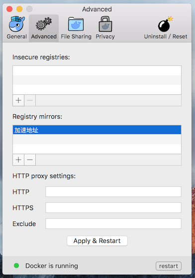
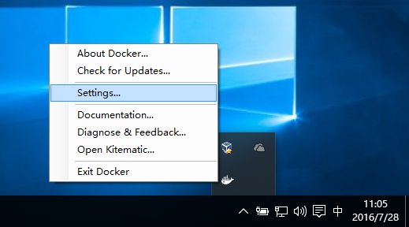
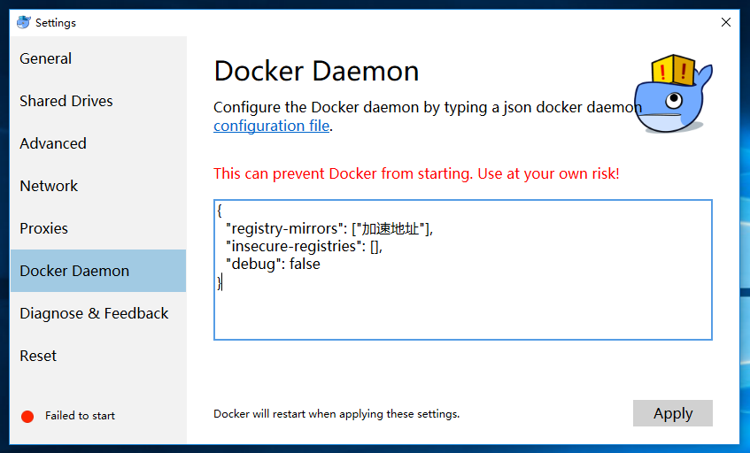

<!-- reviewed by fiona -->

[DaoCloud 加速器](https://www.daocloud.io/mirror)是广受欢迎的 Docker 工具，解决了国内用户访问 Docker Hub 缓慢的问题。DaoCloud 加速器结合国内的 CDN 服务与协议层优化，成倍的提升了下载速度。

# 配置加速器

请先确定您的 Docker 版本在 1.8 及以上。 
登陆[加速器页面](https://www.daocloud.io/mirror#accelerator-doc)可以获取 mirror 地址。
配置好后，您可以像往常一样使用 docker pull 命令，在拉取 Docker Hub 镜像时会自动采用加速器的镜像服务。

## Linux
### 自动配置 Docker 加速器
_适用于 Ubuntu14.04、Debian、CentOS6、CentOS7_

登陆后参考[配置命令](https://www.daocloud.io/mirror#accelerator-doc)
此命令会帮助您配置 registry-mirror 并重启 Docker Daemon。

### 手动配置 Docker 加速器
_适用于各种 Linux 发行版_

您可以找到 Docker 配置文件，一般配置文件在```/etc/default/docker```，在配置文件中的```DOCKER_OPTS```加入


```
--registry-mirror=加速地址
```

重启 Docker，一般可以用下面命令重启


```
service docker restart
```


## Docker for Mac
### 安装 Docker for Mac
Docker for Windows 可以让您在 Mac 上使用 Docker。
参考 [Docker for Mac](https://www.docker.com/products/docker#/mac) 安装文档进行安装。
### 配置 Docker 加速器
右键点击桌面顶栏的 docker 图标，选择 Preferences，在 Advanced 标签下的 Registry mirrors 列表中加入 加速地址 （在[加速器](https://www.daocloud.io/mirror#accelerator-doc)页面获取）。点击 Apply & Restart 按钮使设置生效。

如图所示




## Docker for Windows
### 安装 Docker for Windows
Docker for Windows 可以让您在 Windows 10 pro 上使用 Docker。

参考 [Docker for Windows](https://www.docker.com/products/docker#/windows) 安装文档进行安装。
### 配置 Docker 加速器
在桌面右下角状态栏中右键 docker 图标，修改在 Docker Daemon 标签页中的 json，把 加速地址（在[加速器](https://www.daocloud.io/mirror#accelerator-doc)页面获取）加到「registry-mirrors」的数组里。点击 Apply 使设置生效。

如图所示





## Docker Toolbox
### 安装 Docker Toolbox
Docker Toolbox 可以在 Windows 或者 MacOS 上运行 Docker，是一个完整的开发组件，适用于 Mac OS X 10.8+ 和 Windows 7 & 8.1。

参考 [Docker Toolbox 安装文档](https://www.docker.com/products/docker-toolbox)。高速下载 [Docker Toolbox](http://get.daocloud.io/#install-toolbox)
### 配置 Docker 加速器
请确认你的 Docker Toolbox 已经启动，并执行下列命令（请将 加速地址 替换为在[加速器](https://www.daocloud.io/mirror#accelerator-doc)页面获取的专属地址）

```
docker-machine ssh default
sudo sed -i "s|EXTRA_ARGS='|EXTRA_ARGS='--registry-mirror=加速地址 |g" /var/lib/boot2docker/profile
exit
docker-machine restart default
```

---

# 常见问题

### Docker 加速器是什么，我需要使用吗？

使用 Docker 的时候，需要经常从官方获取镜像，但是由于显而易见的网络原因，拉取镜像的过程非常耗时，严重影响使用 Docker 的体验。因此 DaoCloud 推出 Docker 加速器解决这个难题，通过智能路由和缓存机制，极大提升了国内网络访问 Docker Hub 的速度，目前已经拥有了广泛的用户群体，并得到了 Docker 官方的大力推荐。如果您是在国内的网络环境使用 Docker，那么 Docker 加速器一定能帮到您。

Docker 加速器是 DaoCloud 推出的 Docker Hub Mirror 服务的官方名称。

Docker 官方对 Mirror 的定义：

Such a registry is provided by a third-party hosting infrastructure but is targeted at their customers only. Some mechanism ensures that public images are pulled from a sponsor registry to the mirror registry, to make sure that the customers of the third-party provider can docker pull those images locally.

Mirror 是 Docker Registry 的一种特殊类型，它起到了类似代理服务器的缓存角色，在用户和 Docker Hub 之间做镜像的缓存。这个功能的设计目的是为了企业客户访问 Docker Hub 时降低网络开销。


### Docker 加速器是否收费？

我们承诺 DaoCloud 加速器服务是永久免费的，请放心使用。

### 使用加速器的必要性

* 使用 Docker 的时候，需要经常从官方获取镜像。由于显而易见的网络原因，获取镜像的过程较慢，令人非常痛苦。因此 DaoCloud 推出 Docker 加速器解决这个难题。Docker 加速器利用 Docker 官方的 Mirror 机制，一次配置，无缝使用。
* 值得一提的是，DaoCloud 系统本身也是加速器的重度用户。我们在运行 Docker 的机器上都配置了加速器服务，有效地节省了抓取镜像的时间。

### 加速方法

请先确定您的 Docker 版本高于 1.8。

然后请参考 **[加速器](https://www.daocloud.io/mirror)** 的操作手册。

### Mirror 与 Private Registry 的区别

二者有着本质的差别。

* Private Registry 是开发者或者企业自建的镜像存储库，通常用来保存企业内部的 Docker 镜像，用于内部开发流程和产品的发布、版本控制。
* Mirror 是一种代理中转服务，我们提供的 Mirror 服务，直接对接 Docker Hub 的官方 Registry。Docker Hub 上有数以十万计的各类 Docker 镜像。
* 在使用 Private Registry 时，需要在 Docker Pull 或 Dockerfile 中直接键入 Private Registry 的地址，通常这样会导致与 Private Registry 的绑定，缺乏灵活性。
* 使用 Mirror 服务，只需要在 Docker 守护进程（Daemon）的配置文件中加入 Mirror 参数，即可在全局范围内透明的访问官方的 Docker Hub，避免了对 Dockerfile 镜像引用来源的修改。

### 加速器与其他第三方提供的镜像有何区别？

* 加速器机制（Mirror 机制）是 Docker 的官方机制，兼容性好，方便，安全，高效。
* 加速器机制是由 Docker 官方推出，在 1.8 版本之后提供长期的稳定支持，今后官方会在 Mirror 之上做更多的功能。
* 加速器可以与 Docker 无缝集成，无需修改 Dockerfile，也无需修改命令。
* 加速器直接使用 Docker 官方的镜像，由于有 Docker 内置安全机制，可以确保不会有任何篡改。与其他第三方镜像相比，不会有安全隐患更不会留有后门。

### 为什么我使用加速器后，没有明显提速？

* 请确保您的 Docker 版本是 1.8 及以上，您可以使用 `docker -v` 查看您当前的版本。并且确保当您启动 `Docker Deamon` 进程时指定了 `–-registry-mirror` 参数，您可以参考[加速器页面](https://www.daocloud.io/mirror#accelerator-doc)获得详尽的配置帮助。