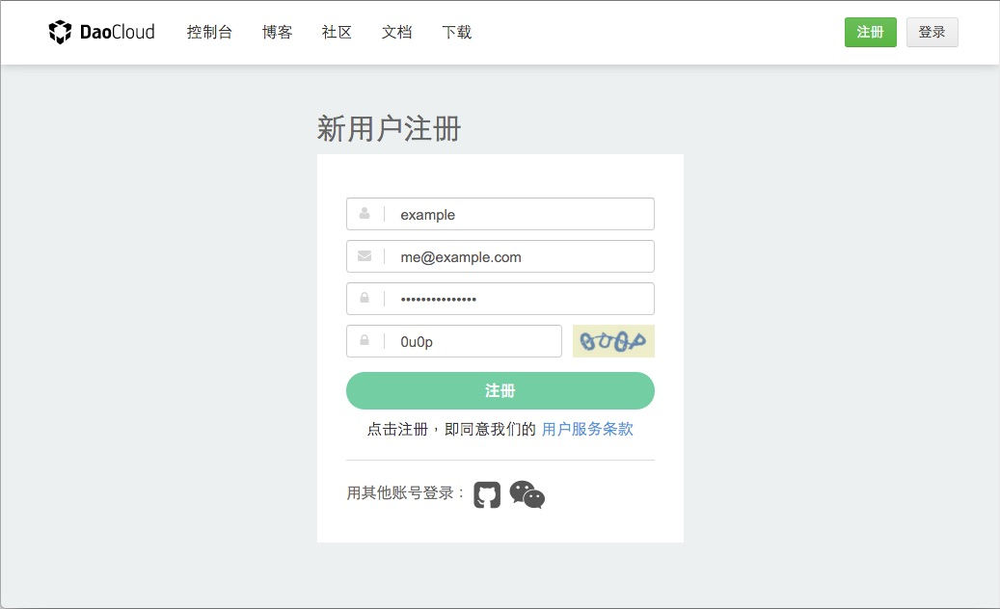
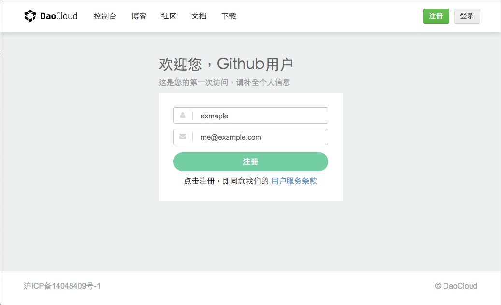
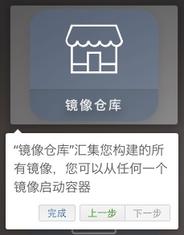

<!-- TODO

本文的结构

1. 使用邮箱注册
2. 使用 Github 账号注册（如 Github 账户已在其他 daocloud id 下绑定代码源，需先解除绑定，才能用作新账户注册）
3. 使用微信注册（微信注册后需要输入用户名，并且建议用户立即绑定邮箱）
4. 注册完成后收到的邮件提醒
5. 用户使用 DaoCloud 的准备工作（代码仓库账号等）

-->

<!-- 修改建议,2015.11.11

增加 「5. 用户使用 DaoCloud 的准备工作（代码仓库账号等）」这一段，可以放在最后，提醒用户准备好代码仓库的账号。

所有的“”都使用「」，这个在我们的文档规范中有提到。

这句「或使用您的公司电子邮箱以注册 DaoCloud 的组织账号」有歧义，应该表达的意思是「用公司邮箱注册 DaoCloud 账号，然后创建组织邀请同事协作开发」。组织账号是在完成个人账号之后再创建的，无法直接注册组织账号。

「我们登陆 DaoCloud 的首页，在页面的中央，我们可以使用我们的电子邮箱，注册我们的 DaoCloud 账号」，这句话出现了四个「我们」，建议尽量精简。

用户首次登录平台，会出现遮罩式引导界面，和右侧道客船长的欢迎页面，建议增加这一段的截图和简单介绍。
Email 注册 DaoCloud 平台后，也可以提醒用户到用户中心手工验证 Email 地址。

GitHub 和微信注册的描述文字之后，增加一句如何使用 GitHub 和微信登录 DaoCloud

-->

--- 

## DaoCloud 账号的注册

感谢您对 DaoCloud 的关注和支持，本文将带您一步一步地加入到 DaoCloud 的大家庭中。希望您能通过 DaoCloud 快速地学习并灵活使用 Docker 进行项目代码的开发、测试和部署。

在使用 DaoCloud 的优质服务之前，您需要先注册一个属于您或您的团队的 DaoCloud 账号。DaoCloud 十分重视用户体验的简易性和灵活性，所以我们提供了数种账号注册方式：通过电子邮箱注册、通过 GitHub 账号注册和通过微信账号注册。

接下来，我们将向您介绍这几种注册方式的详细流程，您可以从中选择一种或多种方便您的方式，开始 DaoCloud 的使用之旅。

### 使用电子邮箱注册 DaoCloud

你可以通过您的个人电子邮箱以注册 DaoCloud 的个人账号，用公司邮箱注册 DaoCloud 账号，然后创建组织并邀请同事进行协作开发。

首先，我们登陆 [DaoCloud 的首页](http://daocloud.io)，在页面的中央，可以使用我们的电子邮箱，注册 DaoCloud 账号。此处假设使用 me@example.com 作为账号邮箱。

点击「加入」，浏览器便会跳转到注册页面中，这里您需要根据您的实际情况进行填写**用户名**和**密码**，根据屏幕提示正确填写**验证码**后，我们便可以点击「注册」按钮以使用电子邮箱注册 DaoCloud 账号了。

注册完成后，浏览器会自动跳转到 DaoCloud 的账号后台。此时，我们需要到我们刚才使用的电子邮箱中查收来自 DaoCloud 的注册验证邮件。

点击邮件中的「立即验证邮箱」按钮或点击下方的超链接即可验证该邮箱所对应的 DaoCloud 账号。

---

### 使用 GitHub 账号注册 DaoCloud 账号

我们除了可以使用电子邮箱注册 DaoCloud 账号以外，我们还可以直接使用 GitHub 账号进行注册并直接将其绑定到 DaoCloud 中，以便在以后的 DaoCloud 功能使用上更为便捷。

同样的，我们登陆到 DaoCloud 的首页，在电子邮箱的填写处下方，有一个「用其他账号注册」的标示，其中第一个图标便是使用 GitHub 账号注册 DaoCloud 账号的入口。

点击这个按钮以后，浏览器会跳转到 GitHub 的应用授权页面上，我们可以在这里查看 DaoCloud 需要获取的权限。对应用信息确认无误后，您需要点击下方的「**Authorize application**」按钮，授权 DaoCloud 获取您的 GitHub 账号信息，完成授权以后便会自动回到 DaoCloud 的注册页面，您只需将您常用的（或指定的）电子邮箱填到页面相应的位置中，并点击「**注册**」按钮，便可完成 DaoCloud 账号的注册。

---

### 使用微信账号注册 DaoCloud 账号

DaoCloud 考虑到国内的用户需要，提供了使用微信账号直接注册 DaoCloud 账号的功能，以将其与您的 DaoCloud 账号绑定，增强 DaoCloud 账号的安全性和提高 DaoCloud 服务的使用体验。

在 DaoCloud 首页的「用其他账号注册」部份出，第二个按钮便是使用微信账号注册 DaoCloud 账号的入口。

点击后，便会跳转到微信二维码界面，您需要使用微信客户端的「扫一扫」功能对其进行扫描，便会看到 DaoCloud 的公众号页面，对其「关注」后，便可以在原本的页面中看到绑定成功的消息。

将您需要的用户名填写到页面中，点击「注册」按钮便可以完成 DaoCloud 账号的注册。

>>>>> 现在绑定微信账号，在原有资源基础上，您还可以额外获得一个 256M 的容器资源和一个 DaoCloud 服务实例。

>>>>> 为了 DaoCloud 服务的正常使用和您的 DaoCloud 账号安全，我们建议您在使用微信注册 DaoCloud 账号后，尽快将其与您的电子邮箱绑定，绑定方法将在「[用户账号设置](http://docs.daocloud.io/daocloud-account-setting/account-setting) 」中介绍。

### 完成 DaoCloud 账号的注册后

在您通过以上任意一种方式完成了 DaoCloud 账号的注册后，你便会跳转到 DaoCloud 的控制版面中，在第一次进入这个页面的时候，您会看到一个用于向您介绍 DaoCloud 基本功能的引导教程。

左边的是一个遮蔽层用于向您介绍「代码构建」和「镜像仓库」两个主要功能：

#### 代码构建

「代码构建」是用于从 GitHub、Bitbucket、Coding 和 GitCafe 等第三方 Git 平台拉取项目代码并进行 Docker 镜像构建的功能。

#### 镜像仓库

「镜像仓库」是一个包含您通过「代码构建」功能创建的 Docker 镜像、DaoCloud 官方提供的镜像和官方 DockerHub 提供的镜像的仓库，您可以通过它把各种 Docker 镜像部署到您套餐内包含的 DaoCloud 云平台或自有集群的主机上。

>>>>> 为了能得到更好的 DaoCloud 服务使用体验，我们推荐您将 GitHub 等第三方 Git 平台的账号与微信账号都与您的 DaoCloud 账号绑定，绑定方法将在「[用户账号设置](http://docs.daocloud.io/daocloud-account-setting/account-setting) 」文档中介绍。

<!--

#### 注册方式

使用邮箱注册
常规流程

使用 Github 账户注册
* OAuth

使用微信注册
* 我们鼓励您将您的 DaoCloud 账号与您的微信账号关联
* 您可以使用微信扫描二维码的方式进行登陆
* 您也可以通过微信获取运维消息推送，更方便地获得 DaoCloud 技术团队的支持
* 绑定微信账号，在原有资源基础上，您还可以额外获得
  + 两个项目
  + 一个 256 M 的容器资源
  + 一个服务实例

目前我们提供两种账号注册方式：

* 直接注册 DaoCloud 账号。
* 通过 GitHub 或微信等账号关联注册。

我们推荐您使用第二种方式进行注册。

### 绑定微信账号

＃### 用户使用 DaoCloud 的准备工作

* 您需要一个代码托管仓库的账号，如 Github、BitBucket、Coding 或 GitCafe
* 在项目根目录，预先写好一个 Dockerfile，了解使用 Docker 镜像方式打包软件项目的一些必要知识
* DaoCloud 提供持续集成功能，您可以通过编写 CI 配置文件的方式使用 DaoCloud 持续集成

-->