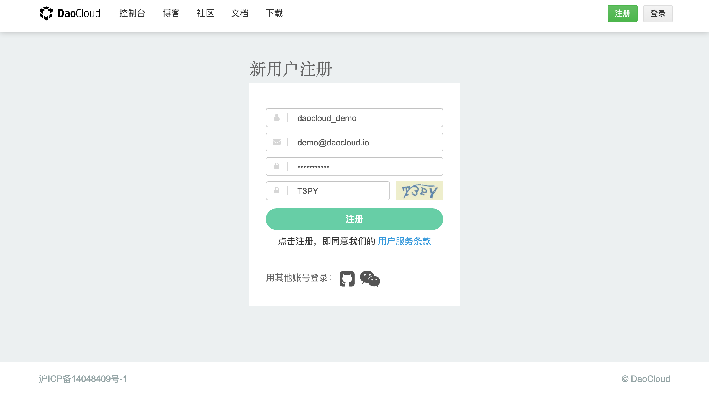
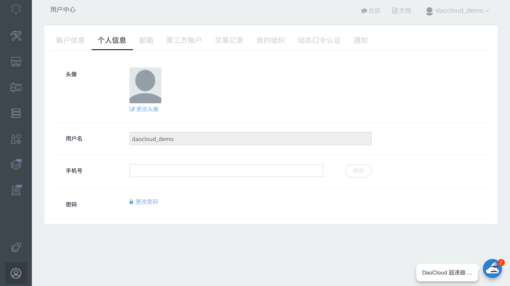
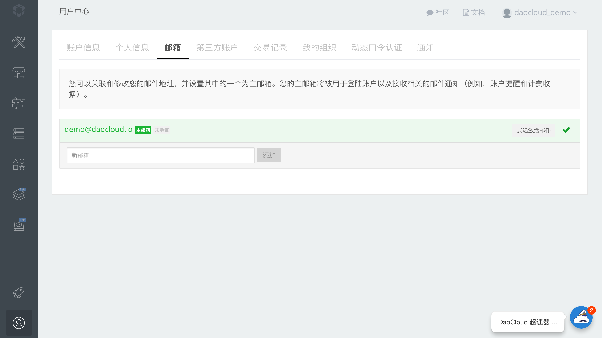

## DaoCloud 账号的注册

<!-- FIXME: 在哪里注册？ -->

#### 注册方式

使用邮箱注册
常规流程

使用 Github 账户注册
* OAuth

使用微信注册
* 我们鼓励您将您的 DaoCloud 账号与您的微信账号关联
* 您可以使用微信扫描二维码的方式进行登陆
* 您也可以通过微信获取运维消息推送，更方便地获得 DaoCloud 技术团队的支持
* 绑定微信账号，在原有资源基础上，您还可以额外获得
  + 两个项目
  + 一个 256 M 的容器资源
  + 一个服务实例

目前我们提供两种账号注册方式：

* 直接注册 DaoCloud 账号。
* 通过 GitHub 或微信等账号关联注册。

我们推荐您使用第二种方式进行注册。

### 绑定微信账号

<!-- TODO: 章节需要移动 -->

＃### 用户使用 DaoCloud 的准备工作

* 您需要一个代码托管仓库的账号，如 Github、BitBucket、Coding 或 GitCafe
* 在项目根目录，预先写好一个 Dockerfile，了解使用 Docker 镜像方式打包软件项目的一些必要知识
* DaoCloud 提供持续集成功能，您可以通过编写 CI 配置文件的方式使用 DaoCloud 持续集成

