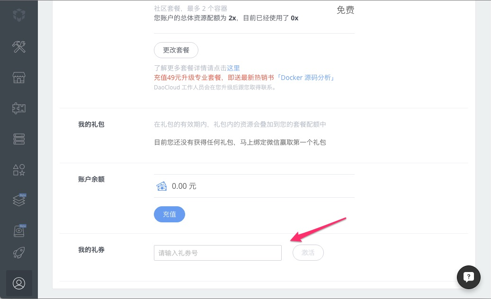
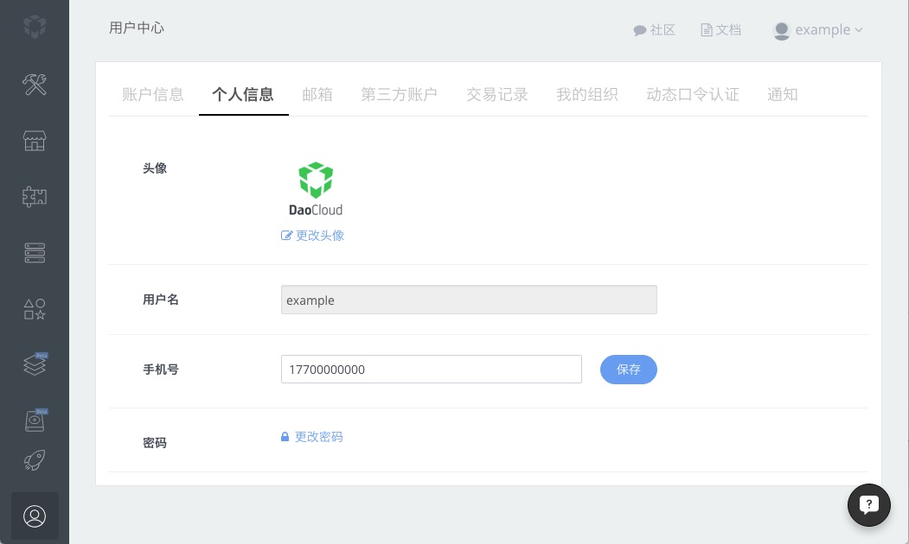
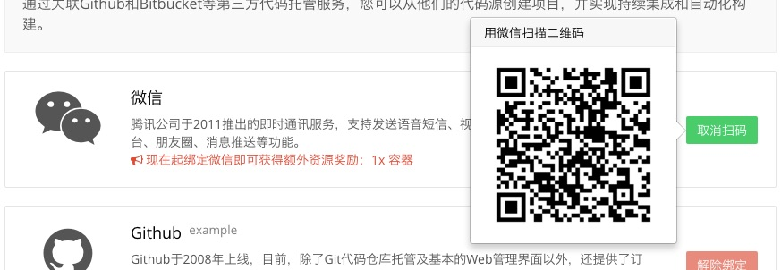

<!-- reviewed by fiona -->

在完成了 DaoCloud 账号的注册后，您大可不必着急使用 DaoCloud 所提供的服务，而是可以先对您的 DaoCloud 账号进行一些必要的了解和设置。

### 账号信息

在个人设置页面中，第一个标签页便是账号的基本信息设置页面。在这个页面中，您可以查看并更改账号当前使用的套餐。

一个新注册的账号默认使用的是免费套餐，DaoCloud 云资源的配额为 **2x**。

<!-- 需要解析云资源的配额 -->

您也可以根据实际需要随时更改账号的套餐，如专业套餐（8x、16x和64x）和企业套餐（128x、256x和512x）。

若您要在 DaoCloud 上部署大型 Docker 容器集群，可以选择企业套餐中的 512x 集群。DaoCloud 提供非常便捷的账户余额充值方式，提供支付宝、微信和银行转账的付款方式（详细请浏览「[DaoCloud 的收费方案](http://docs.daocloud.io/pricing-plan)」），方便个人用户和企业用户体验更优质的 DaoCloud 服务。

如果您在各种渠道获得了 DaoCloud 发放的礼券，可以在这个页面的下方「我的礼券」栏目中将其兑换到 DaoCloud 账户中。

### 个人信息

在这个页面中，您可以对 DaoCloud 账号的基本信息进行查看和修改，如上传头像、设置手机号和更改密码等。

>>> 我们强烈建议您提供一个可以联系到您的手机号码，这样便于团队推送平台更新消息，或其他重要的信息。我们将确保您的个人信息不会泄露。

如果您需要更改密码，请点击「更改密码」，然后按提示输入**原密码**和**新密码**，并点击「保存」即可。

### 邮箱

DaoCloud 的用户系统允许您将多个电子邮箱绑定到同一个 DaoCloud 账号上，以发挥不同的用途。在这个「邮箱」标签页中，您可以关联和修改您的邮件地址，并设置其中的一个为主邮箱。您的主邮箱将被用于登录账号以及接收相关的邮件通知（例如，账号提醒和计费收据）。

如果您需要将其他电子邮箱与您的 DaoCloud 账号绑定，您可以将新的电子邮箱地址填写到「新邮件...」输入框中，并点击「添加」按钮。DaoCloud 会向新的电子邮箱中发送一封验证邮件，按照提示将新的电子邮箱验证即可。

### 第三方账号

DaoCloud 为了追求更优质的服务体验，提供了[**微信**](http://weixin.qq.com)、[**GitHub**](https://github.com)、[**Bitbucket**](https://bitbucket.org/)、[**Coding**](https://coding.net/) 和 [**GitCafe**](https://gitcafe.com) 等第三方网站的账号绑定功能。

#### 绑定微信账号

微信账号是登陆 DaoCloud 的方式之一。绑定微信账号后，DaoCloud 能为您提供更方便的服务，如微信安全登陆、代码构建状态变更等通知的推送等。

若需要将您的微信账号绑定到您的 DaoCloud 账号上，你需要点击「微信」栏目上的「绑定账户」按钮，页面上会弹出一个二维码，使用微信客户端的「扫一扫」功能进行扫描，会看到 DaoCloud 的微信公众号，对其添加关注后，即可将您的微信账号与 DaoCloud 账号绑定在一起。

#### 绑定 GitHub 账号

DaoCloud 为用户提供 Docker 镜像构建服务「代码构建」，其中需要将需要构建的项目代码上传到 GitHub 等第三方托管服务上，才能将其拉取到 DaoCloud 的构建服务中。

如要将您的 DaoCloud 账号与 GitHub 账号绑定，则需要点击 **GitHub** 栏目的「绑定账户」按钮，浏览器会跳转到 GitHub 的应用授权页面。

我们可以在这里查看 DaoCloud 需要获取的权限。核对应用信息，确认无误后，您需要点击下方的「**Authorize application**」按钮，授权 DaoCloud 获取您的 GitHub 账号信息，即可将 GitHub 账号绑定到您的 DaoCloud 账号上。

>>>>> 每一个 GitHub 账号只能与一个 DaoCloud 账号进行绑定。

>>>>> 因为 Bitbucket、Coding 和 GitCafe 等平台的账号绑定流程与 GitHub 类似，故此处不再赘述。

### 交易记录

若您在 DaoCloud 上进行了充值或使用了礼券，那么就会在这里看到所有的记录。

>>>>> 更详细的 DaoCloud 收费、发票方案请浏览「[DaoCloud 的收费方案](http://docs.daocloud.io/pricing-plan)」

### 我的组织

这个页面包含了您的 DaoCloud 账号所加入的组织，如团队或开源社区等。

如要创建一个组织，您需要点击「创建组织」按钮，页面会跳转到创建组织的页面。

>>>>> 组织功能的详细使用方法将在「[组织的概念和用法](http://docs.daocloud.io/daocloud-account-setting/daocloud-org)」中阐述，此处不进行详细介绍。

### 动态口令认证

「动态口令认证」是 DaoCloud 提供的一个用于增强 DaoCloud 账号安全性的功能，它需要将您的 DaoCloud 账号与微信账号进行绑定。

关于「动态口令认证」的更详细内容请查看「[动态口令认证](http://docs.daocloud.io/daocloud-account-setting/two-factor-auth)」。

### 通知

在 DaoCloud 所提供的「镜像构建」功能中，由于 Docker 镜像的构建和持续集成会以异步的形式返回结果，所以 DaoCloud 会以**通知**的形式向您推送，其中推送的方式有电子邮件和微信消息两种方式。

对于一些较为复杂的 Docker 镜像，构建用时可能会比较长，为了能顺利完成接下来的工作，我们建议您尽快完成 DaoCloud 主电子邮箱账号的验证，并将微信账号与 DaoCloud 账号绑定。

>>>>> 另外，为了更好地为开发者提供优质的服务，DaoCloud 也将微信作为我们的客服渠道之一。所以再次建议您尽快将微信账号与 DaoCloud 账号进行绑定。