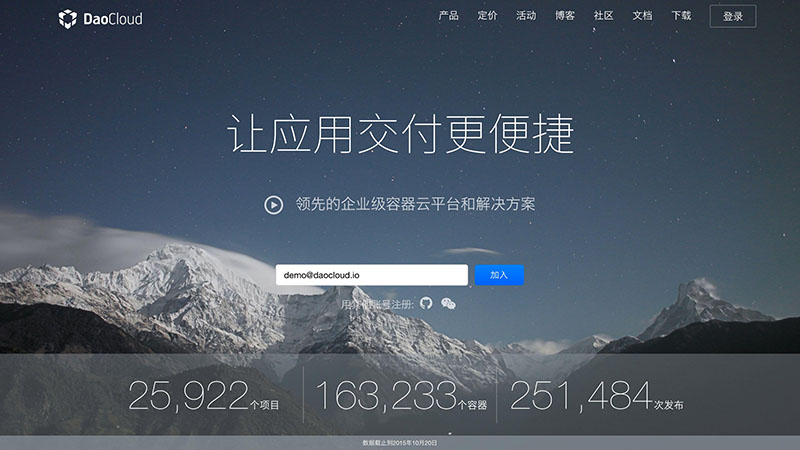

<!-- TODO

本文的结构，以此介绍每一个用户中心的 Tab 页的功能，和注意事项

1. 账户信息
2. 个人信息
3. 邮箱
4. 第三方账户（强调绑定微信总资源，GitHub、等代码仓库可以留到后续章节详细介绍）
5. 交易记录（你需要在自己的主账号充值，可以使用的代金券我稍后提供给你）
6. 我的组织（后面单独文章详细介绍，这里简单提一句即可）
7. 动态口令认证（为了安全，后文详细介绍）
8. 通知（再次推荐用户绑定微信和验证邮箱）

-->
---

在完成了 DaoCloud 账号的注册后，你大可不著急使用 DaoCloud 所提供的服务，而是可以先对您的 DaoCloud 账号进行一些必要了解和设置。

### 账户信息

在个人设置页面中，第一个标签页便是账户的基本信息设置页面。在这个页面中，你可以对账户当前使用套餐进行查看和更改。

一个新注册的账号默认使用的是免费套餐，DaoCloud 云资源的配额为 **2x**。

<!-- 需要解析云资源的配额 -->

你也可以根据实际需要随时更改账号的套餐，如专业套餐（8x、16x和64x）和企业套餐（128x、256x和512x）。

若你要在 DaoCloud 上部署大型 Docker 容器集群，可以选择企业套餐中的 512x 集群。DaoCloud 提供非常便捷的账户余额充值方式，提供支付宝、微信和银行转账的付款方式（详细请浏览「[DaoCloud 的收费方案](http://docs.daocloud.io/pricing-plan)」），方便个人用户和企业用户体验更优质的 DaoCloud 服务。

如果你在各种渠道获得了 DaoCloud 发放的礼券，便可以在这个页面的下方「我的礼券」栏目中将其使用到 DaoCloud 账户中。

### 个人信息

在这个页面中，你可以对 DaoCloud 账号的基本信息进行查看和修改，如上传头像、设置手机号和更改密码等。

如果您需要更改密码，请点击「更改密码」，然后按提示输入**原密码**和**新密码**，并点击「保存」即可。

### 邮箱

DaoCloud 的用户系统允许您将多个电子邮箱绑定到同一个 DaoCloud 账号上，以发挥不同的用途。在这个「邮箱」标签页中，您可以关联和修改您的邮件地址，并设置其中的一个为主邮箱。您的主邮箱将被用于登陆账户以及接收相关的邮件通知（例如，账户提醒和计费收据）。

如果您需要将其他电子邮箱与您的 DaoCloud 账号绑定，您可以将新的电子邮箱地址填写到「新邮件...」输入框中，并点击「添加」按钮。DaoCloud 会向新的电子邮箱中发送一封验证邮件，按照提示将新的电子邮箱验证即可。

### 第三方账户

DaoCloud 为了提供更优质的用户服务，提供了[**微信**](http://weixin.qq.com)、[**GitHub**](https://github.com)、[**Bitbucket**](https://bitbucket.org/)、[**Coding**](https://coding.net/) 和 [**GitCafe**](https://gitcafe.com) 等第三方网站的账户绑定功能。

#### 绑定微信账号

微信账号是登陆 DaoCloud 的方式之一，绑定微信账号后，DaoCloud 能为您提供更方便的服务，如微信安全登陆、代码构建状态变更等通知的推送等。

若需要将您的微信账号绑定到您的 DaoCloud 账号上，你需要点击「微信」栏目上的「绑定账户」按钮，页面上会弹出一个二维码，用微信客户端的「扫一扫」功能进行扫描，会看到 DaoCloud 的微信公众号，对其添加关注后，即可将您的微信账号跟 DaoCloud 账号绑定在一起。

#### 绑定 GitHub 账号

DaoCloud 为用户提供 Docker 镜像构建服务「代码构建」，其中需要将需要构建的项目代码上传到 GitHub 等第三方托管服务上，才能将其拉取到 DaoCloud 的构建服务中。

如要将您的 DaoCloud 账号与 GitHub 账号绑定，则需要点击 **GitHub** 栏目的「绑定账户」按钮，浏览器会跳转到 GitHub 的应用授权页面。

我们可以在这里查看 DaoCloud 需要获取的权限。对应用信息确认无误后，您需要点击下方的「**Authorize application**」按钮，授权 DaoCloud 获取您的 GitHub 账号信息，即可将 GitHub 账号绑定到您的 DaoCloud 账号上。

>>>>> 每一个 GitHub 账号只能与一个 DaoCloud 账号进行绑定。

>>>>> 因为 Bitbucket、Coding 和 GitCafe 等平台的账号绑定流程与 GitHub 类似，故此处不再详细介绍。

### 交易记录

若您在 DaoCloud 上进行了充值或使用了礼券，那么就会在这里看到所有的记录。

>>>>> 更详细的 DaoCloud 收费、发票方案请浏览「[DaoCloud 的收费方案](http://docs.daocloud.io/pricing-plan)」

### 我的组织

这个页面包含了您的 DaoCloud 账号所加入的组织，如团队或开源社区等。

如要创建一个组织，您需要点击「创建组织」按钮，页面会跳转到创建组织的页面。

>>>>> 组织功能的详细使用方法将在「[组织的概念和用法](http://docs.daocloud.io/daocloud-account-setting/daocloud-org)」中阐述，此处不会详细介绍。

### 动态口令认证

「动态口令认证」是 DaoCloud 提供的一个用于增强 DaoCloud 账号安全性的功能，它需要你将你的 DaoCloud 账号与微信账号进行绑定。

关于「动态口令认证」的更详细内容请查看「[动态口令认证](http://docs.daocloud.io/daocloud-account-setting/two-factor-auth)」。

### 通知

在 DaoCloud 所提供的「镜像构建」功能中，由于 Docker 镜像的构建和持续集成会以异步的返回的形式返回结果，所以 DaoCloud 会以**通知**的形式向你推送，其中推送的方式有电子邮件和微信消息两种方式。

对于一些较为复杂的 Docker 镜像，构建用时可能会比较长，为了能尽快完成接下来的工作，我们建议你尽快完成 DaoCloud 主电子邮箱账号的验证并将微信账号与 DaoCloud 账号绑定。

>>>>> 另外，为了更好地为开发者提供优质的服务，DaoCloud 也将微信作为我们的客服渠道之一。所以再次建议你尽快地将微信账号与 DaoCloud 账号进行绑定。

<!--
### 账户信息

TODO: 术语表：个人账户、组织账户、配额

DaoCloud 提供了两种管理账户的方式，一种为个人账户，另一种为组织账户。

[用户中心](user.md)提供了当前用户的个人账户信息而[组织中心](organization.md)则提供了当前用户所选择组织的账户信息。

「用户中心」中的账户信息：

「组织中心」中的账户信息：

#### 账户余额

账户余额在「用户中心」和「组织中心」中分别显示了当前用户和所选择组织的账户余额。

> 提示：关于充值支付的细节请参考[账户充值](payment.md)。

> 注意：个人账户与组织账户的余额是完全独立的，也就是说个人账户的余额无法给组织使用，反之亦然。

#### 账户配额

接下来的列表在「用户中心」和「组织中心」中分别显示了当前用户和所选择组织的配额与使用情况。

> 注意：个人账户与组织账户的配额也是完全独立的，也就是说扩充个人账户的配额并无法增加组织的配额，反之亦然。

### 账户充值

DaoCloud 为个人和组织分别提供一个小配额的套餐以供试用，如果需要切换到更大配额的套餐，请先为账户充值。

#### 充值

充值前，先切换到要充值的个人或组织账号。

接下来在「用户中心」或「组织中心」内选中「账户信息」选项卡。

点击「充值」按钮后，可以输入要充值的金额并使用微信支付或支付宝进行二维码扫码充值。

在微信或支付宝确认支付后，将成功充值。

> 注意：个人账户与组织账户的余额和配额是完全独立的，所以请在充值前**务必**确认充值到的账户，充值后将无法将余额转移到其他账户。

#### 交易记录

想要查询交易的历史记录或者给等待付款的订单付款，请在「用户中心」或「组织中心」内选中「交易记录」选项卡。

在这里，您可以检视历史订单的金额和状态。

> 提示：如果在充值时没有成功，订单会在交易记录中显示「等待付款」。等待付款的订单将在一天后过期，如果还需充值，请重新执行充值操作。

### 用户中心

用户中心提供了 DaoCloud 中个人账户的信息管理、邮箱管理、第三方服务和计费等服务。

「[账户信息](account.md)」选项卡中的内容已经在之前的章节介绍过，在这里不再赘述。

同时「交易记录」选项卡中的内容将在[账户充值](payment.md)中详细介绍。

#### 个人信息

在这里，您可以更改当前用户的头像、手机号和密码。

#### 邮箱

在这里，您可以添加邮箱并设置主邮箱。

#### 第三方账户

DaoCloud 目前支持 GitHub、Bitbucket、Coding、GitCafe 等国内外代码托管库。

> 注意：每个代码库的账号只能关联唯一的用户账户。

> 提示：为了更好地服务开发者，我们使用微信作为客服渠道之一。如果您将微信账号与自己的 DaoCloud 账号绑定，我们即赠送两个项目、一个容器实例和一个服务实例。

-->
