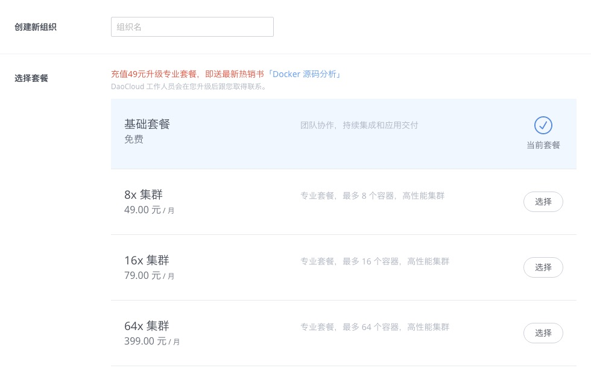
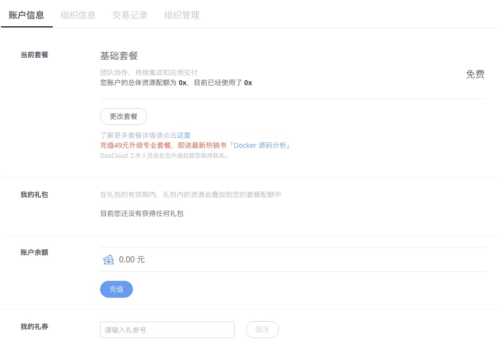
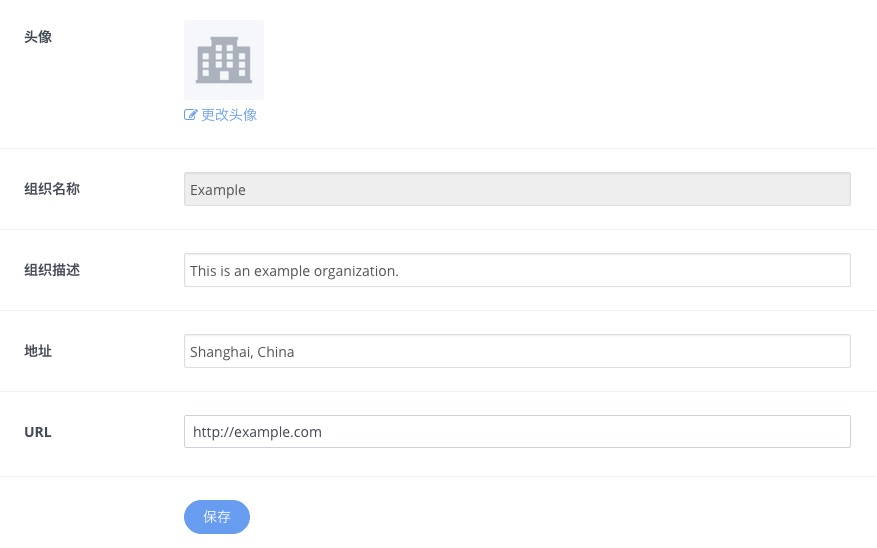
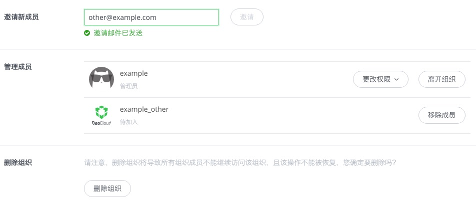

<!-- reviewed by fiona -->

为了便于对 Docker 集群和容器进行管理，DaoCloud 为团队提供了多人协作运营和开发的功能。您可以为您所在的团队或公司创建一个 DaoCloud 组织，并邀请团队成员进入组织中，一同管理属于组织的 Docker 集群、应用和容器。

### 创建组织

#### 第一步

若需要创建一个 DaoCloud 组织，您需要先使用需要作为管理员的账号登录到 DaoCloud 上，然后任意页面的右上角下拉菜单中找到「创建组织」按钮。您也可以在「账号信息」页面中选择「我的组织」选项卡，并点击「创建组织」按钮。

#### 第二步

页面会跳转到创建新组织的界面，在此界面中，您需要填写新组织的名称，选择所要使用的套餐。

>>>> 组织名称只能包含英文数字、下划线 `_`、小数点 `.`、和减号 `-`，并且不能与现有组织重名。请谨慎确定组织名称，组织名称一旦创建将无法再更改。

#### 第三步

创建新的组织需要选择选择组织所使用的套餐，请根据团队的实际需求选择套餐。

最后，点击「创建组织」按钮便可以创建一个新的组织。

### 组织管理

通过点击右上角的所属组织的名称，即可进入该组织的管理界面。

>>> DaoCloud 控制台可以在个人用户状态和组织状态下切换。请务必清楚您当前所处的状态，特别是在进行关联项目、充值等重要操作之前，请务必检查。

#### 账号信息

这个页面与个人账号的管理页面相似，可以对组织账号进行套餐的更改和充值等。

套餐更改和向账号充值的方法与个人用户相同，此处不再重复介绍。

#### 组织信息

创建了新的组织后，你需要对新组织的基本信息进行更改。在「组织信息」标签页中，管理员可以对组织的头像、组织描述、地址和网址等信息进行查看和修改。

#### 组织管理

在「组织管理」页面中，你可以进行组织的成员邀请、权限变更或者删除组织等操作。

>>>>> 在发送新成员邀请后，新成员可以使用现有账号加入组织，也可以注册新账号加入组织。

>>>>> 最后一位管理员无法更改自己的权限或离开组织。

>>>> 要想删除组织，请先删除所有的项目、应用、服务实例和自有主机，再删除组织。组织在删除后**无法重新创建同名组织**，并且**组织的余额将作废**。

### 邀请用户

创建了属于你团队的组织账号后，就可以将团队的成员们都邀请加入到这个组织中，一同管理属于这个组织的 Docker 集群、镜像、应用和容器。

#### 第一步

确认被邀请人已经注册了 DaoCloud 账号，并绑定邮箱。

>>>>> DaoCloud 个人账号的注册方法请参照「[注册流程和注意事项](http://docs.daocloud.io/daocloud-account-setting/how-to-register-to-daocloud)」

打开「组织管理」页面，将受邀伙伴的邮箱填写到「邀请新成员」的输入框中，并点击「邀请」按钮。

#### 第二步

DaoCloud 会向被邀请人发送一封**邀请邮件**，被邀请人点击邮件中的「立刻加入」按钮，即可加入到相应的组织中。

