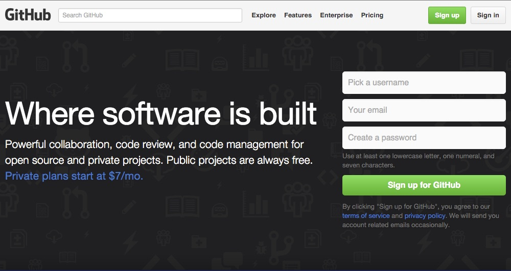
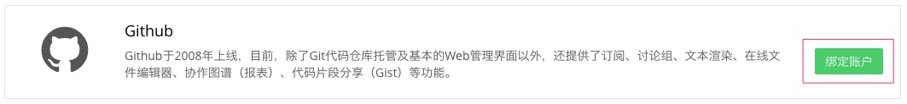
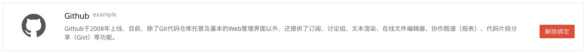
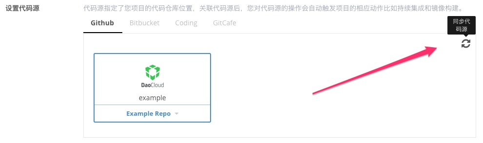

<!-- reviewed by fiona -->

<!--
GitHub 简介，用官网文字，或者Wiki、百科等。

GitHub 绑定的过程

提醒：绑定后本地有缓存，如果 GitHub 端增加了新的项目，但是 DaoCloud 没有现实，需要刷新代码源，具体作法是点击GitHub 项目现实框右上角的刷新按钮，其他代码源同样，也都要讲这个刷新功能。

写到绑定完成即可，后续开始构建的操作设置，可以留一个链接到下一章节，这里不必展开。其他代码源同样。

DaoCloud GitHub 公有仓库提供了大量的开发示例代码，帮助用户快速上手，鼓励用户 Fork 这些项目。最后做一个链接，到写给开发者的例子这篇文章。

-->

---

### 什么是 GitHub

GitHub 是全球范围内使用最广泛的第三方代码托管平台，它以版本管理软件 Git 作为基础，提供各种方便工程师、设计师、产品经理的功能，许多团队都直接使用 GitHub 作为代码的管理平台。

### 绑定 GitHub 账号与 DaoCloud 账号

如果要将托管在 GitHub 上的代码库做为 Docker 镜像的构建源，就需要先将 DaoCloud 账户与您的 GitHub 进行绑定。

>>> 请注意，您用于绑定项目的 GitHub 帐号，必须拥有对代码仓库的 Full Admin 权限， 这样才能够完成授权和写入 Access Token。BitBucket、Coding、GitCafe 也有同样的需求，在此一并强调，后文不再赘述。

#### 第一步

在任意页面的右上角点击「账号信息」，并在新的页面中进入「第三方账号」标签页。

如果您发现的 DaoCloud 账号并没有与 GitHub 账号进行绑定，那么请进行下一步操作。

#### 第二步

点击 GitHub 栏目中的「绑定账号」按钮。

浏览器会自动跳转到 GitHub 的授权请求页面，您只需要点击「**Authorize application**」按钮，授权 DaoCloud 访问您的 GitHub 账号即可。

#### 第三步

授权了 GitHub 应用后，DaoCloud 将会自动完成与您的 GitHub 账号的绑定。

>>>>> DaoCloud 为了更好地为您提供服务，会在认证请求中申请浏览私有库的权限。

### 拉取 GitHub 账号中的代码库列表

当完成与 GitHub 账号的绑定后，DaoCloud 会从 GitHub 拉取您的代码库列表，并缓存起来。

如果您在 GitHub 上新建了新的代码库，则需要在 DaoCloud 的「创建新项目」页面中刷新缓存。

### 参考代码库

DaoCloud 在 GitHub 上提供了大量的开发示例代码，您可以快速上手体验 Docker 和 DaoCloud，欢迎 Fork 这些示例代码。[DaoCloud GitHub](https://github.com/daocloud)