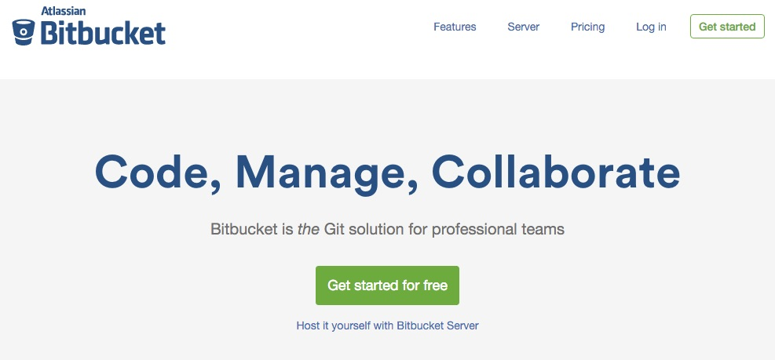
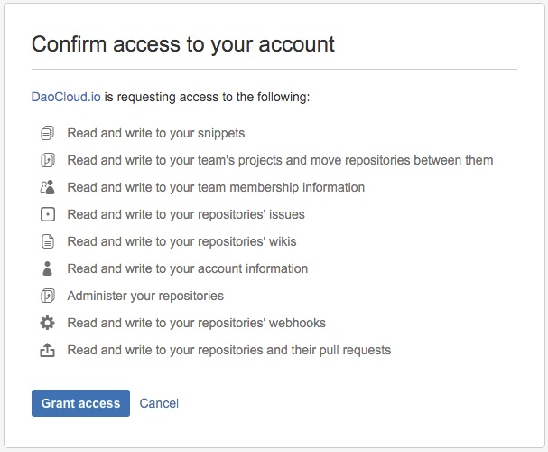

<!-- 
BitBucket 的简单介绍

BitBucket 绑定流程的介绍和截图
DaoCloud GitHub 公有仓库提供了大量的开发示例代码，帮助用户快速上手，鼓励用户 Fork 这些项目。最后做一个链接，到写给开发者的例子这篇文章。
-->

---

### 什么是 Bitbucket

Bitbucket 与 GitHub 在代码管理上的功能相似，是除 GitHub 以外又一大第三方代码托管平台之一。

### 绑定 Bitbucket 账号与 DaoCloud 账号

如果要将托管在 GitHub 上的代码库做为 Docker 镜像的构建源，就需要先将 DaoCloud 账户与您的 Bitbucket 进行绑定。

#### 第一步

在任意页面的右上角点击「账户信息」，并在新的页面中进入「第三方账户」标签页。

如果您发现的 DaoCloud 账户并没有与 Bitbucket 账户进行绑定，那么请进行下一步操作。

#### 第二步

点击 Bitbucket 栏目中的「绑定账户」按钮。

浏览器会自动跳转到 Bitbucket 的授权请求页面，您只需要点击「**Grant access**」按钮，授权 DaoCloud 访问您的 Bitbucket 账号即可。

#### 第三步

授权了 Bitbucket 应用后，DaoCloud 会自动完成与您的 Bitbucket 账户的绑定。

>>>>> DaoCloud 为了更好地为您提供服务，会在认证请求中申请浏览私有库的权限。

### 拉取 Bitbucket 账号中的代码库列表

当完成与 Bitbucket 账号绑定后，DaoCloud 会从 Bitbucket 拉取您的代码库列表，并缓存起来。

与 GitHub 一样，如果您在 Bitbucket 上新建了新的代码库，则需要刷新 DaoCloud 中的缓存。