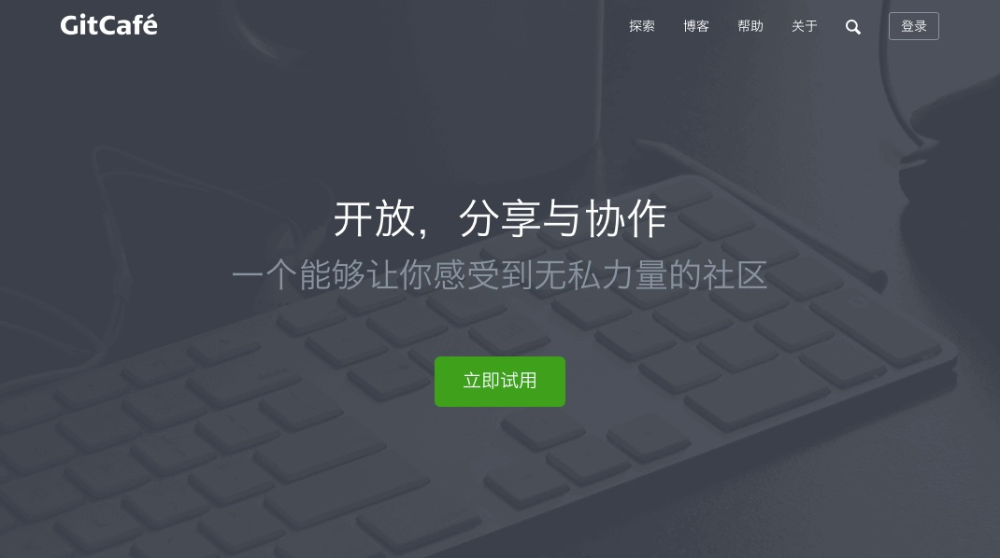
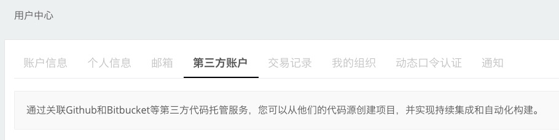
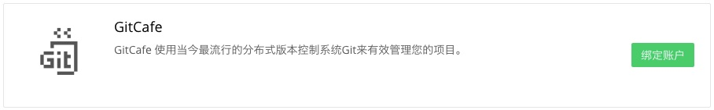
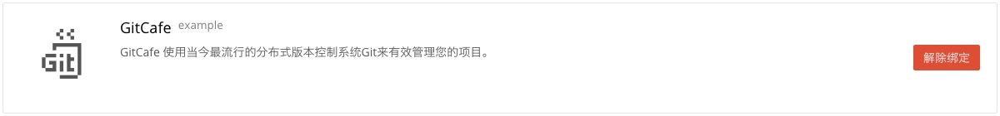

<!-- reviewed by fiona -->

<!-- 
GitCafe 的简单介绍

GitCafe 绑定流程的介绍和截图
DaoCloud GitHub 公有仓库提供了大量的开发示例代码，帮助用户快速上手，鼓励用户 Fork 这些项目。最后做一个链接，到写给开发者的例子这篇文章。
-->

---

### GitCafe

GitCafe 是一个由国人建立的类似于 GitHub 的第三方代码托管平台。

### 绑定 GitCafe 账号与 DaoCloud 账号

若需要将托管在 GitCafe 上的代码库做为 Docker 镜像的构建源，就需要先将 DaoCloud 账号与您的 GitCafe 账号进行绑定。

#### 第一步

在任意页面的右上角点击「账号信息」，并在新的页面中进入「第三方账号」标签页。

#### 第二步

点击 GitCafe 栏目中的「绑定账户」按钮。

浏览器会自动跳转到 GitCafe 的授权请求页面，您只需要点击「**授权**」按钮，授权 DaoCloud 访问您的 GitCafe 账号即可。

#### 第三步

授权了 GitCafe 应用后，DaoCloud 将会自动完成与您的 GitCafe 账号的绑定。

>>>>> DaoCloud 为了更好地为您提供服务，会在认证请求中申请浏览私有库的权限。