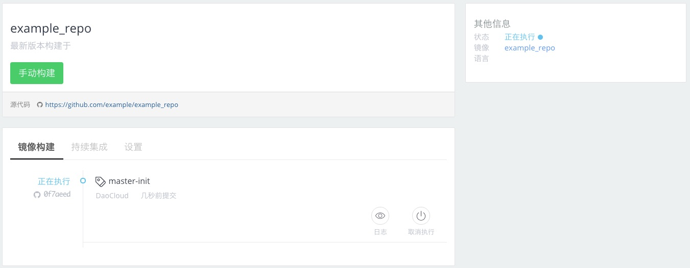
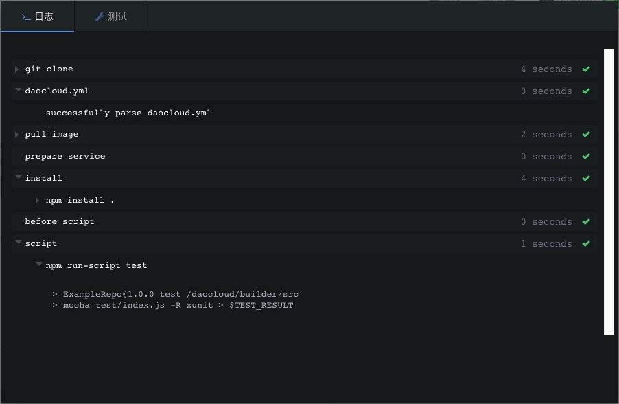

<!-- reviewed by fiona -->

<!--

完整的 CI 流程
daocloud.yml（细节在后面的daocloud.yml单独讲）
触发的方式 
	git commit
    手工重新执行
    触发配置界面
ci 的 log 窗口
邮件提醒

CI的作用：
1.提供自动化测试的基础设施
2.提供代码进行自动化测试所需要的运行时环境和各类数据服务能力
3.执行指定的自动化测试脚本，并反馈测试结果

-->

<!--

完整的 build 流程
dockerfile
触发的方式：

	添加新项目时的首次init build（默认是 master 分支）
	git tag commit（所有分支都会触发）
    手动构建（可以选择代码分支，但是code是基于上次自动构建的 commit 版本）
    触发配置界面
build 的 log 窗口
邮件提醒

-->

---

完成了 DaoCloud 与第三方代码托管平台的绑定后，我们就可以从代码托管平台上拉取代码，并进行持续集成和镜像构建。

### 从 GitHub 拉取代码库并进行构建

在控制台点击「代码构建」，然后在「代码构建」的界面中点击「创建新项目」。

#### 第一步：填写项目名称

在「项目名称」上填写该项目的 Docker 镜像名称。


>>>>> 项目名称只能包含英文数字、下划线 `_`、小数点 `.`、和减号 `-`，并且不能与现有项目重名。

#### 第二步：选择代码库

成功从 GitHub 拉取了代码库列表后，我们就可以从中选择我们需要通过 DaoCloud 进行 Docker 镜像构建的代码库，并将其拉取到 DaoCloud，创建一个代码构建项目。


#### 第三步：开启持续集成

持续集成是增加代码质量并降低业务风险的最佳实践。 

若您需要为该镜像开启持续集成功能，则让「持续集成」栏目的切换按钮处于「已开启」状态（默认开启）。


#### 第四步：确认构建位置和 Dockerfile 路径

一般来说，一个 Docker 镜像都会单独使用一个代码库进行维护和管理；但同时也不排除存在需要深入到代码库的某个文件夹中进行镜像构建。DaoCloud 提供了灵活的应变方式。

比如您的一个代码库包含了您公司的所有运行环境类 Docker 镜像的构建代码，而您现在只需要对其中一个进行 Docker 镜像构建，那么只需要在「构建目录」处填写目标路径的相对位置。


Dockerfile 是 Docker 进行镜像构建时所使用基于的任务配置文件，默认情况下它都会处于构建目录的根位置中。当然，出于特殊情况的调整，Dockerfile 也可以处于别的位置。


#### 第五步：选择发布应用镜像的位置

应用镜像是打通应用开发和业务运维之间通路的关键交付件，也是应用统一发布的重要一环。 

为了方便您管理这一核心资产，应用构建成功后，系统会自动把应用镜像发布在 DaoCloud 镜像仓库（您的私有空间）中，同时也支持将应用镜像发布到第三方镜像仓库中。


#### 第六步：构建应用

完成所有信息的填写后，您就可以点击「开始创建」来从 GitHub 拉取代码库并交由 DaoCloud 创建其 Docker 镜像了。


点击了「开始创建」后，页面就会跳转到该项目的管理页面。



您可以从「master-init」这个构建版本的「日志」中看到这个该该项目的构建情况。


等待构建完成后，「master-init」版本的状态便会变成「执行成功」。此时，您的 Docker 镜像就已经被创建完成了，您可以点击「查看镜像」到 DaoCloud 的「镜像仓库」中查看该镜像。


#### 构建缓存

你可以开启「构建缓存」功能，以提高镜像构建的速度。开启缓存会把最近的一次构建过程缓存起来，从而获得更快的构建体验。如果需要使用一个干净的构建环境则可以关闭缓存。

如果要开启「构建缓存」功能，请在项目的「设置」页面中，将「构建缓存」功能设置为开启状态。


### 加入 `daocloud.yml` 以进行测试

DaoCloud 提供了完善健壮的持续集成功能，以为用户提供便捷的测试服务。

1. 提供自动化测试的基础设施。
2. 提供代码进行自动化测试所需要的运行时环境和各类数据服务能力。
3. 执行指定的自动化测试脚本，并反馈测试结果。

#### 开启「持续集成」功能

在你需要进行持续集成的项目中，点击「设置」标签页，将「持续集成」选项设置为开启状态。


#### 编写 `daocloud.yml`

按照 [`daocloud.yml` 的结构和写法](http://docs.daocloud.io/ci-image-build/daocloud-yml) 中的要求，将 `daocloud.yml` 编写好，并上传到代码平台上。从下一次上传开始，DaoCloud 便会对代码进行测试。

``` yaml
image: daocloud/ci-node:0.12
```

先引入测试的基本环节，此处我们使用 DaoCloud 提供的 Node.js 环境。

``` yaml
env:
    - PORT = 12345
```

设置环境变量。

``` yaml
install:
    - echo $MYENV
    - echo "This is an install segment"
    - echo "Here, we usually run scripts to setup a base environment"
    - echo "For customized base image, you need to install git here unless you have git installed in your base image"
    - echo "eg. npm install ."
    - npm install .

script:
    - echo "This is an script segment"
    - echo "Run test cases here"
    - echo ""
    - npm run-script test
```

编写好安装和测试代码。将其放在项目代码中的根目录位置，并上传到代码托管平台上。

#### 进入持续集成流程

将代码推送至代码托管平台后，DaoCloud 随即便会根据您所定义的 `daocloud.yml` 进行持续集成任务。





### 自动构建

当项目的测试通过后，你可以选择让其进行自动构建 Docker 镜像。

如果需要使用自动构建功能，则需要在项目的「设置」页面中，将「自动构建」选择设置为开启状态。


>>>>> 如果您的通知设置中开启了「持续集成」和「镜像构建」相关的通知，在完成测试或镜像构建后，会通过可用的方式向您推送消息。

### 使用 DaoCloud 构建镜像的优势

我们很容易注意到，在 DaoCloud 进行 Docker 镜像的构建比在本地电脑要快很多，这得益于我们在网络拓扑、镜像存取加速等方面所做的大量优化工作。这些优化节约了国内 IT 人士的宝贵时间，再也不用因为网络等原因在屏幕前苦苦等待 Docker 镜像的构建了。

此外 DaoCloud 可以根据在第三方代码托管平台上的设置，完成由规则触发的自动构建 Docker 镜像。目前，DaoCloud 根据推送新的标签来触发。如果推送了新的标签，DaoCloud 就认为这是一次发布需要自动构建镜像。我们也可以通过手工启动构建的方式来触发镜像的重新构建。