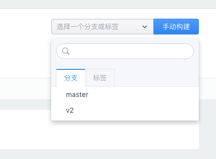
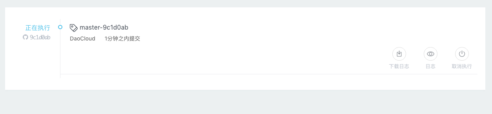
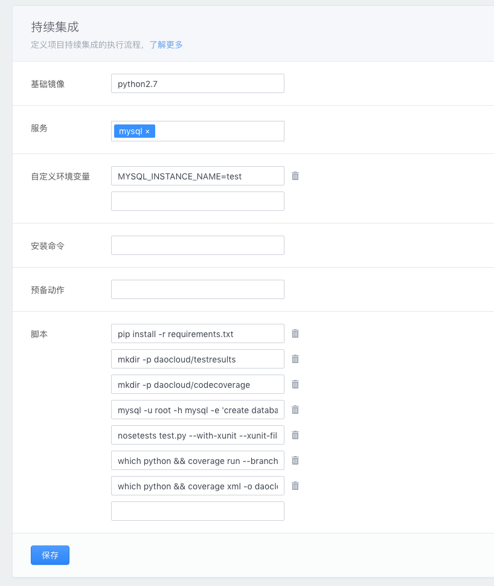
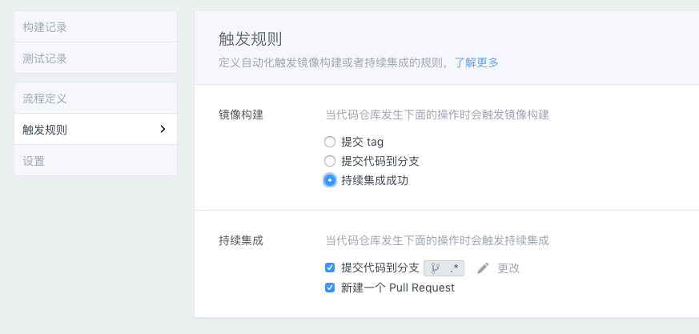
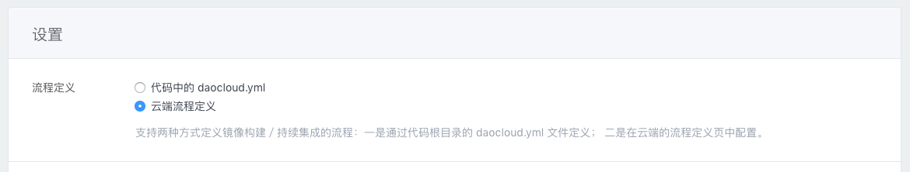
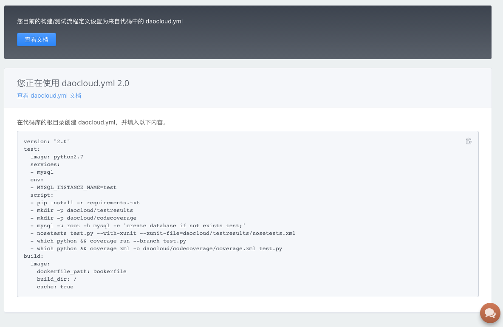

<!-- reviewed by fiona -->

<!--

完整的 CI 流程
daocloud.yml（细节在后面的daocloud.yml单独讲）
触发的方式 
	git commit
    手工重新执行
    触发配置界面
ci 的 log 窗口
邮件提醒

CI的作用：
1.提供自动化测试的基础设施
2.提供代码进行自动化测试所需要的运行时环境和各类数据服务能力
3.执行指定的自动化测试脚本，并反馈测试结果

-->

<!--

完整的 build 流程
dockerfile
触发的方式：

	添加新项目时的首次init build（默认是 master 分支）
	git tag commit（所有分支都会触发）
    手动构建（可以选择代码分支，但是code是基于上次自动构建的 commit 版本）
    触发配置界面
build 的 log 窗口
邮件提醒

-->

---

现在我们来试一试从代码托管平台上拉取代码，并进行镜像构建和持续集成。

### 创建新项目并构建镜像

在控制台点击「代码构建」，然后在「代码构建」的界面中点击「创建新项目」。

#### 第一步：填写项目名称

在「项目名称」上填写该项目的 Docker 镜像名称。

#### 第二步：选择代码库

从第三方代码托管平台中选择我们想要构建的代码库，如果找不到需要的代码库可以点击右上角刷新按钮同步列表。

#### 第三步：开启持续集成

持续集成是增加代码质量并降低业务风险的最佳实践。 

开启持续集成功能即可在代码变更时自动在 DaoCloud 上运行测试代码。

#### 第四步：确认构建位置和 Dockerfile 路径

点击「流程定义」可以看到若干选项，我们使用默认的「常规镜像」进行构建。

一般来说，Dockerfile 会放在代码库的根目录下，如果您的项目中 Dockerfile 放在其他路径或者采用其他名称，则需要确认构建路径和 Dockerfile 的填写是否正确。

#### 第五步：构建镜像

确认所有信息的填写后，您就可以选择代码分支并点击「手动构建」来执行构建镜像。

您可以从「日志」中看到该构建的执行情况。

等待构建完成后，状态便会变成「执行成功」。此时，您的 Docker 镜像就已经被创建完成了，您可以点击「查看镜像」到 DaoCloud 的「镜像仓库」中查看该镜像。

#### 构建缓存

你可以开启「构建缓存」功能，以提高镜像构建的速度。开启缓存会把最近的一次构建过程缓存起来，从而获得更快的构建体验。如果需要使用一个干净的构建环境则可以关闭缓存。

如果要开启「构建缓存」功能，请在项目的「流程定义」页面中，将「构建缓存」功能设置为开启状态。

### 进行持续集成

DaoCloud 提供了完善健壮的持续集成功能，以为用户提供便捷的测试服务。

1. 提供自动化测试的基础设施。
2. 提供代码进行自动化测试所需要的运行时环境和各类数据服务能力。
3. 执行指定的自动化测试脚本，并反馈测试结果。

#### 开启「持续集成」功能

在你需要进行持续集成的项目中，点击「设置」标签页，将「持续集成」选项设置为开启状态。

#### 「持续集成」流程定义

点击「流程定义」会发现多出了「持续集成」的选项。

关于服务的连接方式详见[配置测试服务](http://docs.daocloud.io/ci-image-build/daocloud-yml#-4)

#### 进入持续集成流程

将代码推送至代码托管平台后，DaoCloud 会根据您的设置进行持续集成任务。

### 测试完成后自动构建

当项目的测试通过后，可以自动构建 Docker 镜像。

如需使用该功能，在项目的「触发规则」页面中，将构建规则选择为持续集成成功时构建。

#### 使用代码库中的 `daocloud.yml`

`daocloud.yml`功能上与「流程定义」一致，使用后优先从代码库的`daocloud.yml`文件读取配置。

在「设置」中更改流程定义来源为代码中的 daocloud.yml。

点击「流程定义」会看到自动生成的`daocloud.yml`内容，将其保存至代码库根目录下的`daocloud.yml`文件中并上传到代码库。之后便会优先使用该文件的配置。

### 使用 DaoCloud 构建镜像的优势

我们很容易注意到，在 DaoCloud 进行 Docker 镜像的构建比在本地电脑要快很多，这得益于我们在网络拓扑、镜像存取加速等方面所做的大量优化工作。这些优化节约了国内 IT 人士的宝贵时间，再也不用因为网络等原因在屏幕前苦苦等待 Docker 镜像的构建了。

此外 DaoCloud 可以根据在第三方代码托管平台上的设置，完成由规则触发的自动构建 Docker 镜像。目前，DaoCloud 根据推送新的标签来触发。如果推送了新的标签，DaoCloud 就认为这是一次发布需要自动构建镜像。我们也可以通过手工启动构建的方式来触发镜像的重新构建。