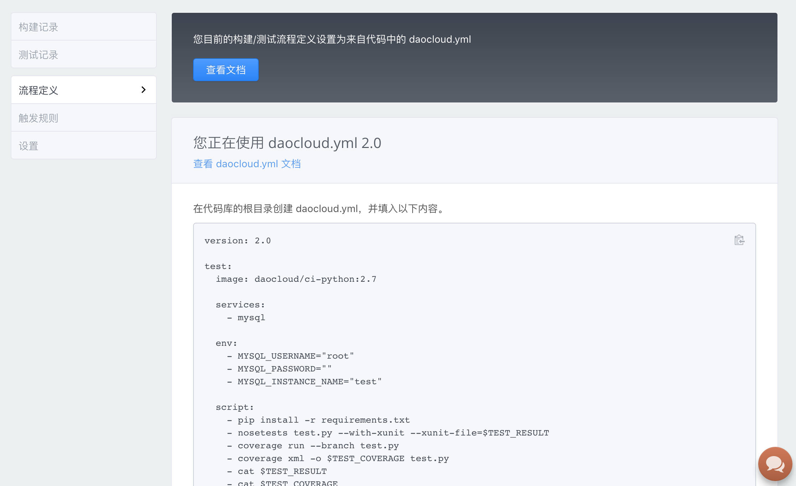
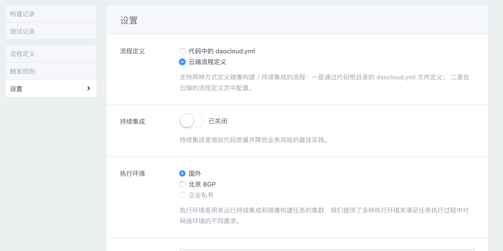
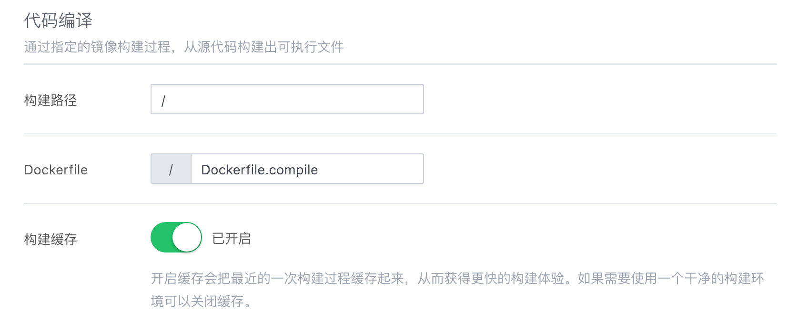
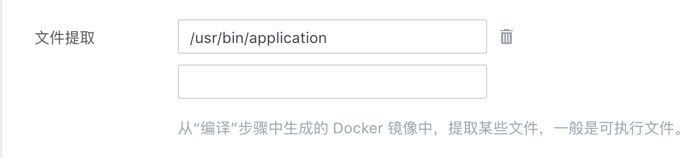
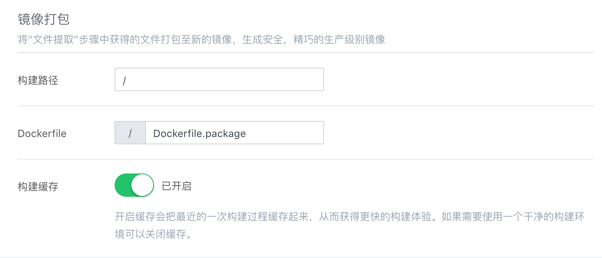
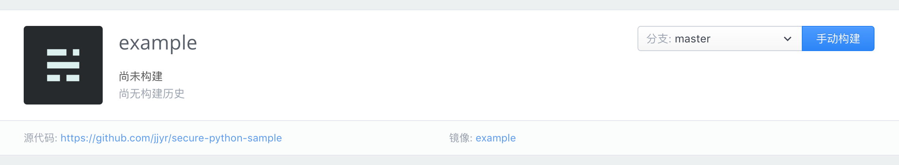

Docker 镜像会将 Dockerfile 中每一步结果保存进其 layer ，如果是从源码构建镜像的话会将代码留在镜像中。为了解决这种问题 DaoCloud 推出了「安全镜像」构建功能。

安全镜像构建流程包含三个步骤：代码编译、文件提取、打包镜像。通过分离编译和打包，产生一个安全、精巧、不含源代码的生产级别镜像。

## 开始构建安全镜像

我们以[DaoCloud/secure-python-sample](https://github.com/DaoCloud/secure-python-sample)这个 repo 为例，首先将该 repo fork 到自己的 github 帐号。

然后在 DaoCloud 镜像构建中创建新的项目(找不到刚刚 fork 的 repo 的话请点击刷新 repo 按钮)。

点击「流程定义」可以看到下图：

因为我们的 repo 中已有 [daocloud.yml 文件](http://docs.daocloud.io/ci-image-build/daocloud-yml-2-0-preview)，所以默认优先使用该文件配置。

我们也可以使用云端设置，这样就不用在代码中加入 daocloud.yml 文件了。

点击设置，选择云端流程定义。

再次选择流程定义，我们可以看到图形化的设置界面

我们在「代码编译」中指定我们用来编译的 Dockerile

编译步骤的 [Dockerfile](https://github.com/DaoCloud/secure-python-sample/blob/master/Dockerfile.compile#L9) 会生成二进制文件`/usr/bin/application`。所以在「文件提取」中填写`/usr/bin/application`代表我们要提取这个文件。

最后我们填写用来打包的 Dockerfile

可以看到这个 [Dockerfile](https://github.com/DaoCloud/secure-python-sample/blob/master/Dockerfile.package) 只是简单的将上一步指定的文件 COPY 到新镜像中。这样我们最终得到的镜像中只包含了一个混淆后的二进制文件。

点击「保存」，选择 master 分支后点击手动构建

构建完成！我们得到了一个只包含二进制文件的安全镜像！