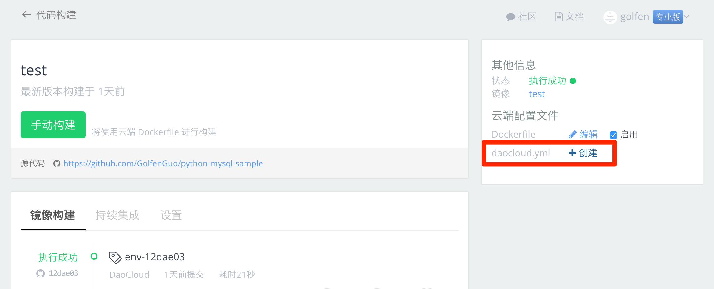
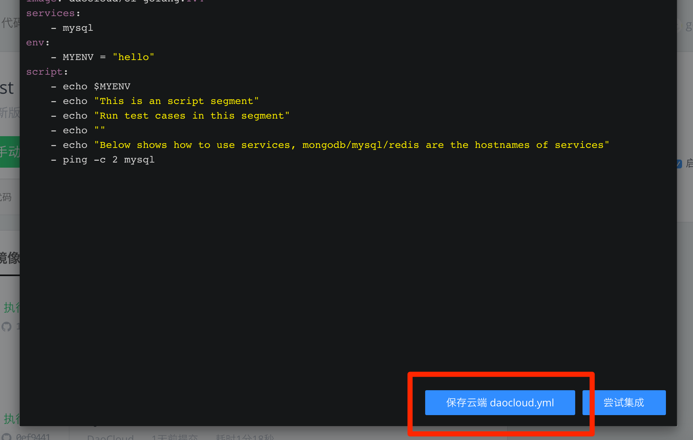

---

### 什么是云端 daocloud.yml？

用户可以维护一份持续集成配置文件 daocloud.yml 在 DaoCloud 云端，我们称之为云端 daocloud.yml，它比较适用于下面这些场景：
* 用户的代码仓库中没有 daocloud.yml
* 用户需要用一份不同于代码仓库中的 daocloud.yml 进行持续集成测试
* 持续集成过程中需要引用一些隐私数据，比如密码，不适合保存在代码仓库中
* 需要调试 daocloud.yml，每次都要更新代码仓库效率很低

### 如何创建云端 daocloud.yml

用户可以在线编辑并保存云端 daocloud.yml，过程如下所示：

* 在项目页面，点击创建云端 daocloud.yml

* 如果用户没有创建过云端 daocloud.yml，系统会试图根据代码仓库中 Master 分支的根目录查找 daocloud.yml。 如果在代码仓库中找不到 daocloud.yml，系统会显示一个示例 daocloud.yml
* 可以在编辑框中编辑 daocloud.yml，最后点击“保存云端 daocloud.yml”按钮

### 如何调试云端 daocloud.yml

在很多场景下，用户需要在线调试 daocloud.yml，如果每次都更新代码仓库中的 daocloud.yml 版本再调试的话，效率很低。 这时就可以使用云端 daocloud.yml 进行快速在线调试。 

用户在线编辑 daocloud.yml 后，可以点击窗口下面的“尝试集成”，点击后会自动切换到运行日志。

### 如何启用云端 daocloud.yml 进行持续集成

在持续集成时，用户可以选择使用云端 daocloud.yml 进行集成测试，如下图所示。该选项一旦启用，在运行持续集成时都会忽略代码仓库的 daocloud.yml，仅用云端维护的版本。

