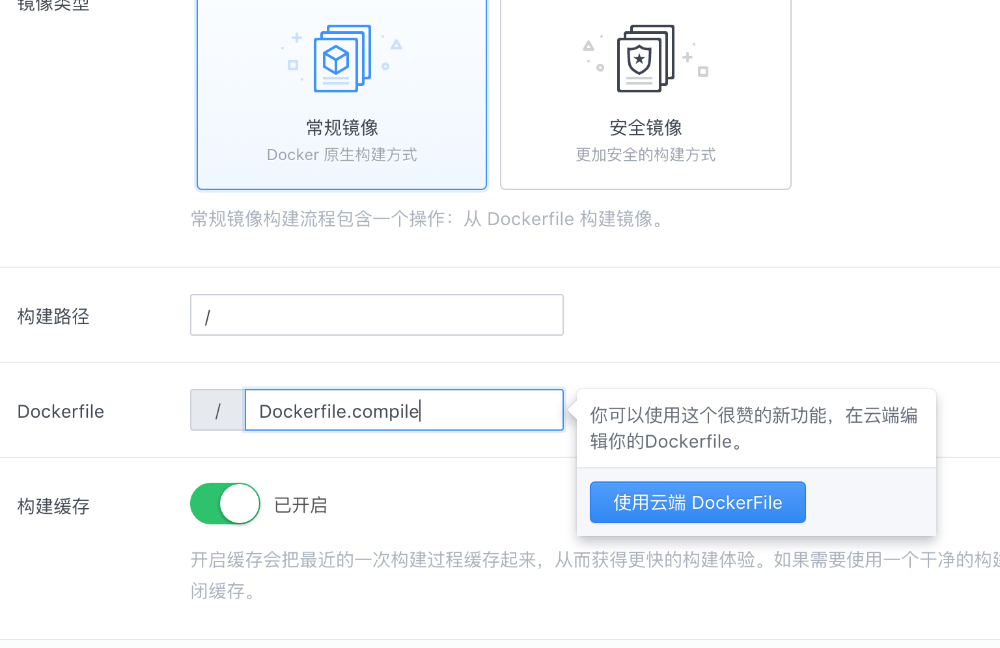
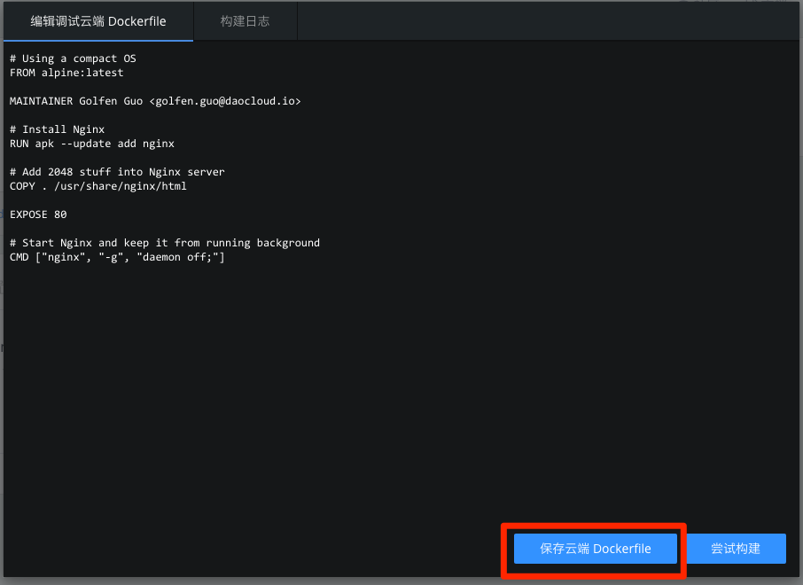

---

### 什么是云端 Dockerfile？

用户可以维护一份 Dockerfile 在 DaoCloud 云端，我们称之为云端 Dockerfile，它比较适用于下面这些场景：
* 用户的代码仓库中没有 Dockerfile
* 用户需要用一份不同于代码仓库中的 Dockerfile 构建镜像
* 构建过程中需要引用一些隐私数据，比如密码，不适合保存在代码仓库中
* 需要调试 Dockerfile，每次都要更新代码仓库效率很低

### 如何创建云端 Dockerfile

用户可以在线编辑并保存云端 Dockerfile，过程如下所示：

* 在流程定义页面，点击“创建云端 Dockerfile”

* 如果用户没有创建过云端 Dockerfile，系统会试图根据用户指定的项目构建位置（在项目设置中指定，默认为项目根目录）从 Master 分支查找 Dockerfile。 如果在代码仓库中找不到 Dockerfile，系统会显示一个示例 Dockerfile
* 可以在编辑框中编辑 Dockerfile，最后点击“保存云端 Dockerfile”按钮
* 然后点击“保存”按钮保存镜像构建设置

### 如何使用云端 Dockerfile 构建镜像

在镜像构建时，用户可以选择使用云端 Dockerfile 进行构建。该选项一旦启用，无论是手动构建还是自动构建，都会忽略代码仓库的 Dockerfile，仅用云端维护的 Dockerfile 版本。

