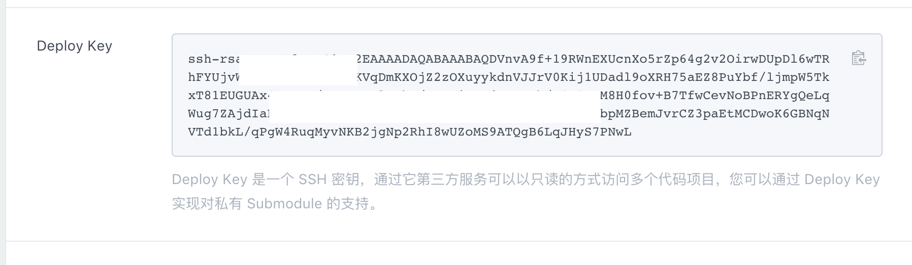
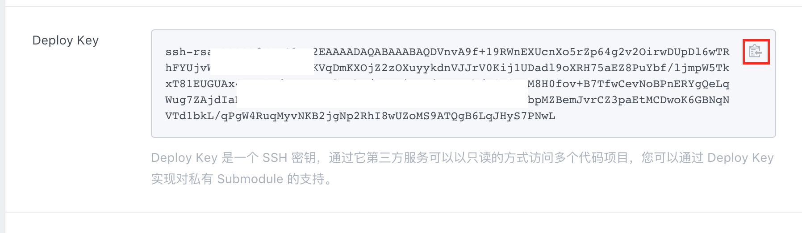
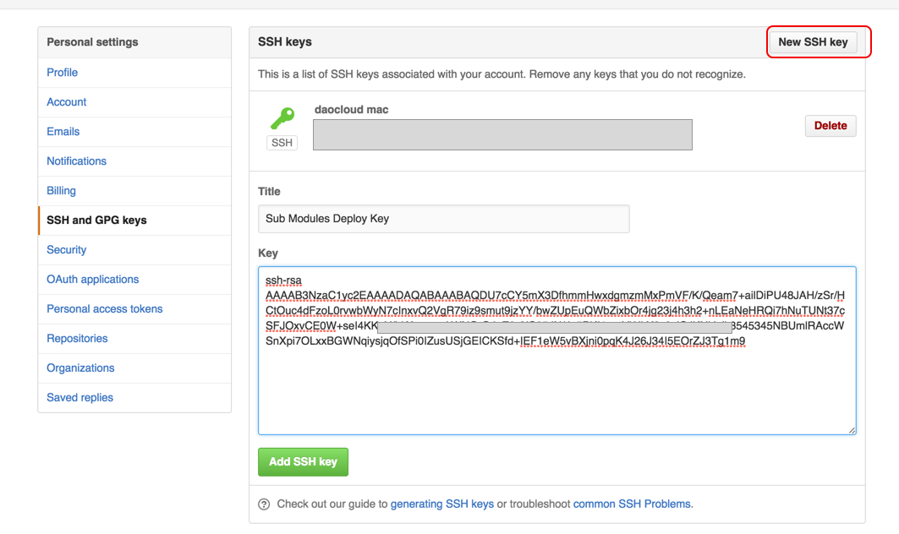

有些项目的代码组织中使用了 git submodule 功能，但是如果某个项目引用的 submodule 是私有的，会导致代码构建／持续集成时拉取代码失败。这时可以参考下面的流程进行操作达到支持私有 submodule 的目的。

_下面的例子以 Github 为例_

### 创建项目
按照正常流程创建代码构建项目，在项目“设置”页面可以查看 Deploy Key。

### 复制 Deploy Key
点击如下所示红框内的复制按钮，即可复制 Deploy key。

### 添加到用户的SSH_key
在某个 Git 用户账户下添加上面复制的 Deploy Key 为用户的 SSH_Key。请注意，该用户需要有对应代码项目以及所有依赖的 submodule 项目的访问权限

### 完成
完成上述设置后，就可以在构建项目／持续集成过程中正常拉取代码了

