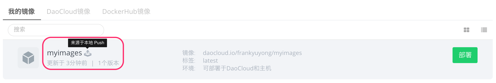

点击镜像名称后，进入镜像细节页面，在这个页面，您可以完成如下操作：


1. 查看镜像概览，这个概览的内容，来自您在代码仓库中的 Readme 文件，支持 markdown 格式。我们建议您在此写明镜像的介绍信息，和部署运行时的注意事项，便于团队内部其他成员知晓和协作。
2. 查看镜像版本，DaoCloud 将确保您在代码仓库每一次打 tag，我们都会完成一次镜像构建，这里列出了包括master-init在内的所有镜像历史版本
3. 在版本 tab，您还可以拉取镜像，部署镜像，把选定版本设置为 latest，或删除镜像
4. 设置 tab，提供了镜像改名的功能

「我的镜像」是您的私有镜像仓库，您可以使用 Docker 客户端 pull 或者 push 镜像。以上图的镜像为例，以下是具体的操作步骤：

在您的 Docker 主机的命令行界面，首先您需要完成登录，输入您的 DaoCloud ID 和密码即可完成。

```
sudo docker login daocloud.io
Username:[您的 DaoCloud 用户名]
Password:［您的 DaoCloud 密码］
Email:［您注册 DaoCloud 时提供的电子邮件地址］
Login Successed

```

可以使用如下的命令，把 DaoCloud 上的镜像 pull 到本地，镜像的地址，一般在镜像详情的页面可以看到。

```
docker pull daocloud.io/[你的 DaoCloud ID]/［镜像名称］:［Tag］  
```

如果要把本地镜像 push 到 DaoCloud 镜像仓库（您的私有仓库），需要执行如下的步骤。

首先您需要为镜像打一个 tag，下面的命令列出所有的镜像，并执行打 tag 打动作。在打 tag 时，需要使用镜像的 Image ID。另外，请注意打 tag 时，需要指明您的 DaoCloud 用户 ID，这样才会把镜像 push 到您的仓库，否则默认是到 DaoCloud 仓库的根目录，这个目录普通用户并无权限，push 时会发生权限错误。

```shell
＃ docker images

REPOSITORY	TAG	IMAGE ID	CREATED	VIRTUAL SIZE
ubuntu	13.10	9f676bd305a4	5 weeks ago	178 MB
ubuntu	saucy	9f676bd305a4	5 weeks ago	178 MB
ubuntu	raring	eb601b8965b8	5 weeks ago	166.5 MB
ubuntu	13.04	eb601b8965b8	5 weeks ago	166.5 MB

# docker tag 9f676bd305a4 daocloud.io/[ID]ubuntu

# docker push daocloud.io/ubuntu
```

push 完成后，镜像会显示在「我的镜像」页面，并且被标示为来自本地 push。您可以直接操作部署和其他修改。



>>>>> 注意，我们对所有用户都开通了镜像的 pull 功能，但是**仅限付费用户使用 push 功能**。另外，我们也建议您通过 Dockerfile 的方式在 DaoCloud 完成镜像的构建，或者直接使用 Docker Hub 上的镜像，尽量避免 push 本地镜像到 DaoCloud 平台，由于一些版本问题，如果你呢镜像版本较久，可能无法在 DaoCloud 完成部署。