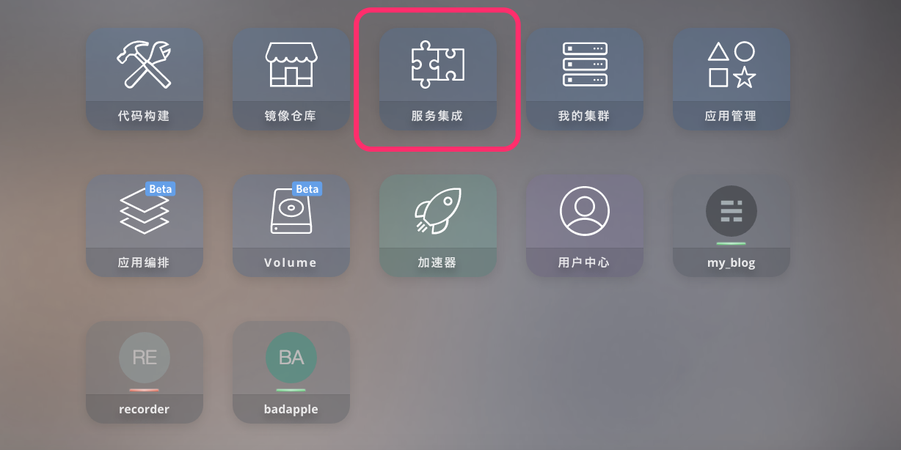
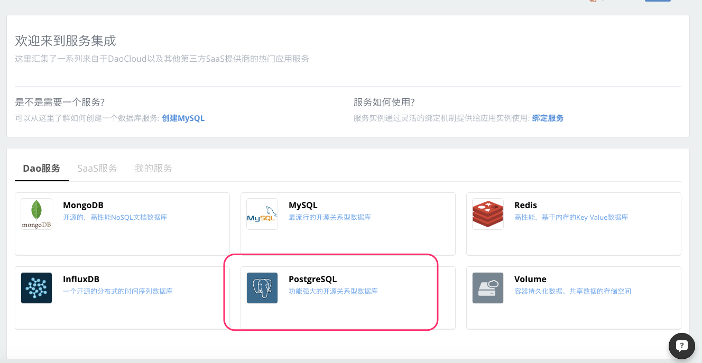
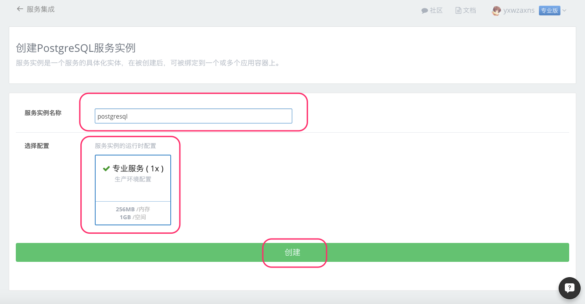
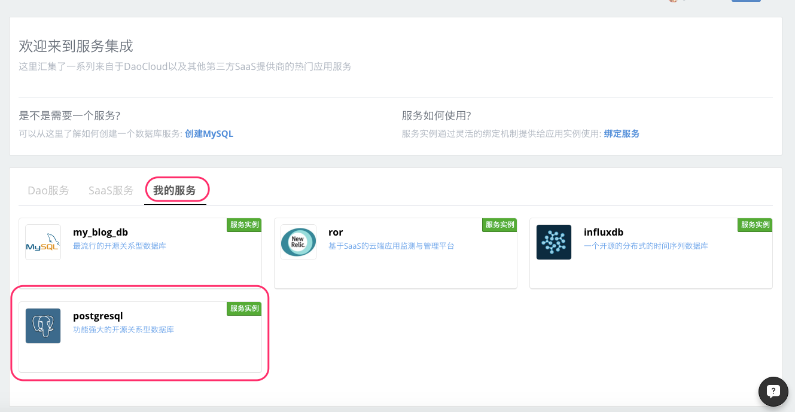
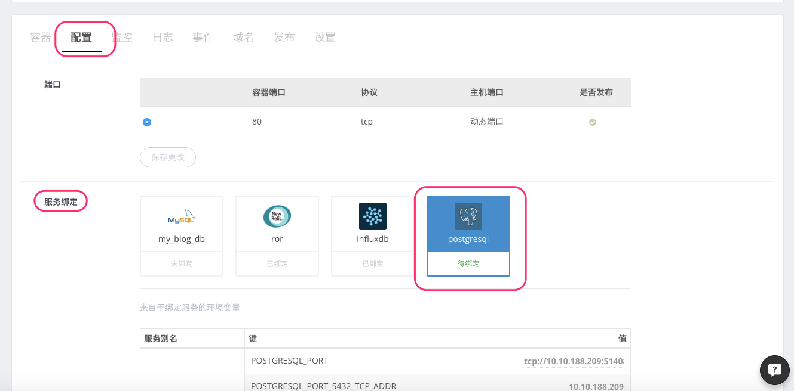
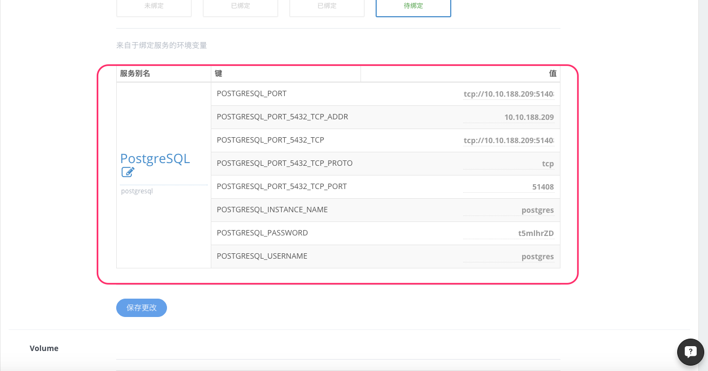
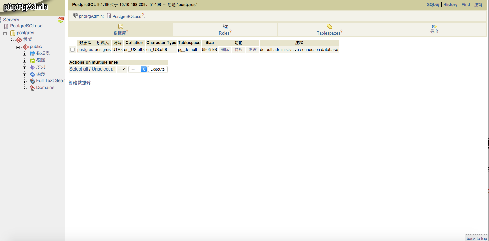

#### 什么是 PostgreSQL

PostgreSQL 是以加州大学伯克利分校计算机系开发的 POSTGRES，现在已经更名为PostgreSQL，版本 4.2为基础的对象关系型数据库管理系统（ORDBMS）。PostgreSQL支持大部分 SQL标准并且提供了许多其他现代特性：复杂查询、外键、触发器、视图、事务完整性、MVCC。同样，PostgreSQL 可以用许多方法扩展，比如， 通过增加新的数据类型、函数、操作符、聚集函数、索引。免费使用、修改、和分发 PostgreSQL，不管是私用、商用、还是学术研究使用。

#### 在 DaoCloud 服务集成创建 PostgreSQL 服务。

1. 登录 DaoCloud 控制台，选择「服务集成」。

  

2. 在「Dao服务」里选择 PostgreSQL 服务。

  

3. 点击 「创建服务实例」。

  

4. 输入服务实例名称，点击「创建」按钮创建 PostgreSQL 服务实例

  > 注意：目前 DaoCloud 只提供了【生产环境】类型的配置。

  

5. 创建完成，可以看到 PostgreSQL 服务的相关参数。

  

6. 在「我的服务」里查看已创建的 PostgreSQL 服务

  


#### PostgreSQL 与我的应用绑定

1. 选择需要绑定 PostgreSQL 服务的应用，在「应用配置」下的「服务绑定」里选择
  刚刚创建好的 PostgreSQL 服务。

  > 您可以在创建应用时绑定 PostgreSQL 服务，也可以把 PostgreSQL 服务绑定在现有的应用上

  

2. 当您选择了要绑定的 PostgreSQL 服务以后，会发现下面出现了关于连接 PostgreSQL 所需要的信息，在您选择保存更改以后，这些信息会写入到您绑定应用的环境变量里，这样您就可以在代码里通过读取相关环境变量来使用 PostgreSQL 服务。

  

3. 如何读取环境变量，下面我们使用 Go 语言来展示如何从环境变量里读取连接 PostgreSQL 所需要的信息以及如何操作 PostgreSQL ，相关代码如下：

  > 完整的 Docker 镜像请前往 [GitHub](https://github.com/allencloud/golang-postgres-web-sample.git) ，您可以 fork 到自己的项目里运行这个例子。

```go
  package main

  import (
  	"database/sql"
  	"fmt"
  	"github.com/gin-gonic/gin"
  	_ "github.com/lib/pq"
  	"os"
  )

  func main() {
  	host := os.Getenv("POSTGRESQL_PORT_5432_TCP_ADDR")
  	port := os.Getenv("POSTGRESQL_PORT_5432_TCP_PORT")
  	username := os.Getenv("POSTGRESQL_USERNAME")
  	password := os.Getenv("POSTGRESQL_PASSWORD")

  	dbname := os.Getenv("POSTGRESQL_INSTANCE_NAME")

  	connection_info := "host=" + host + " port=" + port + " user=" + username + " password=" + password + " dbname=" + dbname + " sslmode=disable"
  	fmt.Println(connection_info)
  	db, err := sql.Open("postgres", connection_info)
  	if err != nil {
  		fmt.Println("Open Error")
  		return
  	}

  	if _, err := db.Exec("CREATE TABLE Persons(Name varchar(255))"); err != nil {
  		fmt.Println(err.Error())
  	}

  	if _, err := db.Exec("INSERT INTO Persons (name) VALUES ('DaoCloud')"); err != nil {
  		fmt.Println(err.Error())
  	}

  	r := gin.Default()
  	r.GET("/ping", func(c *gin.Context) {
  		c.String(200, "pong")
  	})

  	r.GET("/", func(c *gin.Context) {
  		rows, err := db.Query("SELECT * FROM Persons")
  		if err != nil {
  			fmt.Println(err.Error())
  		}
  		var data string

  		for rows.Next() {
  			var name string
  			_ = rows.Scan(&name)
  			data += name +"\n"
  		}

  		fmt.Println(data)
  		c.JSON(200, data)
	})

	r.Run(":8080")
}

```

成功部署后访问应用，便可以看到应用成功连接 PostgreSQL 并进行了相关的操作。

#### 管理 PostgreSQL 服务
* 在 GitHub 上有许多 PostgreSQL 服务管理工具，比如 [phpPgAdmin](https://github.com/phppgadmin/phppgadmin.git)，这里我们把 phpPgAdmin 构建成 Docker 镜像来管理我们的 PostgreSQL 服务。

  > 镜像地址：[https://github.com/gewentao/DaoCloud_phpPgAdmin.git](https://github.com/gewentao/DaoCloud_phpPgAdmin.git)

  fork 上面的代码在 DaoCloud 构建镜像并创建 phpPgAdmin 应用，注意绑定要管理的的 PostgreSQL 服务，应用启动成功后就可以进行常规的 PostgreSQL 服务管理操作

  

至此，我们已经掌握了如何创建和使用 DaoCloud 平台之上的 PostgreSQL 服务。
