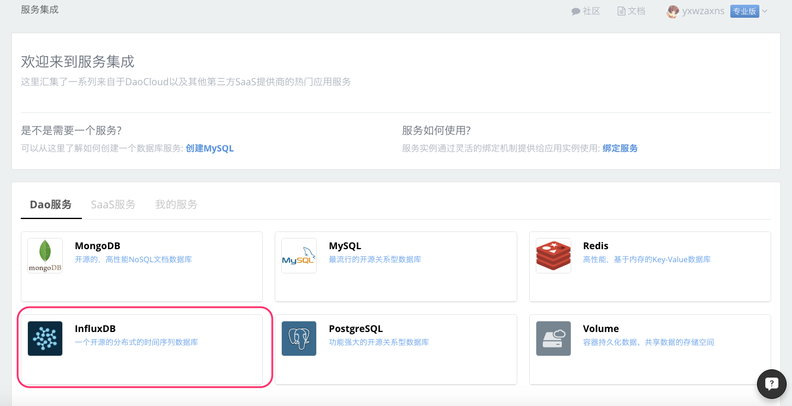
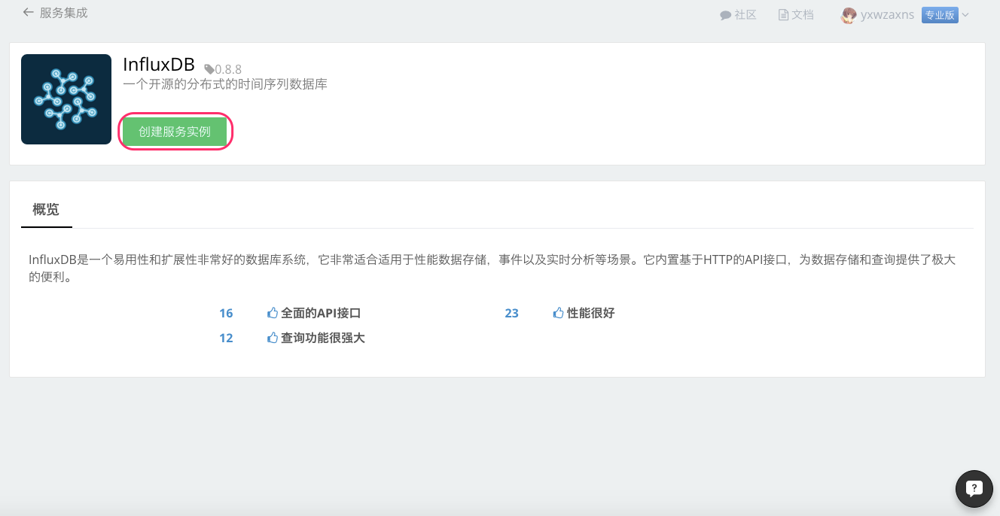
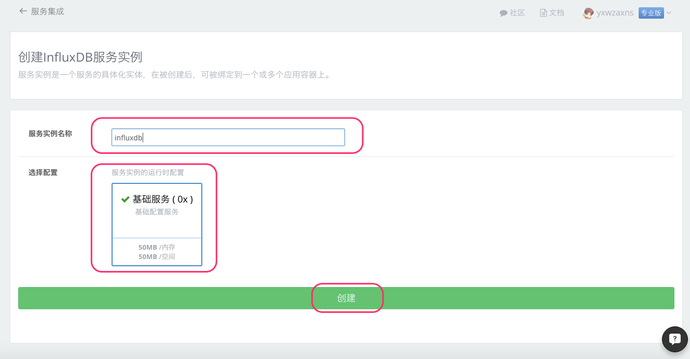
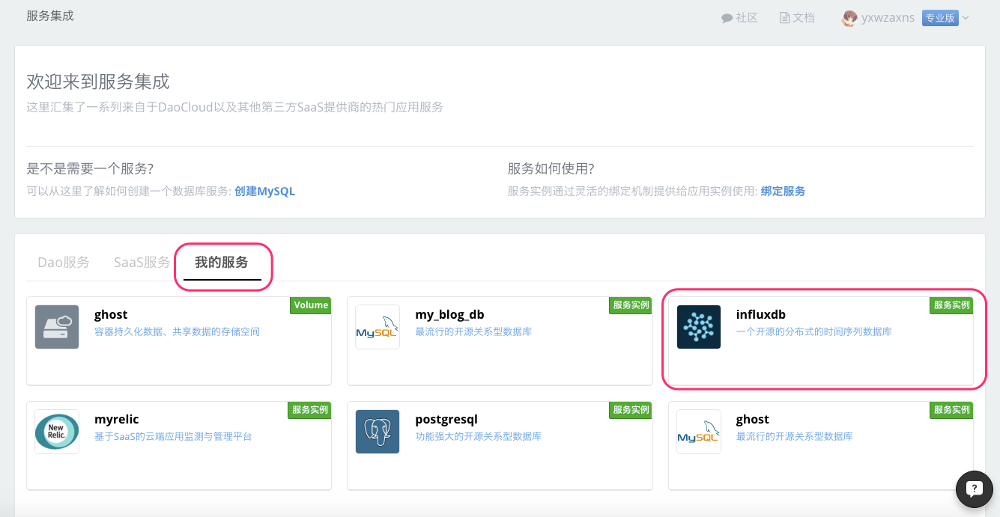

#### 什么是 InfluxDB
InfluxDB是一个易用性和扩展性非常好的数据库系统，它非常适合适用于性能数据存储，事件以及实时分析等场景。它内置基于HTTP的API接口，为数据存储和查询提供了极大的便利。
#### 在 DaoCloud 服务集成创建 InfluxDB 服务。
1. 登录 DaoCloud 控制台，选择「服务集成」。

  

2. 在「Dao服务」里选择 InfluxDB 服务。

  

3. 点击 「创建服务实例」。

  

4. 输入服务实例名称，点击「创建」按钮

  

5. 创建完成，可以看到 InfluxDB 服务的相关参数。

  

6. 查看我已创建的服务

  

#### InfluxDB 与我的应用绑定
1. 选择需要绑定 InfluxDB 服务的应用，在「应用配置」下的「服务绑定」里选择刚刚创建好的 InfluxDB 服务。

  > 您可以在创建应用时绑定 InfluxDB 服务，也可以把 InfluxDB 服务绑定在现有的应用上

  

2. 当您选择了要绑定的 InfluxDB 服务以后，会发现下面出现了关于连接 InfluxDB 所需要的信息，在您选择保存更改以后，这些信息会写入到您绑定应用的环境变量里，这样您就可以在代码里通过读取相关环境变量来使用 InfluxDB 服务。

  

2. 如何读取环境变量和使用 InfluxDB，下面我们使用 Python 语言来操作 InfluxDB，关键代码如下：

 > 完整的 Docker 镜像请前往 [GitHub](https://github.com/DaoCloud/influxdb_sample.git) ，您可以 fork 到自己的项目里运行这个例子

  ```Python
  #!/usr/bin/python
  import json
  import math
  import requests
  import sys
  import os

  from time import sleep

  # Read the environment value
  host = os.getenv('INFLUXDB_PORT_8086_TCP_ADDR')
  if host is None:
      host = "localhost"

  port = os.getenv('INFLUXDB_PORT_8086_TCP_PORT')
  if port is None:
      port = '8086'

  user = os.getenv('INFLUXDB_USERNAME')
  if user is None:
      user = 'root'

  password = os.getenv('INFLUXDB_PASSWORD')
  if password is None:
      password = 'root'

  STATUS_MOD = 100
  n = 0

  # Firstly use the credentials to create an influxdb database.
  # We take name db1 as an instance.
  db = 'db1'

  url = 'http://%s:%s/db?u=%s&p=%s'%(host, port, user, password)
  data = {'name': db }

  # Start to create influxdb database
  r = requests.post( url, data=json.dumps(data))

  # Start to to generate points and draw them into influxdb
  while True:
      for d in range(0, 360):
          v = [{'name': 'sin', 'columns': ['val'], 'points': [[math.sin(math.radians(d))]]}]
          url = 'http://%s:%s/db/%s/series?u=%s&p=%s'%(host,port,db,user,password)
          r = requests.post(url, data=json.dumps(v))
          if r.status_code != 200:
              print 'Failed to add point to influxdb -- aborting.'
              sys.exit(1)
          n += 1

          sleep(0.01)

          if n % STATUS_MOD == 0:
              print '%d points inserted.' % n
  ```

  应用成功部署后，在日志一栏便可以看到数据正在写入 InfluxDB。

    

#### 至此，我们已经掌握了如何创建和使用 DaoCloud 平台之上的 InfluxDB 服务。

