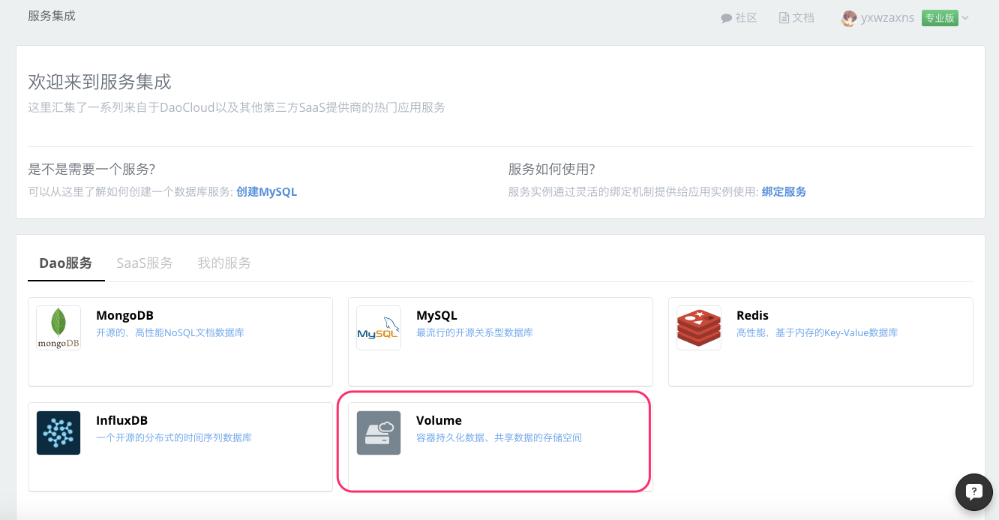
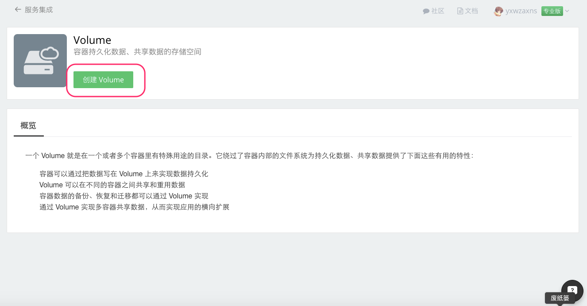
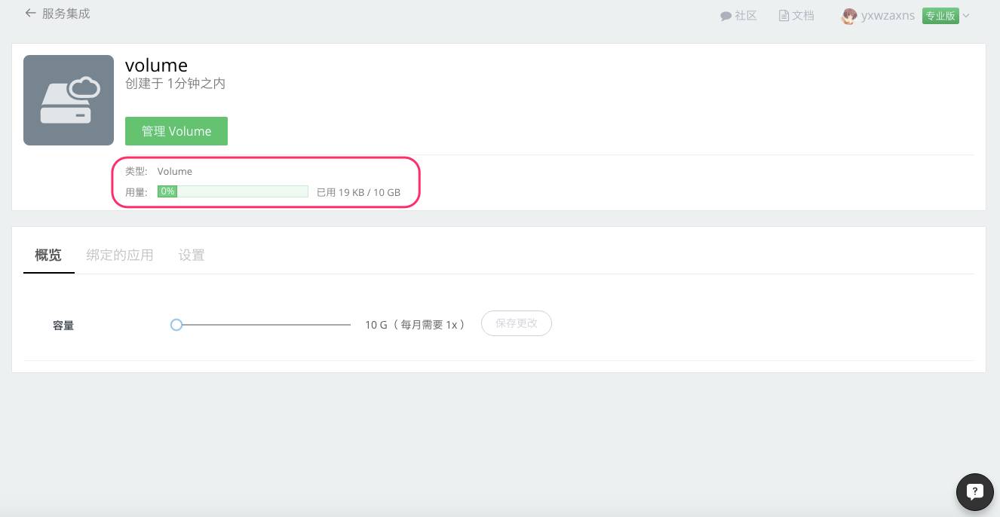
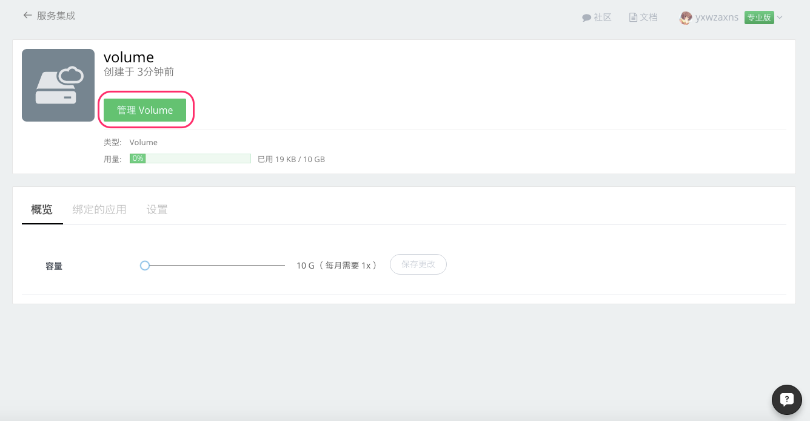
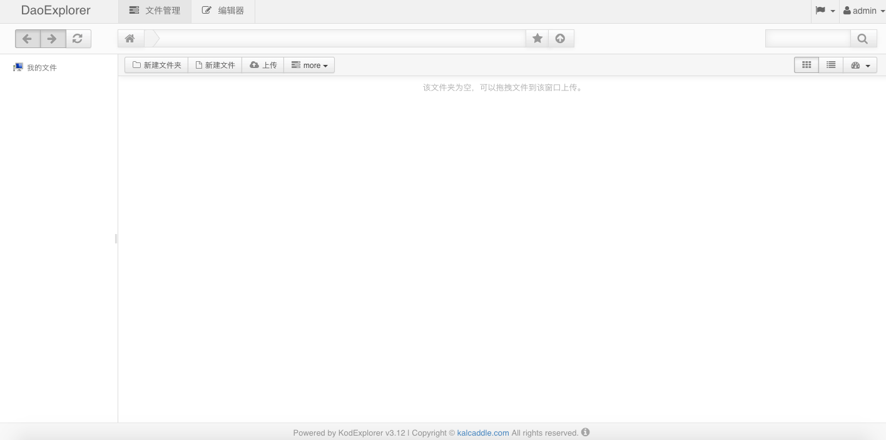
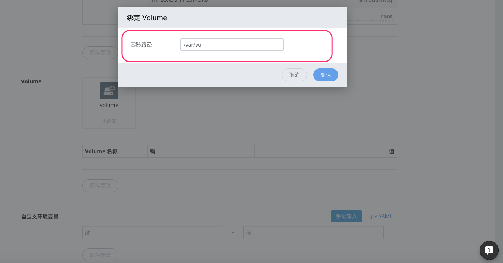

#### 什么是 Volume

Volume 就是在一个或者多个容器里有特殊用途的目录。它绕过了容器内部的文件系统为持久化数据、共享数据提供了下面这些有用的特性：

+ 容器可以通过把数据写在 Volume 上来实现数据持久化
+ Volume 可以在不同的容器之间共享和重用数据
+ 容器数据的备份、恢复和迁移都可以通过 Volume 实现
+ 通过 Volume 实现多容器共享数据，从而实现应用的横向扩展

#### 在 DaoCloud 服务集成创建 Volume 服务。

1. 登录 DaoCloud 控制台，选择「服务集成」。

  

2. 在「Dao服务」里选择 Volume 服务。

  

3. 点击 「创建 Volume」。

  

4. 输入服务实例名称，为 Volume  选择合适的容量，点击「开始创建」按钮创建 Volume 服务实例

  > 每 10G 容量需要消耗 1x 的资源配额

  

5. 创建完成，可以看到 Volume 服务的相关信息，比如 Volume 已使用存储容量。

  

6. 在「我的服务」里查看已创建的 Volume 服务

  

7. 在 Volume 服务页面，点击「管理 Volume」进入 Volume 的管理页面。

  

  进入 Volume 管理界面，在这里，您可以像操作本地文件夹一样操作 Volume 里的内容。

  

#### Volume 与我的应用绑定

1. 选择需要绑定 Volume 服务的应用，在「应用配置」下的「Volume」里选择刚刚创建好的 Volume。

  > 您可以在创建应用时绑定 Volume，也可以把 Volume 绑定在现有的应用上。

  

2. 当您选择了要绑定的 Volume 服务以后，会弹出一个输入框，要求输入 Volume 挂载到容器的路径，然后保存更改即可。

  

#### 如何使用 Volume
如何使用 Volume 来持久化容器数据？这里我们用一个简单的例子来进行演示。同样，您可以通过我们在 [GitHub](https://github.com/yxwzaxns/DaoCloud_volume.git) 上提供的代码来进行下面的演示，主要代码如下，它的功能是在我们访问应用时把 Volume 里的文件内容读取出来，并把访问记录在 Volume 下的 ip.log 日志里：

```ruby
require 'sinatra'
require 'erb'

module Sinatra
  class Base
    set :server, %w[thin mongrel webrick]
    set :bind, '0.0.0.0'
    set :port, 8080
    set :views, File.dirname('.') + '/views'
  end
end

get '/' do
  path="/var/vo"
  content=Hash.new
  dir=Dir.entries(path)
  files=[]
  # 切换到 /var/vo volume 目录
  Dir.chdir(path) do
    # 查找 /var/vo 下的文件
    dir.each do |f|
      if File.exist?(File.expand_path(f)) && File.directory?(f) != true
        files.push File.expand_path(f)
      end
    end
    # 把所有文件内容放入变量 content
    files.each do |f|
        item=Array('')
        IO.foreach f do |l|
          item.push l
        end
        content[f]=item
    end
    # write log
    log=Time.new().to_s+"   "+request.ip+"  :"+request.user_agent+"\n"
    f=File.new("ip.log","a")
    f.write(log)
    f.close
  end
  erb :index, :locals => {:content => content}
end

```

具体步骤：
1.  从 [GitHub](https://github.com/yxwzaxns/DaoCloud_volume.git) 上拉取代码在 DaoCloud 里构建镜像，创建应用，并在应用上绑定 Volume 到 /var/vo，因为此时我们绑定的 Volume 里还没有内容，所以访问应用结果如下图显示：

  

2. 现在来到 Volume 管理界面，在里面创建一个文件并写入一些内容，保存后重新访问我们的应用。

  

  访问结果如下：

  

  很明显，应用成功读取到了我们建立的文件，我们回到 Volume 的管理界面，刷新一下浏览器，发现在当前目录下的确产生了一个 ip.log 的日志文件。这说明

  + 我们可以通过 Volume 来修改我们的应用，而不必每一次修改后都要重新构建代码，更新应用了。
  + 我们可以把应用产生的日志或者数据放到 Volume 下，方便我们查看

#### 至此，我们已经掌握了如何创建和使用 DaoCloud 平台之上的 Volume 服务。
