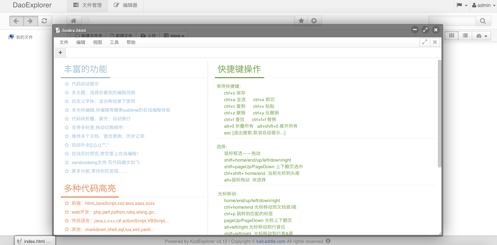
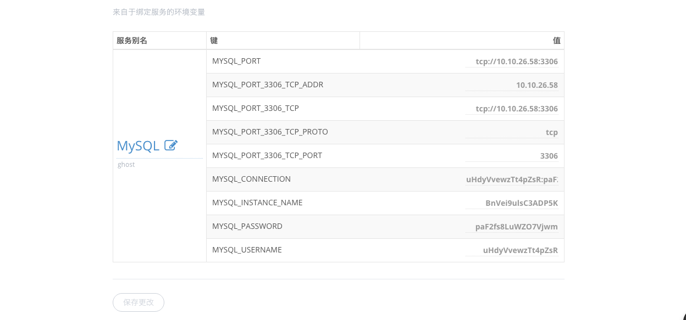
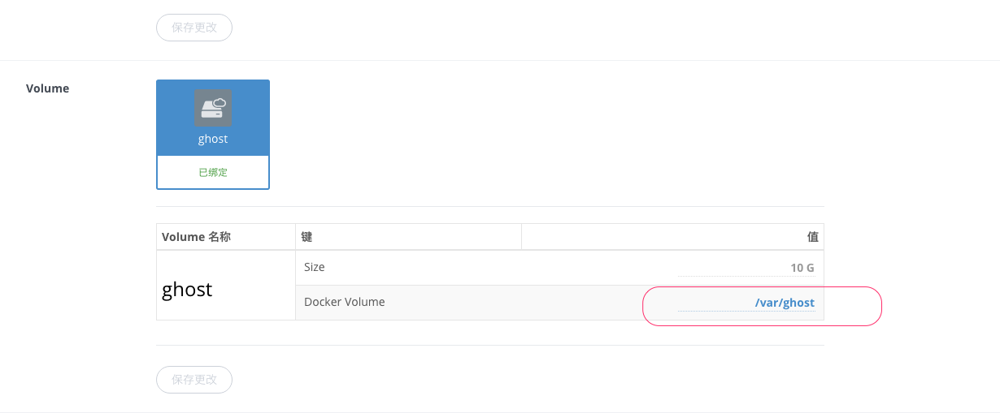
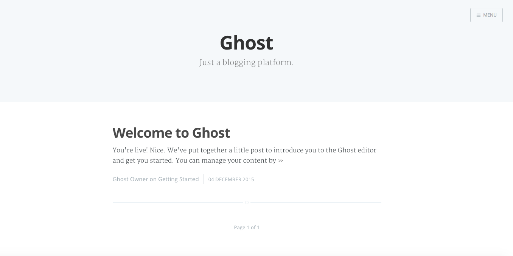

#### 使用 Volume 控制器管理文件
在上一节里 [使用 Volume 实现容器状态持久化](../08.use-volume) 里我们介绍了 Volume 在 Docker 里的应用以及怎么创建 Volume 服务。在这一节我们将用搭建一个在 DaoCloud 搭建 Ghost 博客的例子来演示 Volume 的具体功能以及应用。
#### 首先介绍 Volume 控制台的功能
Volume 控制台为我们提供了很多关于 Volume 操作的功能，在 Volume 控制台除了有查看文件的功能以外，还有很多便捷的功能：
1. 上传文件，点击「上传」按钮，可以选择上传本地文件也可以远程下载文件到 Volume 里。

  
2. 在线编辑文件，Volume 控制台提供了强大的文件编辑功能，可比拟本地编辑器，它提供了常见编辑器的基本功能，包括语法高亮，函数寻找等功能。给用户带来极好的体验。

  

#### 开始 Volume 的一个小应用
接下来我们用一个实例来介绍 Volume 的应用，这个实例将在 DaoCloud 上建立一个用 Ghost 搭建的博客，然后我们用 Volume 来存放博客上传的图片，主题和配置文件，使应用的数据不因为容器状态的变化而丢失。您可以按照以下步骤搭建一个相同的应用。
> 相关代码我们存放在 [GitHub](https://github.com/yxwzaxns/ghost.git) 上，您可以下载并使用

1. 在 [GitHub](https://github.com/yxwzaxns/ghost.git) 上拉取代码在 DaoCloud 构建 Ghost 镜像。在 Dokerfile 文件里，您需要注意其中的 **ENV GHOST_CONTENT /var/ghost** 它是 Ghost 存放上传图片，主题，数据库的目录，我们的目的是持久化这个目录，所以要把这个目录与我们将要用到的 Volume 绑定在一起。

  ```
  ENV GHOST_CONTENT /var/ghost
  ```
2. 代码构建成功后，我们需要新建一个 MySQL 服务和一个 Volume 服务，然后在镜像仓库找到我们构建完成的 Ghost 镜像，点击 部署，这里我们需要给 Ghost 应用同时绑定 MySQL 和 Volume 服务。

  

  > 注意： Volume 选择的路径要与上面变量 GHOST_CONTENT 里的路径一致。

  
3. 应用成功启动后，我们还需要先修改一些 Ghost 必须参数，比如绑定应用的域名，和必要的 email 功能的配置。这时我们绑定的 Volume 就派上用场了，来到「我的服务」，点击进入对应的 Volume 控制台，您可以看到，Ghost 目录下的 Content 文件夹和 config.js 配置文件出现在这里。打开 config.js 修改里面 production 下的 url 和 mail 选项。

  
4. 修改完毕后，重启应用，访问 **http://your_app_path/ghost/** 设置博客相关信息，我们的博客应用就成功建立了。

  
  > 如何更换主题？
  >  
  > 直接把下载的主题文件夹上传到 Volume 里的 themes 目录下，重启应用在博客后台设置选项里选择要使用的主题保存即可。

***

##### 当以后 Ghost 需要升级版本时，直接更新容器，而不用考虑应用数据或者配置信息的丢失。在备份方面，我们也只需考虑备份 Volume 内的文件即可。
#### 到此为止，我们已经学会了 Volume 的实际应用
