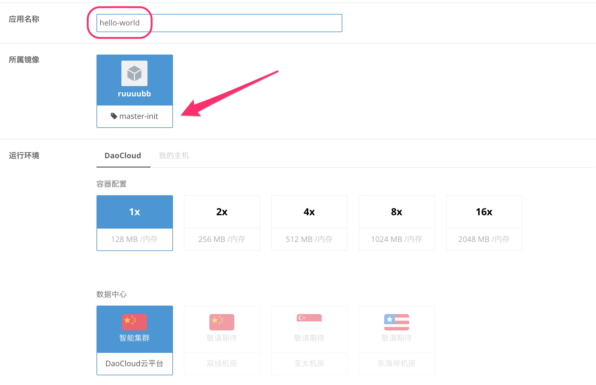

DaoCloud 为用户提供了跨越多个公有云平台的智能容器集群，我们允许用户把镜像仓库中的 Docker Image，部署和运行在 DaoCloud 智能容器集群之上。DaoCloud 智能容器集群可以部署 http web 应用，和 tcp 服务器应用，平台提供了包括负载均衡、日志和监控等在内的应用生命周期管理服务。

在 DaoCloud 智能容器集群部署应用，需要分三个步骤来完成，下面与您逐一详述：

第一步：设置运行环境

1. 在镜像仓库选择您构建完成的镜像，或我们的内置镜像，您也可以直接输入镜像名称，从 Docker Hub 上检索，选中镜像后点击部署，会进入「运行环境」设置界面。
2. 输入应用名称，如果您部署的是 Web 应用，这个名称将被用来生成您的应用域名，我们的格式是：`http(s)://[用户ID]-[应用名称].daoapp.io`。
3. 确认您部署的镜像名称，和 tag 版本。
4. 选择运行环境，在「DaoCloud」和「我的主机」，选择「DaoCloud」，有关如何在「我的主机」上部署，我们在后续的文档中会有介绍。
5. 选择容器配置和数据中心，目前我们支持最大 2G 内存的单个容器，如果您的应用需要更大规模的容器，请[与我们联系](mailto:support@daocloud.io)。
6. DaoCloud 目前有位于国内的智能集群平台，稍后我们会推出更多分区，包括国内和海外节点。

点击「基础设置」按钮，进入下一步。

第二步：进行基础设置

1. 在端口选择页面，DaoCloud 会解析出当前部署 Docker 镜像 EXPOSE 的所有端口，DaoCloud 支持应用向外暴露 http(s) 或 tcp 端口，DaoCloud 智能平台只允许对外暴露**一个**端口。如果您的镜像在 Dockerfile 中对外 EXPOSE 了多个端口，请您选择一个。
2. 如果应用需要使用数据库服务，您可以在服务绑定中选择。绑定服务需要知道应用预设的「环境变量别名」，并根据服务实例的实际参数，填写这些环境变量，如果您的代码时 Fork 来的，请仔细阅读代码的 README。
3. 被绑定的服务需要预先创建好，您可以在「[使用 DaoCloud 服务集成](..／../daocloud-services)」这一节，了解详细的步骤。
4. DaoCloud 支持绑定容器 Volume，用于在应用保存文件，绑定 Volume 时，需要输入容器内的路径（如：/data）。请注意容器本身并不支持文件持久化，**单独的容器实例在被重启或重新部署后，其中临时保存的内容会丢失**，请务必使用数据库，或 Volume 作为内容持久化的方式。
5. 我们还允许用户导入自定义环境变量，可以在部署配置界面手工输入，也可以通过 yaml 文件批量导入。根据部署目的的不同（如测试环境、预发布环境和生产环境），可以通过不同的自定义环境变量，来提供不同环境下的外部配置。

>>>>> DaoCloud 支持应用暴露 http 或 tcp 端口，但每个应用只能选择暴露一个端口。

第三步：进行高级设置

1. 我们可以设置部署完成后，是否自动启动应用。
2. 在上一步选择完端口后，请确保您选择与之匹配的协议，如您选择对外暴露非 80/443 端口，请务必在容器服务协议中选择 tcp 协议。
3. DaoCloud 平台支持多实例应用的自动负载均衡，您可以调节应用部署的容器实例个数。
4. 指定容器的启动命令。
5. 点击部署，DaoCloud 会自动完成后续的镜像下载，资源分配和部署工作

>>>>> 请注意，DaoCloud 支持多实例应用的自动负载均衡。如过您的应用是 Web 应用，请确保应用是无状态的，并且妥善处理 session 的保存逻辑；如果您发布的是 tcp 后台服务应用，请确保您的应用在多实例状态下能够正常工作。您可以考虑使用数据库或者 Volume 作为多个无状态应用的共享存储。

在部署完成后的应用详情页面，您可以看到应用的状态，访问 URL（如果是 tcp 类应用，会显示 IP 地址）。在应用详情页面，我们可以执行对应用运行时的监控和配置，这部分我们在[下一篇文章](../../app-deploy-mgmt/mgmt-apps-on-daocloud)中与您详细介绍。

<!--
另外，为了方便用户进入容器调试，我们提供了容器控制台功能，点击[打开控制台]，可以通过 Web Console 的方式，进入容器的终端界面。这个终端以安全访问的方式，采取 Web 途径进入容器内部，操作效果等同于使用 ssh 登陆终端。这个控制台，默认连接超时的时间是 15 分钟，超时后需要退出重新连接。
-->

