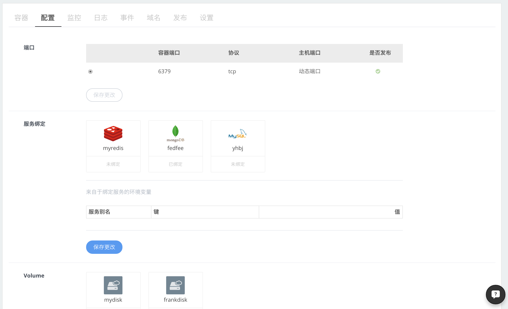
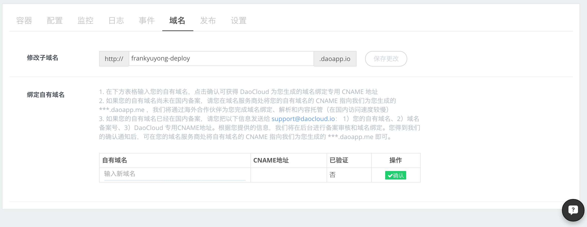
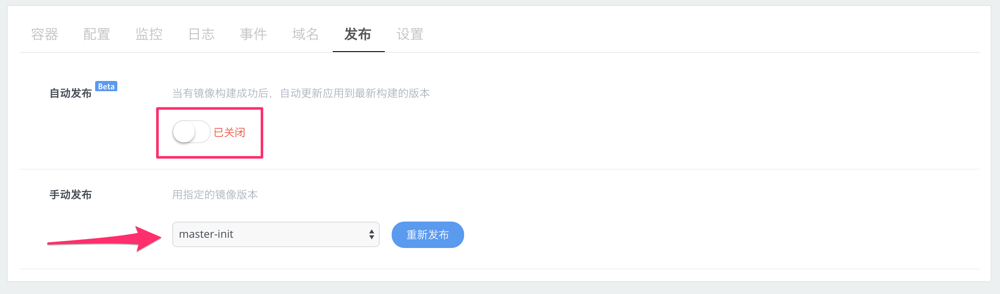

向智能容器集群部署应用后，DaoCloud 提供了丰富的管理功能，这些功能涵盖了主流 PaaS 平台的核心能力，还在此基础上，增加了与持续交付相关的自动发布、分支发布等功能，下面我们与您详细介绍。

#### 容器

1. 调整容器实例的资源配置
2. 选择容器运行环境
3. 增加或修改启动命令
4. 调整容器实例个数

>>>>> 进行修改后，容器会进入更新状态，在修改完成后，容器会被重启。再次提醒，**单独的容器实例在被重启或重新部署后，其中临时保存的内容会丢失**，请务必使用数据库，或 Volume 作为内容持久化的方式。

#### 配置

1. 这个配置页面与创建应用时的完全一致，可以修改应用端口、服务绑定、Volume 和自定义环境变量。
2. 数据库和 Volume 的内容，在解绑后也会保存，不必担心内容丢失。

#### 监控

1. DaoCloud 提供了容器实例的 CPU、内存和网络吞出情况的监控图标，分为实时和 24 小时两种展示方式。
2. 如果您的应用存在多个实例，我们会采取求均值或求和的方式展示所有应用实例的状态。

#### 日志

1. 日志界面会列出 http 应用的访问日志，或应用本身吐出的日志信息。
2. 如果应用存在多个实例，在日志的时间戳之后，会表明实例的 ID。
3. 日志界面支持暂停滚动、按时间段显示和搜索查询功能。

#### 事件

1. 记录来自 DaoCloud 平台对应用作出的所有才做，包括扩容、重启等等。
2. 可用于生产环境中的操作记录或审计。

#### 域名

1. 用户可以修改应用发布的 daoapp.io 二级域名，需要注意，二级域名在全局范围内不能重复。
2. 我们为用户提供了绑定自有域名方式，请根据页面的提示操作完成。

#### 发布

1. 自动发布，当有镜像构建成功后，自动更新应用到最新构建的版本。对于频繁更新或迭代的应用，这是非常便利的一项功能，开发者只需要提交代码，打 tag，之后会触发自动构建和应用的自动更新。免去了在 DaoCloud 控制台手工发布的重复步骤。
2. 手动发布，允许用户选择特定的镜像版本，这非常适合发布回滚，或 A/B 发布等场景的需求。

#### 设置

1. 在设置界面，可以删除应用。
2. 在 DaoCloud，绑定代码仓库的项目、镜像和应用，这三者之间存在关联关系，必须先删除运行中的应用，才能删除镜像仓库中的镜像，最后才能删除项目。

