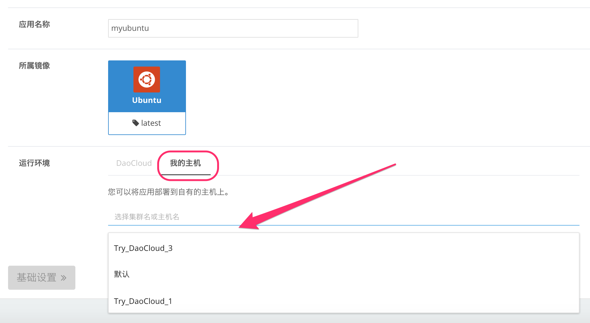
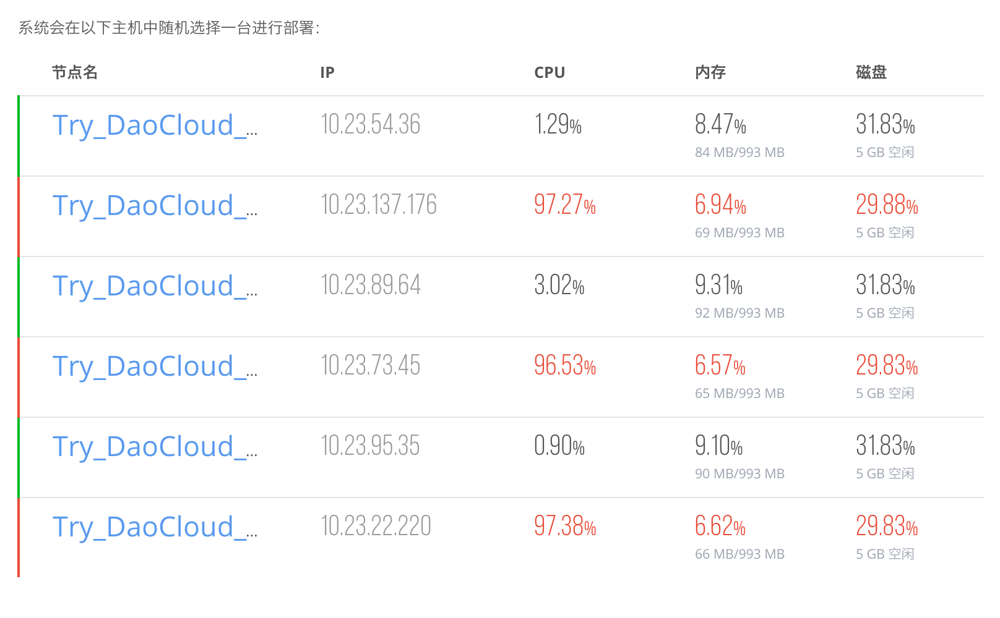
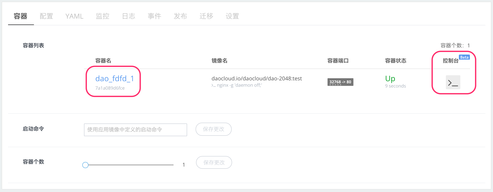
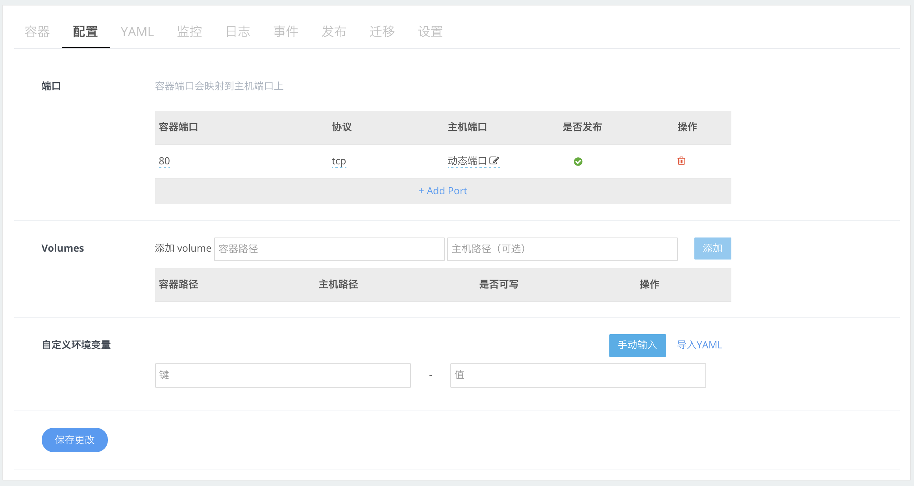
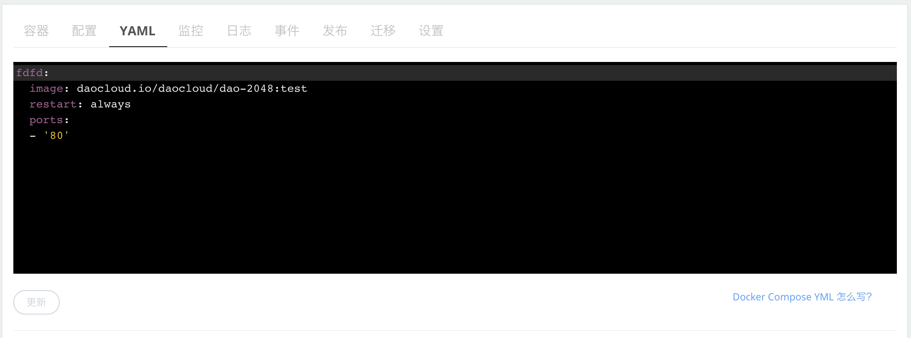
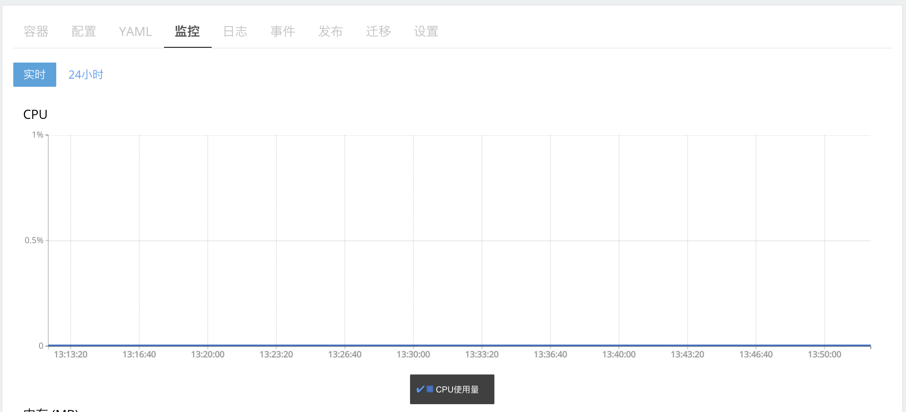
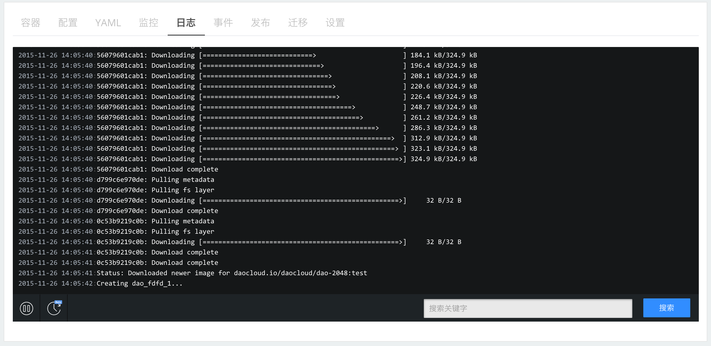
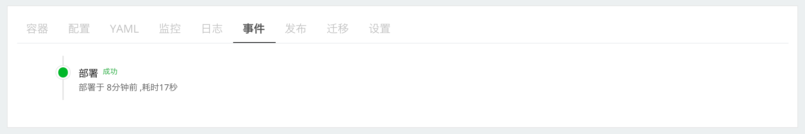

DaoCloud 提供的基于公有云的智能容器平台，为用户提供了一站式从构建、发布到部署运维的服务，容器运行所在的底层资源，由 DaoCloud 负责调度和维护，负载均衡等高级功能，也集成在平台之内。

在一些情况下，用户需要拥有对底层资源的访问权利，进行特殊的优化，另外，也有用户希望使用自己存量的硬件资源，在这种情况下，主机集群可以很好的平衡应用部署自动化，和底层资源可控可管的需求。

如您对自有集群和自有主机的创建设定尚不了解，请阅读「创建和管理 DaoCloud 主机集群」这一部分的文档。下面的文档，分发布应用和管理应用两个部分来介绍。

#### 向自有主机集群上发布应用

第一步：设置运行环境

1. 在镜像仓库选择您构建完成的镜像，或 DaoCloud 提供的内置镜像，您也可以直接输入镜像名称，从 Docker Hub 上检索，选中镜像后点击部署，会进入「运行环境」设置界面。
2. 输入应用名称，在自有集群部署时，应用名称仅起到标示作用，并不会被用来作为 URL。
3. 确认您部署的镜像名称，和 tag 版本。
4. 选择运行环境，在「DaoCloud」和「我的主机」，选择「我的主机」，此时「选择集群名或主机名」下方，会列出您已经创建的所有集群，和已经添加的所有主机。
5. DaoCloud 允许用户把应用部署到指定的主机之上，或选择一个集群作为部署的目标。在后者的情况下，系统会在以下主机中随机选择一台进行部署，并且进行动态的资源调配。
6. 点击「基础设置」按钮，进入下一步。

>>>>> 您可以使用 DaoCloud 提供的[胶囊主机](../../cluster-mgmt/add-cell-node)，快速试用这一项功能。

第二步：进行基础设置

1. 容器镜像暴露的端口都会被列出，用户可以添加新的端口，也可以删除已有的端口。来自容器的端口，会被映射到主机的动态端口上，也可以手工制定主机映射端口。
2. 可以绑定本机或共享网络存储上的 Volume 到容器，用来保存需要持久化的数据。
3. 同 DaoCloud 智能容器平台，用户也可以导入自定义环境变量。
4. 点击「高级设置」按钮，进入下一步。

>>>>> 自有主机上的容器端口，没有任何限制，用户可以暴露任意多端口，但需要注意的是，在应用多实例的情况下，用户需要自己完成负载均衡的配置，并确保同一主机之上无端口冲突。自有主机并不提供预置的数据库服务，当需要使用 MySQL 等数据服务时，可以选择 MySQL 进行进行部署，使用 Volume 保存数据库文件，并通过环境变量等方式与应用容器建立连接。

第三步：进行高级设置

1. 设置自动重启，当容器意外停止运行时，系统会自动启动容器。
2. Privileged 权限，可以启动主机上容器的 Privileged 权限，这个功能可以等同于使用 `--privileged` 参数启动容器，适用于 Docker in Docker 等特殊场景。
3. 调整容器运行实例，当容器实例多于一个时，则会在主机之上创建多个容器实例，直到主机资源耗尽为止。另外**再次提醒**，自有集群之上多实例应用，需要用户自己完成负载均衡设置。
4. 指定应用容器的启动命令
5. 点击「立即部署」

需要注意，在部署的阶段，主机会从 DaoCloud 的镜像仓库下载容器镜像，受限于网络的速度，这个过程比在 DaoCloud 智能容器平台上要长一些，如果镜像较大，需要用户耐心等待，并通过日志了解进度。在下载完成后，应用详情界面会显示应用的名称和状态。

恭喜您！至此，您的应用已经在自有主机之上成功运行了，您可以使用您主机的内部或外部 IP 地址和您暴露的端口访问应用。下面我们为您介绍自有主机之上应用的管理方式。

#### 管理自有主机集群上的应用

在主机上完成应用部署后，我们在「应用详情」页面，可以进行应用管理操作。

##### 容器

容器列表列出了应用所有的容器实例，我们可以点击容器名进入容器的详细信息界面，也可以点击控制台，通过类似 Web Console 的方式，登陆到容器内部。使用鼠标点击容器端口下方的黑色端口映射信息，会显出出主机的 IP 地址，和自动分配的外部随机端口，如果是 Web 应用，点击可知也打开页面。

在这个界面，我们还可以修改启动命令，和调整容器实例个数。当容器实例多于一个时，则会在主机之上创建多个容器实例，直到主机资源耗尽为止。另外**再次提醒**，自有集群之上多实例应用，需要用户自己完成负载均衡设置。

##### 配置

配置界面与创建应用时相同，可以调整端口、Volumes 和自定义环境变量。

##### YAML

YAML 页面是实用复杂应用编排时的配置文件修改页面，可以完成多节点多实例复杂应用的自动一次性发布，具体的细节，请参考[部署复杂的多节点微服务应用](../../app-deploy-mgmt/use-stack-to-deploy-microservices)。

##### 监控

DaoCloud 提供了容器实例的 CPU、内存和网络吞出情况的监控图标，分为实时和 24 小时两种展示方式。如果您的应用存在多个实例，我们会采取求均值或求和的方式展示所有应用实例的状态。

##### 日志

日志界面会列出 http 应用的访问日志，或应用本身吐出的日志信息。如果应用存在多个实例，在日志的时间戳之后，会表明实例的 ID。日志界面支持暂停滚动、按时间段显示和搜索查询功能。

##### 事件

记录来自 DaoCloud 平台对应用作出的所有才做，包括扩容、重启等等。可用于生产环境中的操作记录或审计。

##### 发布

自动发布，当有镜像构建成功后，自动更新应用到最新构建的版本。对于频繁更新或迭代的应用，这是非常便利的一项功能，开发者只需要提交代码，打 tag，之后会触发自动构建和应用的自动更新。免去了在 DaoCloud 控制台手工发布的重复步骤。手动发布，允许用户选择特定的镜像版本，这非常适合发布回滚，或 A/B 发布等场景的需求。

##### 迁移

支持应用和实例在多个主机之间迁移。**需要注意**，迁移时，容器内的状态，和临时生成的数据无法保留，请使用数据库，或者 Volume 作为持久化数据的方式。

##### 设置

当容器意外停止运行时，系统会自动启动容器。赋予容器额外的权限，对应于启动容器时设置 --privileged 参数。

