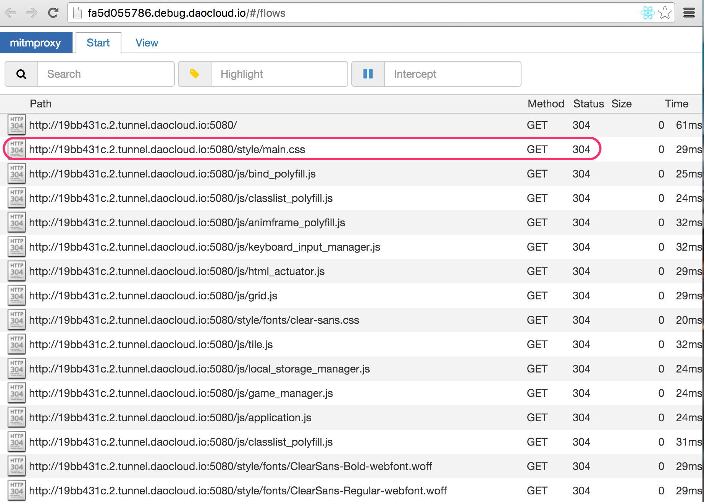

云隧道功能是 DaoCloud 为开发者提供的一项高级功能，旨在帮助开发者在复杂多变的网络环境下，获得一致和稳定的应用访问入口，便于开发和应用的调试，是开发者的安全云隧道，跨网络的容器云地址，让您在本地也能部署公网服务器。

>>>>> 请注意，云隧道功能，目前仅适用于部署在**自有集群中主机上**的应用，并仅提供 **HTTP** 方式的隧道访问。

有关自有集群和在自有集群之上部署应用，请分别参考对应的文档：

>+ [创建和管理 DaoCloud 主机集群](../../cluster-mgmt)
>+ [向自有主机集群上发布应用](../../app-deploy-mgmt/deploy-to-cluster)

云隧道有一些非常有价值的应用场景，我们举例如下。

#### 通过云隧道对外暴露内网应用

DaoCloud 具备在跨云跨网环境下进行容器的部署和管理的能力，我们可以将用户内网环境中的机器接入 DaoCloud 管理平台，与持续集成、应用部署等环节无缝对接。在此技术的基础之上，我们发布的云隧道功能，可以把用户内网主机上部署的容器应用，通过特殊的云隧道，发布到外网，整个过程，并不需要打开任何防火墙端口。我们以 2048 这个应用为例进行演示：

1. [创建自有集群](../../cluster-mgmt/what-is-cluster)并[添加主机](../../cluster-mgmt/add-cell-node)，为了演示效果，您可以添加一台位于内网的服务器，或者任何一台能够连接外网的虚拟机，如果您手头没有可用的主机，也可以使用我们提供的[胶囊主机](../../cluster-mgmt/add-cell-node)。
2. 在 DaoCloud [镜像仓库](../../daocloud-registry/use-daocloud-registry)选择一个应用部署到您刚创建的集群，在这个例子中，我们部署了一个 2048 页面游戏。
3. 部署完成后，您会在应用管理的页面，看到云隧道功能。请注意：云隧道是针对专业版用户的一项收费功能。
4. 点击「创建」按钮，我们将为您的应用生成一个可在外网访问的 URL！

注意事项：

>+ 仅支持在 DaoCloud 自有主机上的应用，并且容器需要通过 DaoCloud 来部署，而不是在主机上通过 `docker run` 启动。
>+ 目前隧道协议仅开放了 HTTP ，暂时不支持 HTTPS 和 TCP／UDP 等访问协议。
>+ 云隧道功能是为了开发者进行远程应用调试和演示，我们对带宽和并发链接数都有一定的上限控制，不可以用在生产环境，或者跑一些流量密集型的应用。

使用场景

>+ 远程访问公司、或家中主机上的应用，或为客户 demo 部署在内网的应用。
>+ 在微信应用开发场景中，可以使用云隧道为开发中的应用获得一个稳定的 URL，便于进行微信回调测试，省去了管理防火墙、配置临时域名等操作，加快开发测试的速度。
>+ 在任何内网防火墙，或者动态外网 IP 环境下，位应用提供一个稳定不变的入口 URL。这个 URL 和背后的云隧道，不会随着网络和 IP 地址的变化而发生变化，云隧道将自动适应网络变化。

#### 微服务应用的调试

在时下流行的微服务架构中，应用通常采用了前后端分离的设计，后端的功能，通过 API Server 方式对前端提供，由前端的代码，使用 Restful API 的方式调用。在这种情况下，前端调用后端的过程往往涉及到了大量的网络通信，监控和调试的难度较大。DaoCloud 云隧道提供了跨网络、有依据的微服务应用的调试功能，具体的使用方式请参考如下的例子。

在这个例子中，我们选择了一个非常简单的 API Server 和 Client 的组合。

1. 我们把 API Server 部署在自由主机之上，并开启云隧道服务。
2. 在获得了外网访问的 URL 后，我们点击「打开调试」，会开启一个截获并显示所有 HTTP 访问情况的调试窗口，如下图。
3. 我们可以通过这样的方式，调试前后端分离应用。

#### 搭建属于自己的云隧道服务

待续。。。
