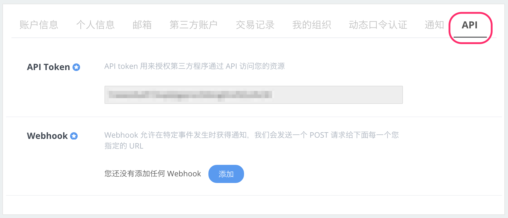

DaoCloud 提供 API 和 Webhook 接口，便于第三方应用与 DaoCloud 集成。

#### DaoCloud Open API

DaoCloud Open API 提供了认证、代码构建、应用管理等多个层级的操作接口，第三方应用可以通过这些 API，并结合 Webhook 事件，完成复杂的功能整合。

>>>>> 有关 API 接口和调用细节，请参考我们的 OpenAPI [文档站点](../../api)。

#### API Token 配置界面

为了使用 DaoCloud OpenAPI，请先在「用户中心」的「API」界面，配置 Token。
我们为每个用户提供了唯一的 API Token，在调用我们的 API 时，您需要在代码中包含这个 Token，以便完成身份验证。

#### Webhook 配置界面

为加强第三方应用与 DaoCloud 的交互，我们提供了 Webhook 事件钩子，在「镜像构建」和「持续集成」完成后，我们可以向指定的 URL 发送消息，第三方应用可以根据这些消息，触发后续的操作逻辑。

#### 与 DaoCloud Open API 对接并建立合作

我们真诚邀请各类应用开发者，SaaS 服务提供商使用 DaoCloud Open API，实现自动化的应用构建和交付。
对于使用 DaoCloud Open API 的合作伙伴，我们将分享市场资源，共同推广。

如您有兴趣，可以跟我们联系：[support@daocloud.io](mailto:support@daocloud.io)
