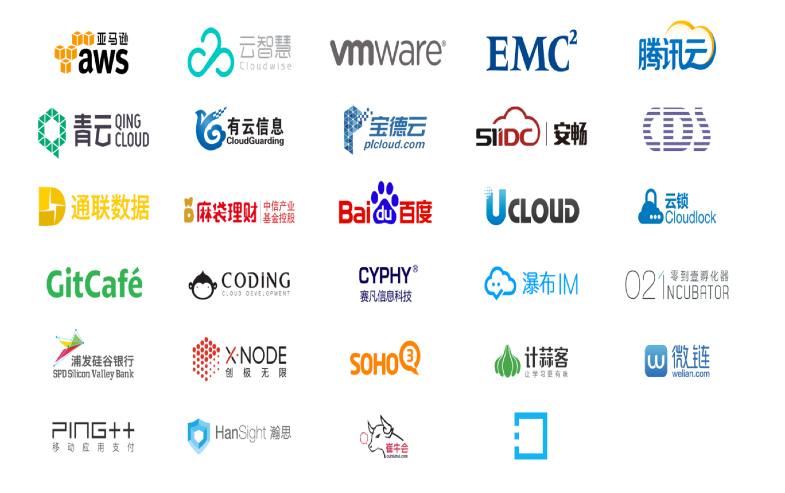

「Container+」联盟是由 DaoCloud 于今年6月份发起的开放性组织。联盟以打造立体生态、共赢容器市场为目标，旨在推动容器技术在企业落地。

* 联合产业链上下游的合作伙伴
* 共同推动企业级容器云平台发展
* 帮助企业实现互联网的架构和业务双转型

如您有意成为 DaoCloud 「Container+」联盟成员，请[与我们联系](mailto:info@daocloud.io)。

