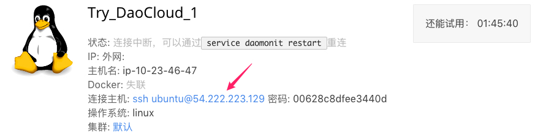
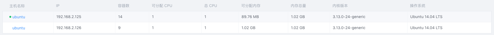
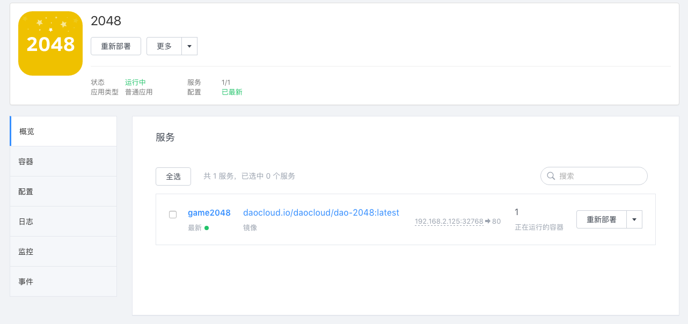

DCE 提供了一整套安装套件。你可以在 10 分钟之内安装 DaoCloud Enterprise (DCE)。 

这个页面将帮助你在 DaoCloud 胶囊主机上快速安装一套简单的 DaoCloud Enterprise (DCE) ，并使用 DCE 控制台部署你的应用。如果你对胶囊主机不熟悉，你可以查看[添加胶囊主机](http://docs.daocloud.io/cluster-mgmt/add-cell-node)来了解胶囊主机的申请和使用。

如果你熟悉 DCE 和 Docker，你可以直接前往[应用部署](http://docs.daocloud.io/daocloud-enterprise/deploy-an-application)查看更详细的 DCE 安装与部署方案。 

一个基础的 DCE 容器集群包含了主控节点、副控节点和容器节点，其中，主控节点作为统筹者负责监控管理集群中的容器节点，副控节点作为主控节点的备份节点，保证 DCE 的高可用，容器节点运行所有的 Docker 容器和应用，并接受主控节点的管理。

>>>>> 这里我们使用胶囊主机安装 DCE 构建单节点容器集群，这时主控节点、副控节点、容器节点在一台节点上，即一台节点承担三种角色。


## 简单介绍

本次示例将向你介绍如何安装 DCE 和如何使用 DCE 控制台快速部署一个简单的 2048 应用。部署完成后，便可以通过浏览器进入该游戏。为了保证简单快速，本次示例中使用一台胶囊主机安装 DCE，模拟单节点集群。

>>>>> DaoCloud 向用户提供了应用仓库，在本次示例中，只要在应用仓库中找到 2048，然后点击立即部署即可，不需要用户编写任何代码。

## 第一步 准备环境

在安装 DCE 之前，你需要申请使用一台胶囊主机。

DaoCloud 胶囊主机配备了 Docker 环境，无需再安装 Docker。

当你添加胶囊主机后，请单击下图标示的连接连接到胶囊主机的终端环境，然后再进行下一步。



## 第二步 安装主控节点

在终端中使用如下命令安装 DCE。
```
bash -c "$(docker run -i --rm daocloud.io/daocloud/dce install)"
```

当控制台输出类似下面的输出时，则安装成功。
```
Installed DCE
DCE CLI at 'export DOCKER_HOST="192.168.2.125:2375"; docker info'
DCE WEB UI at http://192.169.2.125
```

安装过程可能出现 `Please run the script to enable Overlay Network`  提示，此时，请使用如下命令重启 Docker。
```
service docker restart
```


 >>>>> 安装好 DCE 控制器后，便可以通过浏览器访问主控节点对应的 IP，进入 DCE 控制台。需要注意的是，当你使用 DaoCloud 胶囊主机的时候，进入 DCE 控制台的 IP 是 DaoCloud Dashboard 页面显示的胶囊主机的外网 IP，而不是 DCE 安装完成后提示的 IP。


## 第三步 接入主机

目前你已经完成了主控节点的安装，如果你只有一台胶囊主机用于 DCE，你可以跳过当前步骤，进入下一步，开始部署应用。如果你有多台胶囊主机，那么当你在安装好主控节点后，你还需要在其他胶囊主机上安装 DCE 容器节点（简称为容器节点），从而使该胶囊主机接入 DCE。

容器节点安装方法如下

1. 获取主控节点机器 IP，即上一步中胶囊节点的外网 IP
2. 登录容器节点，进入终端
3. 执行如下命令，安装容器节点程序，将当前节点加入 DCE

```
bash -c "$(docker run -i --rm daocloud.io/daocloud/dce join {你的控制器IP})"
```

完成主机接入后，你可以在 DCE 控制台「主机」页面查看、管理新加入的主机。



## 第四步 部署应用

到现在，你已经完成 DCE 基本环境的安装，接下来，我们以在 DCE 控制台部署 2048 作为示例向你介绍应用部署流程。

首先在 DCE 控制台点击「应用」，接着点击「应用」创建，开始创建应用，填写应用名称，然后选择创建方式，这里选择「应用仓库」。


>>>>> 更多创建方式的使用，可以参考[应用部署](http://localhost:8080/daocloud-enterprise/deploy-an-application)


浏览 DaoCloud 提供的应用仓库，从中选择选择「2048」。


最后，点击「立即部署」，完成 2048 应用的部署。

>>>>> 在应用配置部署环节，可以通过修改「Compose YML」配置应用。 


## 第五步 管理应用

DCE 通过 WEB UI 提供了一套完整的 DCE 控制台。通过浏览器访问主控节点的 IP，就进入 DCE 控制台。在 DCE 控制台，你可以对应用、容器、存储卷、网络、主机等进行配置和修改。

在本次示例中，安装完 2048 应用后，DCE 将自动跳转到应用管理页面，你可以在该页面对应用进行更加精细的控制和管理。


>>>>> 更多应用管理的信息，可以参考[应用管理](http://docs.daocloud.io/daocloud-enterprise/manage-applications)


