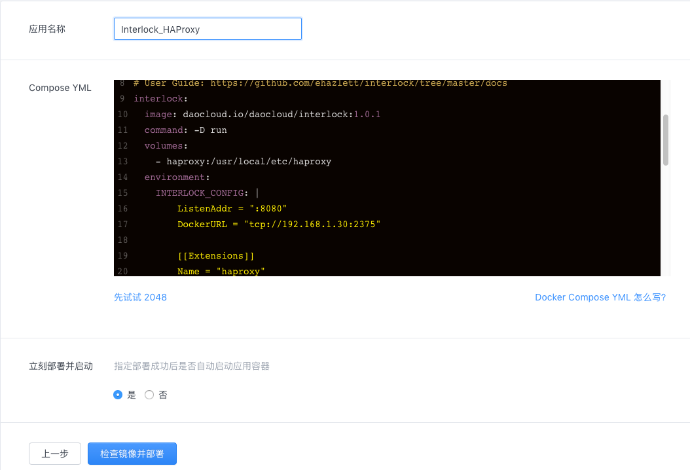

## 简单介绍

当开发人员开始开发一个应用的时候，常会将注意力集中到功能、性能、鲁棒性和软件质量上，对于应用的的持续部署和发布并不重视，而这为运维人员的运维工作带来了困难。为了解决这个问题，人们提出了 DevpOps，要求开发人员不仅要开发程序，还要了解程序部署发布的相关流程并参与到程序的部署和发布之中，即促进开发团队和运维团队更加高效的协作。

DevOps 要求应用部署是可拓展的。这意味着应用不再是一个巨大的、高度耦合的“大个子”，大型的应用需要被合理的拆分成多个小型、无状态、可重用的微服务组件。这些微服务组件能够非常容易的进行部署、拓展、管理和发布。

DaoCloud Enterprise（DCE）能够帮助用户更好的实践 DevOps。DCE 具备服务发现，在 DCE 容器集群中，如果有新的容器或应用被部署，DCE 能够及时的、自动化的发现该容器或应用。除此之外，DCE 也能够对多个应用进行负载均衡处理。换句话说，容器集群中同时部署多个提供相同服务的应用实例，如果有服务请求，DCE 会自动接受该请求，并根据各个应用实例的负载情况，将请求转发给某个实例。通过 DCE 的服务发现和负载均衡，用户能够在不对代码进行任何更改的情况下，就将服务进行横向拓展，满足高可用和高性能的需求。


### 示例说明

在本页，你能够了解到如何使用 DCE 的服务发现和负载均衡部署一个高可用的应用服务。这里以一个部署一个简单的 2048 服务作为例子。这个例子包含五个 2048 应用实例。

部署目标：
>* 在 DCE 上部署五个 2048 应用
>* 每个服务能够被 DCE 自动发现
>* 所有的服务能够通过一个预先定义的 DNS 域名进行访问
>* 所有的服务组成一个虚拟集群，具备高可用和负载均衡


## 部署 Interlock 和 HAProxy

### Interlock 和 HAProxy 介绍

Interlock 是一个容器化的事件驱动工具，它能够连接到 DCE 的主控节点并监控主控节点发生的事件。在这里，Interlock 负责监控和查找 DCE 容器集群中的容器节点的元数据 （metadata），如主机名和 lanbels。在获取到这些元数据后，Interlock 会使用这些数据向负载均衡后端程序注册（或注销）容器节点。需要注意的是，Interlock 和后端的负载均衡程序都是无状态的，以保证后期能够轻松对当前需要负载均衡服务的节点进行拓展。

HAProxy 是一个提供高可用负载均衡的应用代理，支持虚拟主机。HAProxy 官方数据显示，HAProxy 最高可以支持高达 10 G 的并发请求。这里是用 HAProxy 作为负载均衡代理，使得应用服务在快速拓展的同时，也具备高并发处理能力。


通过 Interlock 和 HAProxy 的组合，我们能够实现高可用的负载均衡。为了方便部署，DaoCloud 在应用仓库提供了已经配置好大部分功能的 `Interlock HAProxy` 镜像，大大降低了部署负载均衡的难度。

### 部署镜像

在 DCE 中部署 Interlock 和 HAProxy 需要进入 DCE 控制台。

首先，请你进入 DCE 控制台的应用子页面，并创建应用。创建应用方式选择「应用仓库」，镜像选择 `Interlock HAProxy`:


检查主控节点 IP 并设置 HAProxy 管理员密码：


填写应用名称并检查 YML 文件：


控制台提示创建成功后，通过访问 `IP:PORT/haproxy?stats` 进入 HAProxy。

进入 HAProxy 需要输入验证信息，登录名为 `admin`，密码为创建应用时设置的密码：


进入 HAProxy：


## 部署应用并拓展

进入 DCE 控制台，创建应用。创建方式选择「应用仓库」，镜像选择 `2048`，然后在 YML 文件后面追加？？？如下内容：

```
  labels:
  - "interlock.hostname=2048"
  - "interlock.domain=local.com"
```


追加说明：
[list]()

应用部署完成后，我们进入 HAProxy 页面，可以看到 HAProxy 已经发现了新应用：


为了实现多个应用的负载均衡处理，这里还需要拓展应用。拓展应用指使用相同的镜像和配置启动多个应用容器。

拓展应用需要从下拉列表中选择：


填写拓展数目：


完成应用拓展，进入 HAProxy，可以看到新拓展的应用：


配置 host 和 dns

访问 2048


