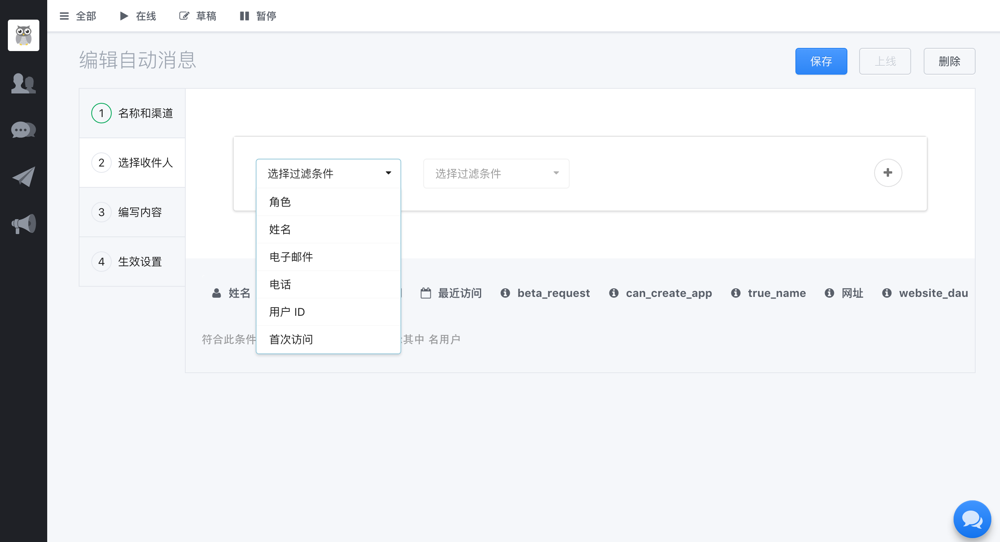

* DaoVoice 可以拉近公司和用户的距离，可以 10 倍提升「用户参与感」
* 精益运营支撑服务，将用户行为与反馈数据输入到产品迭代周期，让用户定义产品
* 激发用户的持续参与感
* 数据驱动提升用户参与感
* 参与感成就精准用户画像

DaoVoice 的推出是为了帮助企业实现以用户为中心的「精益运营」体系。DaoVoice 以数据为驱动，精益运营，将用户行为与反馈数据输入到产品迭代周期，让用户定义产品，让参与感驱动产品迭代。DaoVoice 同时能够与 DaoCloud 的三大产品线－－DaoShip（持续交付流水线）、DaoHub（企业级容器镜像仓库）、DaoCloud（企业级容器云平台）进行整合，共同打造一个以用户为中心的应用开发、交付、运维和运营闭环。

当前，企业 IT 面临着严峻的考验。企业需要的 IT 能力已经不再单单是过去解决企业信息化的问题；企业如果不具有持续创新的能力，很有可能就会成为下一个被颠覆者。在这种形势下，企业需要持续释放的「原力」，而这种原力就是真正获取互联网企业所拥有的 IT 能力，如快速迭代能力和持续创新的能力。DaoCloud 已经基于其三大产品组合 DaoShip、DaoHub 和 DaoCloud 打造了一个快速迭代的闭环，DaoCloud 将其称之为「原力引擎」， DaoVoice 的推出更为「原力引擎」注入了强大的驱动力。现在这台原力引擎已日益完善，我们将把这套「原力引擎」推送给更多企业客户，帮助企业持续释放创新原力。

#### 我该使用DaoVoice吗

* 如果您是产品经理，DaoVoice是您的不二选择。你可以看到用户在网站的信息，并通过个性化推送提升用户参与感，根据用户反馈迭代产品
* 如果您是市场推广，DaoVoice可以帮助您洞察用户客户，并帮助您联系和转化潜在客户
* 如果您是客服人员，DaoVoice可以更方便的解决用户提出的难题，比起工单更好用，更亲切
* 如果您是工程师，DaoVoice可以帮助您定位用户的问题，让开发更敏捷

#### DaoVoice 的核心功能

DaoVoice 是一款创新的融合式用户和产品运营管理平台，由 DaoCloud 开发并运营。DaoVoice 秉承「数据驱动，精益运营」的理念，为各种形态的互联网应用提供包括 客户互动、实时消息、定向推送、反馈收集、融合客服、信息挖掘、留存转化 等功能，帮助开发者打造以用户为中心，由客户参与和反馈驱动的互联网应用。

DaoVoice 包括以下核心功能：

##### 页面集成客户沟通工具

* 与各类 Web 应用无缝集成，提供与用户交流沟通的便捷渠道。沟通工具支持 Web 和 Email 两种方式，秉承「ChatOps」理念，拉近用户与产品运营团队的距离
* 应用场景：典型的客服及用户交流工具，用户信息采集，信息反馈等

##### 触发式事件管理和跟踪

* 通过在页面代码中调用 SDK，DaoVoice 可以捕获用户的各类操作活动，并根据用户行为在后台通过 Segment 和 Tag 标识用户。运营团队可以实施根据用户行为模式的精准服务及营销
* 应用场景：精细化用户行为模式跟踪、捕获及分析，可以帮助运营团队获取 DAU、网站核心功能使用频率，并细化到具体用户的层面

##### 自定义自动消息

* DaoVocie 提供向用户主动推送消息的机制，并且提供了非常灵活的自定义配置，可以根据用户注册时间，各类行为模式为条件，触发推送消息
* 应用场景：打造差异化、精细化用户体验，提供根据用户行为模式的主动信息推送，如用户进入付费功能时，推送产品价值、促销等场景化信息

##### 实现产品运营到研发的完美闭环

* DaoVoice 将与 DaoCloud 容器交付平台集成，运营团队可以将用户的产品反馈与开发需求管理流程对接，实现更高速的开发、交付、运维、运营闭环
* 应用场景：运营团队的数据不再是孤岛，实现自动化的运营到研发对接，当用户提出产品需求或 Bug 时，DaoVoice 自动与 DaoCloud 容器交付系统对接

>>>>> DaoVoice 目前在产品内测阶段，如需要试用，请访问 [www.daovoice.io](http://www.daovoice.io) 并提交内测申请。
