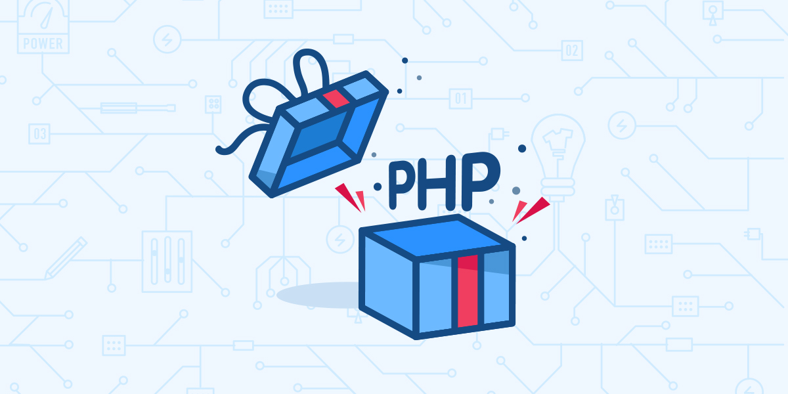

<!-- reviewed by fiona -->

用 PHP 作为我们「Docker 开发大礼包」开篇是带着一些朝圣的心情的。这是一门堪称「古老」的语言，也是一门争议最多的语言，更是一门不断涅槃的语言。「PHP 是最好的语言」这个流传已久的梗，或许正是对我国最有群众基础的编程语言描述里，最经典的注解。

就让我们一起回顾一下 PHP 的发展历程作为此系列文章的开篇。历史是最好的老师，他给每个未来提供启示。

##### 谁创造了 PHP？

Rasmus Lerdorf 在 1994 年创造了 PHP，Andi Gutmans 和 Zeev Suraski 于 1997 年重写了 PHP 的解析器，之后他们在以色列成立了著名的 Zend 公司来维护 PHP 的开发。

##### PHP 是什么的缩写？

起先的意思直白的有点近乎粗鲁「Personal Home Page」，后来改成了「PHP: Hypertext Preprocessor」即便用今天的眼光看也是很酷炫的命名。

##### PHP 最著名的版本？

PHP 5 发布于 2004 年 7 月 13 日，距今正好第十一个年头。

##### 下一个 PHP 版本？

PHP 7 计划于 2015 年 12 月 3 日发布。

##### PHP 的形象代言人？

一只蓝色的大象，因为「elePHPant」（黄色的那头是 Hadoop）。

##### 谁在主导 PHP 的方向？

PHP Group 来维护其标准，Zend 作为商业公司提供参考实现。

##### HHVM 又是什么？

HipHop Virtual Machine (HHVM) 是 Facebook 对 PHP 的一次革命性衍进。HHVM 采用实时编译进程，使得 PHP 的执行效率大幅提升。Facebook 在 2013 年全面采用 HHVM 运行 PHP，间接拉升了 PHP 生态的逼格，激发了整个 PHPer 群体的活力。

##### PHP 的包依赖怎么做？

Composer

##### PHP 的单元测试怎么做？

PHPUnit

##### 常见的 PHP 技术栈和应用场景？

LAMP（Linux + Apache + MySQL + PHP）长期占据着我国互联网应用的主流架构。即便在今天，这也是电商和社区类互联网公司的主要技术栈。尤其在电商领域，说 PHP 托起半个中国的购物车都不为过。

##### 为什么 ASP 和 JSP 都没有 PHP 受众广？

当年 FTP 比起 VPS 简直是白菜价。但这也间接养成了 PHP 开发重功能轻工程的通病，加上部署的随意性，上规模后运维虐成狗。

##### 就这个运维问题，作者 Rasmus Lerdorf 怎么看？

> I'm not a real programmer. I throw together things until it works then I move on. The real programmers will say “Yeah it works but you're leaking memory everywhere. Perhaps we should fix that.” I’ll just restart Apache every 10 requests.

翻译过来就是：「重启应该就有好运气」。

##### 那怎么破的，能教教吗？

上 Docker！

欢迎进入「PHP 应用 Docker 开发大礼包 - Powered by DaoCloud」，六篇由浅入深、精心设计的系列文章，带领 PHP 开发者领略 Docker 化应用开发和发布的全新体验。

* [如何制作一个定制的 PHP 基础 Docker 镜像（一）](../../php-docker/php-docker-001)
* [如何开发一个 PHP 的 Docker 化应用（二）](../../php-docker/php-docker-002)
* [如何开发一个 PHP + MySQL 的 Docker 化应用（三）](../../php-docker/php-mysql-docker-003)
* [如何配置一个 Docker 化持续集成的 PHP 开发环境（四）](../../php-docker/docker-php-ci)
* [如何开发一个 PHP + NewRelic 的生产级 Docker 化应用（五）](../../php-docker/php-newrelic-docker-05)
* [如何开发一个 Laravel + MySQL 框架的 Docker 化应用（六）](../../php-docker/laravel-mysql-docker-06)