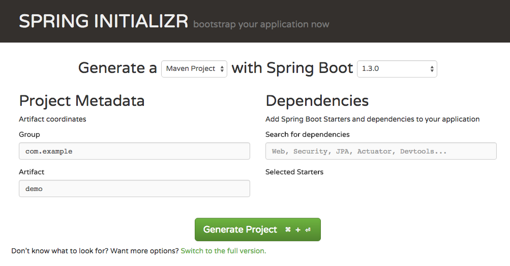

> 目标：用 Docker 的方式搭建一个 Java Spring Boot 应用
> 
> 本项目代码维护在 **[DaoCloud/docker-demo-spring-boot](https://github.com/DaoCloud/docker-demo-spring-boot)** 项目中。
>
> 您可以在 GitHub 找到本项目并获取本文中所提到的所有代码文件。

### 前言
Java 一直是企业应用开发的大头，在互联网时代，在云计算、大数据的推动下，Java 又焕发了新生。

Spring Framework 是 Java 应用开发中应用最广泛的框架，基于 AOP 及 IOC 的思想，让它能与任何 Java 第三方框架进行非常便利的集成。

Spring Boot 是由 Pivotal 团队提供的全新框架，其设计目的是用来简化新 Spring 应用的初始搭建以及开发过程。该框架使用了特定的方式来进行配置，从而使开发人员不再需要定义样板化的配置。通过这种方式，Spring Boot 致力于在蓬勃发展的快速应用开发领域（Rapid application development）成为领导者。

Maven 自从公布以来，在 Java 应用构建和管理中一直处于最重要的地位，基于 Project Object Model 的概念管理项目。

### Docker 化应用的关键元素
* 镜像是 Docker 应用的静态表示，是应用的交付件，镜像中包含了应用运行所需的所有依赖：包括应用代码、应用依赖库、应用运行时和操作系统。
* Dockerfile 是一个描述文件，描述了产生 Docker 镜像的过程。详细文档请参见 [Dockerfile文档](https://docs.docker.com/reference/builder/)
* 容器是镜像运行时的动态表示，如果把镜像想象为一个 Class 那么容器就是这个 Class 的 instance 实例。

一个应用 Docker 化的第一步就是通过 Dockerfile 产生应用镜像。

### 创建 Spring Boot 项目

访问 http://start.spring.io 站点，根据需要建立自己的应用。



在整个 Java 教程中，我们将基于 Spring Boot 开发一个 RESTful API 应用，使用 MongoDB 来持久化我们的数据，项目使用 Maven 构建。

现在，我们先建立一个 RESTful API 应用。

所以，我们在 Dependencies 中填写 Web ，然后点击 Generate Project 按钮，将会下载回来一个基于 Maven 的项目模板。

### 添加项目代码

编辑 `src/main/java/io/daocloud/demo/DockerDemoSpringBootApplication.java` 文件，添加一个方法，加上 `@RequestMapping` 注解，并添加类注解 `@RestController`。

```
@RestController
public class DockerDemoSpringBootApplication {

    public static void main(String[] args) {
        SpringApplication.run(DockerDemoSpringBootApplication.class, args);
    }

    @RequestMapping("")
    public String hello(){
        return "Hello! Docker!";
    }
}
	
```

### 添加 Dockerfile

在应用根目录下建立 Dockerfile 文件，内容如下：

```
FROM maven:3.3.3

ADD pom.xml /tmp/build/
RUN cd /tmp/build && mvn -q dependency:resolve


ADD src /tmp/build/src
        #构建应用
RUN cd /tmp/build && mvn -q -DskipTests=true package \
        #拷贝编译结果到指定目录
        && mv target/*.jar /app.jar \
        #清理编译痕迹
        && cd / && rm -rf /tmp/build
		
VOLUME /tmp
EXPOSE 8080
ENTRYPOINT ["java","-Djava.security.egd=file:/dev/./urandom","-jar","/app.jar"]

```

> 由于项目使用 Maven 构建，故本次基础镜像选用 `maven:3.3.3` 官方镜像。

> 官方维护的 Maven 镜像依赖于 Java 镜像构建，所以我们不需要使用 Java 镜像。

因为 Spring Boot 框架打包的应用是一个包含依赖的 jar 文件，内嵌了 Tomcat 和 Jetty 支持，所以我们只需要使用包含 Java 的 Maven 镜像即可，不需要 Tomcat 镜像。

为了减少镜像大小，在执行 Maven 构建之后，清理了构建痕迹。

在 Dockerfile 文件的最后，使用 `ENTRYPOINT` 指令执行启动 Java 应用的操作。

Dockerfile 具体语法请参考：**[Dockerfile](https://docs.docker.com/reference/builder/)**。

### 进入 Docker 的世界

在一切准备好之后，在应用根目录执行如下命令，构建 Docker 镜像：

```
docker build -t docker-demo-spring-boot .
```

最后，让我们从镜像启动容器： 

```
docker run -d -p 8080:8080 docker-demo-spring-boot
```

打开浏览器，或者使用 curl 访问如下地址：
```
http://127.0.0.1:8080
```

将会看到 `Hello! Docker!` 文字。

如果看到这段字符串，那么就说明你成功将一个基于 Spring Boot 的应用 Docker 化了。

欢迎来到 Docker 的世界，这个世界有你意想不到的精彩！

#### 致谢

本文由 DaoCloud 社区用户**谭文科**提供