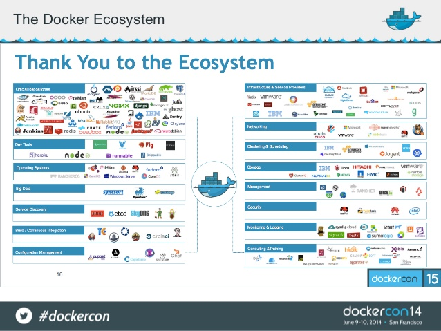

DaoCloud Enterprise (DCE) 企业级容器集群解决方案。

## 什么是 DaoCloud Enterprise (DCE)

DaoCloud Enterprise 提供了一套容器集群解决方案。DCE 可以管理您的计算资源，包括物理机和公有云环境，您可以在 DCE 上部署并管理所有的 Docker 应用。  

DCE 的特点是 标准化、企业级和开放性。

## 标准化

DCE 可以通过标准的方式来部署、管理、监控您的Docker应用。并提供了容器，虚拟网络和存储的功能。 DCE是高度标准化的，兼容Docker Compose和Docker API。

DCE提供了应用管理的功能，您可以通过界面向导或者Compose文件来创建应用，并支持持续发布，审计日志等功能。还包含有容器环境，存储卷管理和虚拟网络的功能。

DCE 还提供了基于标准的应用仓库，可以使用来着DaoCloud云的应用。也可以连接 Docker Hub 和您的私有镜像仓库。

DCE 兼容Docker Compose和Docker API。可以使用Docker命令行操作容器等对象。并可以和各种已经集成Docker系统互操作。

## 企业级 

DCE 是适用于企业级环境的。您可以将DCE安装在物理机，虚拟化(VMware,OpenStack)和云环境上，操作系统也可以选择几乎所有的Linux发行版，包括Linux - Ubuntu, RedHat, Centos, Suse 等,Windows 也即将支持。

DCE有部署运维工具套件，您可以一键安装，升级，配置虚拟网络等操作。并支持离线化安装。最小化安装只需要1台主机

DCE提供了丰富的监控功能，包括系统看板，日志，性能监控。让系统出现异常的时候，可以看到消息提示。

DCE还提供了高可用，DCE可以一键部署多master多活的高可用模式。并提供和安全性支持，支持多用户管理。
 
DCE集成DaoVoice，可以提供行业最佳的在线服务支持。

## 开放性

DCE 是一套开放的体系，所有Docker生态圈可以和 DCE 无缝集成。 DCE 可以发现您部署容器和应用。可以和多种CI/CD 无缝对接，支持持续发布。 

DCE还可以提供企业级存储集成。给容器提供存储的能力。可以和企业级别存储无缝对接。
