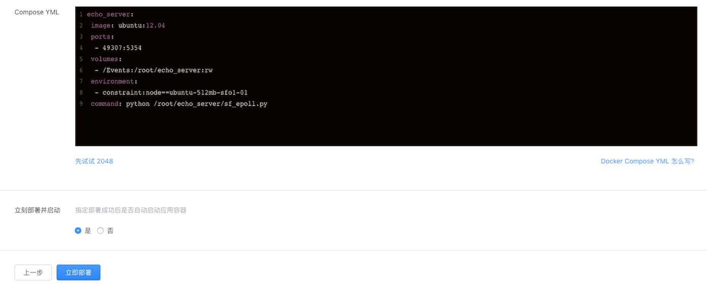
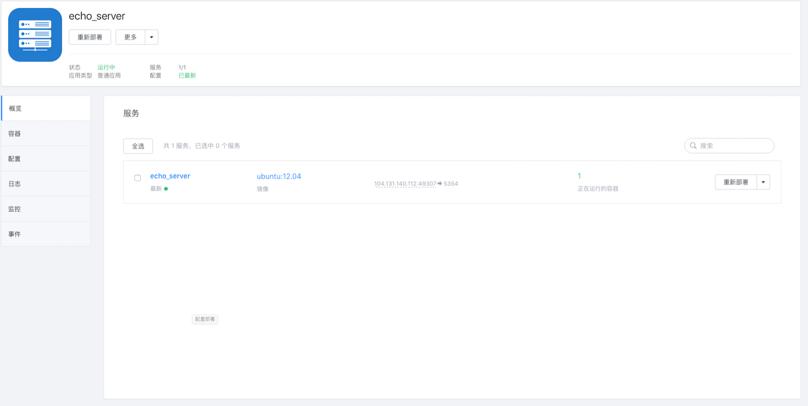
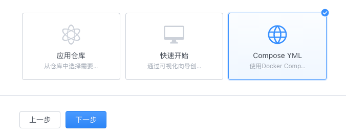
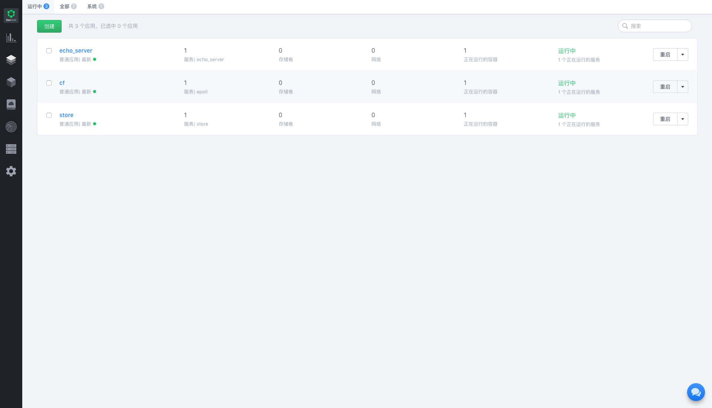

## 什么是应用
应用是为针对用户的某种应用目的撰写的软件，开发人员通过应用为用户提供服务，而 DaoCloud 通过 DCE 向应用开发人员提供快捷的应用交付与部署服务。你可以通过 DCE 安装、部署并管理所有的 Docker 应用，包括私有云和公有云环境。

## 通过应用仓库部署应用
DCE 允许你连接到 DaoCloud 应用仓库，选择已有的应用镜像，然后根据镜像快速部署和构建你的应用，仅仅需要三个步骤，就能够完成应用部署。DaoCloud 应用仓库目前已经拥有包括 MySql，Nginx，Redis 在内的 23 种 Docker 镜像。

如果你需要通过应用仓库部署应用，你需要在「选择创建方式」时，点击「应用仓库」，并选择你需要的应用镜像，之后便可以部署你的应用。


从现有应用仓库中选择需要的应用镜像，这里以 2048 为例，选择 2048。


成功部署。


通过浏览器访问，进入 2048 游戏。


## 通过快速开始部署应用
DCE 向用户提供了通过「快速部署」的可视化向导进行应用部署的方式。你可以跟随着 DCE 控制台可视化向导的指引，轻松地完成应用部署。
首先，创建应用，并且在「选择创建方式」时，点击「快速开始」。

进入「添加服务」，根据页面内容提示，输入「服务名」和「所属镜像」，如果「所属镜像」为私有镜像，请勾选「是否是私有镜像」。这里以回显服务器为例。

点击「展开基本设置」，根据应用需要依次设置「容器端口」，「存储卷」，「调度节点」以及「环境变量」。
这里以回显服务器作为例子，将机器的 49307 端口流量映射到 Docker 容器的 5354 端口，当外部主机向该主机的 49307 发送回显请求时，系统会自动将请求转发给 Dokcer 应用容器的 5354 端口。回显服务器应用中，将回显服务器的代码存储在主机的 /root/Events 中，通过存储卷映射，将该路径映射到 Docker 容器的 /root/echo_server 目录下，便于应用开发和部署。Docker 容器存储卷映射默认具备写权限， 如果你的应用不需要对主机目录进行写操作，请取消该选项。


>>>>> 你可以从[GitHub](https://github.com/chengxuyuanfei/Events/tree/docker_echo)获取回显服务器的代码。


>>>>> 当你使用存储卷时，请不要将主机根目录挂载到 Docker 镜像中，以免 Docker 中的程序对主机造成破坏。

点击「展开高级设置」，依次设置「自动重启」和「启动命令」。完成后选择「配置部署」，进入下一步操作。

查看「Compose YML」，确认后，点击立即部署。

完成 echo_server 应用的部署。


使用 Socket 测试回显服务器是否运行正常。
```
input:hello DaoCloud!
reply: hello DaoCloud! length: 15
```
>>>>> [回显服务器测试代码](https://github.com/chengxuyuanfei/Events/blob/docker_echo/client.py)


## 通过Compose YML部署应用
除了提供「应用仓库」和「快速开始」两种快速部署方案外，DCE 还提供了基于 Compose YML 的应用部署方案。熟悉 Compose YML 的开发人员可以通过编写 YML 实现更加灵活的应用部署。
>>>>> [Compose YML 介绍和编写规则](https://docs.docker.com/compose/compose-file/)

当你需要使用 Compose YML 进行应用部署时，你需要在「选择创建方式」时，点击「Compose YML」。


随后你便进入 Compose YML 编写页面，你可以在此编写你需要的部署规则。


>>>>> 当你使用「应用仓库」和「快速开始」部署方案时，同样可以在执行部署前修改 DCE 默认生成的 YML 规则。

## 应用管理
DCE 为用户提供了丰富的应用管理操作。你可以通过 DCE 控制台对任何应用进行「停止」，「重启」，「下载并部署」，「卸载并删除」和「下载并部署」等操作。
当你需要对某个应用进行管理时，你首先需要点击「应用」，进入应用管理控制台。
在应用管理控制台，你可以查看处于不同状态中的应用，如「运行中」应用，「全部」应用和「系统」应用。

>>>>> 「系统」应用为 DCE 程序运行所需的应用。

从应用列表选择你需要查看管理的应用，进入应用子页面。在这里，你可以查看 DCE 监控到的该应用的运行信息，如运行日志，事件和性能监控。同样，你也能够通过「重新部署」等操作对应用进行管理。


### 扩展应用

### 持续发布