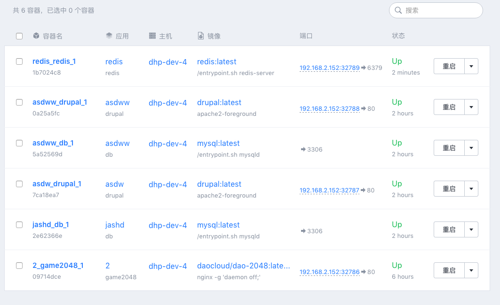

DCE 为用户提供了基于 WEB 的控制台，通过浏览器访问 DCE 主控节点 IP 即可进入控制台。
DCE 控制台具有管理容器的功能，点击 DCE 控制台「容器」即可进入容器管理页面。

## 管理容器

在 DCE 控制台容器管理子页，DCE 为每个容器提供了可选择的管理服务。当用户点击容器列表最右方的下拉按钮，即可根据需要对应用进行各类操作。

操作说明：

| 操作 | 操作说明 |
| ---- | ---- |
| 重启 | 重启当前容器 |
| 停止 | 停止当前容器 |
| 删除 | 删除当前容器 |
| 控制台 | 弹出通过 CLI 客户端进入容器进行管理的命令 |

## 查看容器详情

当用户需要对各个容器进行更佳细致的操作时，可以点击该容器，进入该容器的详情页。

容器详情页主要操作说明：

| 操作 | 操作说明 |
| ----- | ----- |
| 概览 | 查看、管理当前容器启动的服务 |
| 日志 | 查看当前容器的输出日志 |
| 监控 | 查看当前容器所在节点的CPU、内存、网络等性能数据 |
| 进程 | 查看当前容器的进程信息 |
