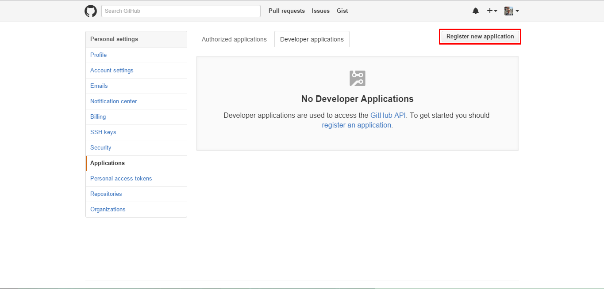
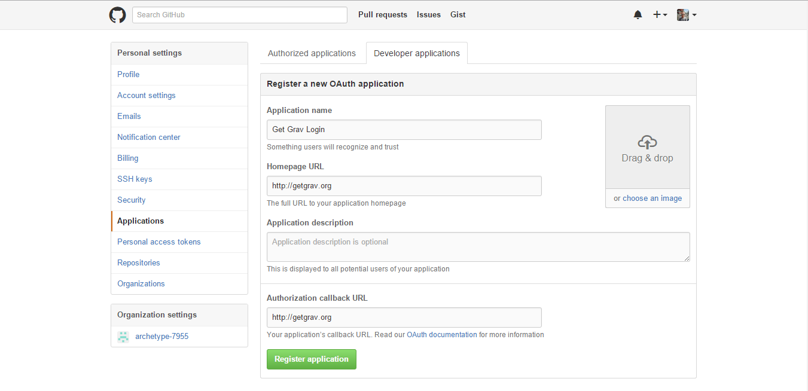
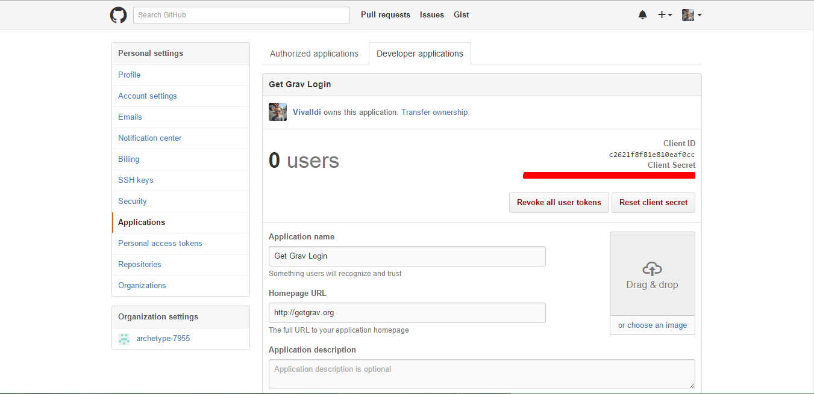
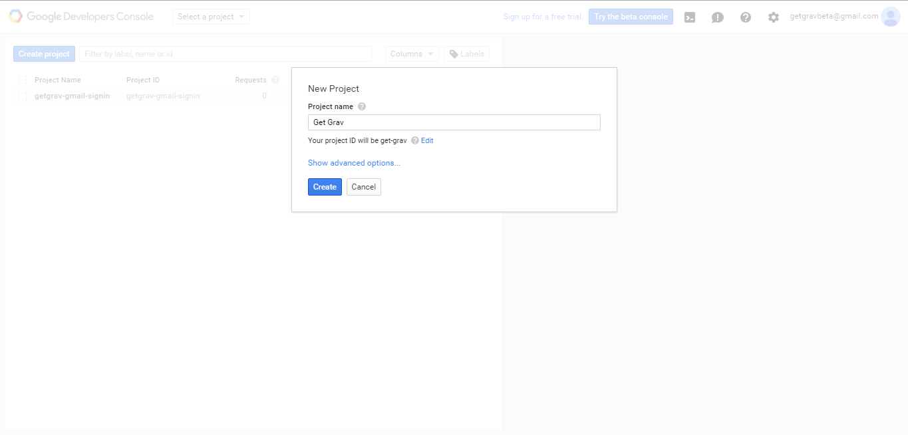
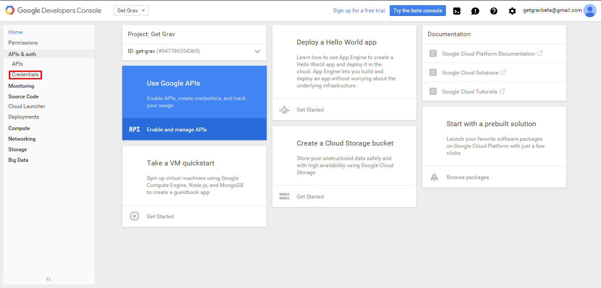
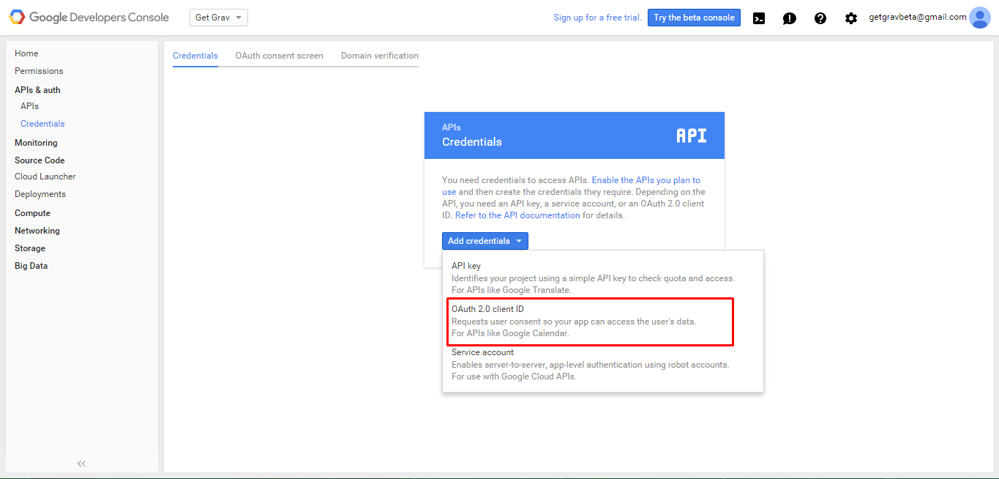
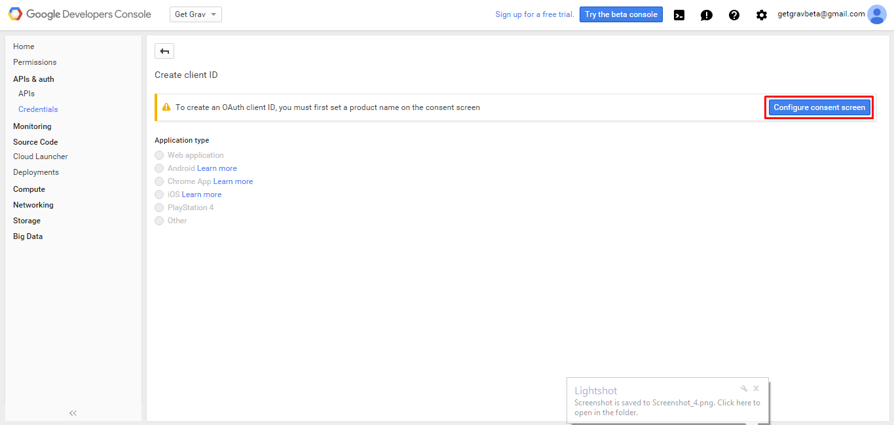
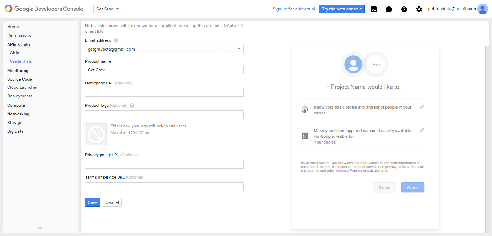
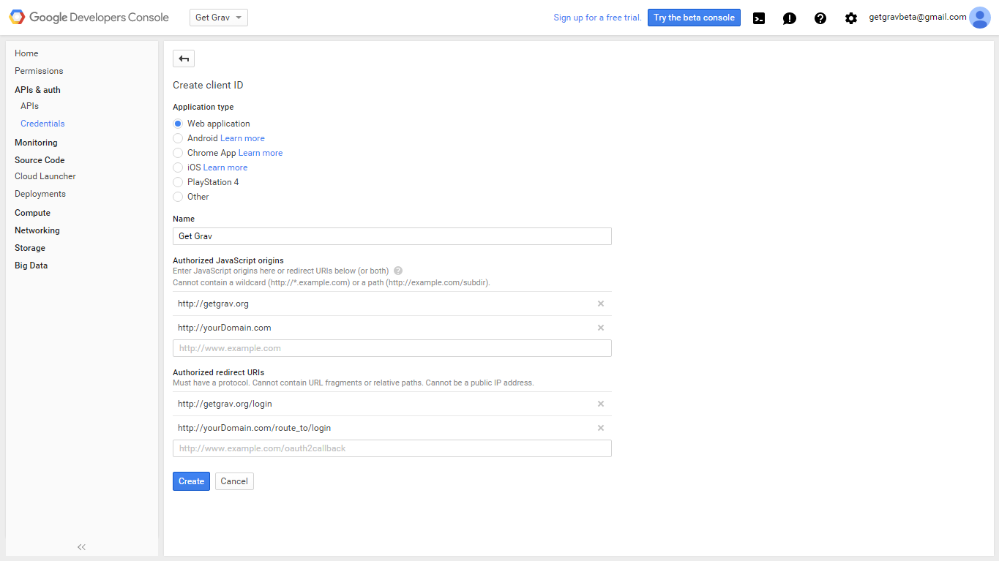
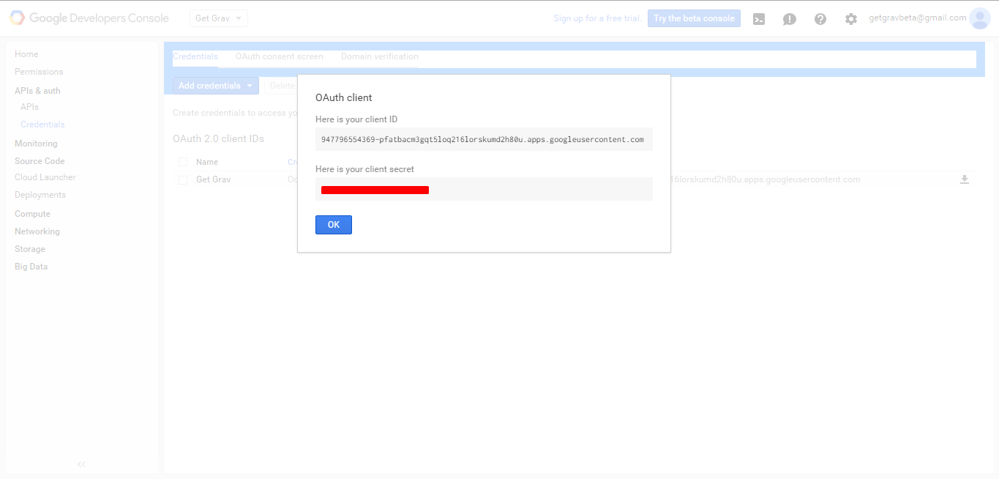

# Grav Login Plugin

The **login plugin** for [Grav](http://github.com/getgrav/grav) adds login, basic ACL, and session wide messages to Grav.  It is designed to provide a way to secure front-end and admin content throughout Grav.

| IMPORTANT!!! This plugin is currently in development as is to be considered a **beta release**.  As such, use this in a production environment **at your own risk!**. More features will be added in the future.


# Installation

The **login** plugin actually requires the help of the **email** and **form** plugins. The **email** plugin is needed to ensure that you can recover a password via email if required.  The **form** plugin is used to generate the forms required.

These are available via GPM, and because the plugin has dependencies you just need to proceed and install the login plugin, and agree when prompted to install the others:

```
$ bin/gpm install login
```

# Creating Users

You can either use the built-in CLI capabilities, or you create a user manually by creating a new YAML file in your `user/acounts` folder.


# CLI Usage

The simplest way to create a new user is to simply run the `bin/plugin login newuser` command. This will take you through a few questions to gather information with which to create your user. You can also use inline arguments to avoid the interactive questions.

### Commands

| `bin/plugin login newuser`       | (Supports Interactive Questionnaire)                            |
|-----------------------------------|-----------------------------------------------------------------|
| [ -u, --user=USER ]               | The username.                                                   |
| [ -p, --password=PASSWORD ]       | The password. Ensure the password respects Grav's password policy. **Note that this option is not recommended because the password will be visible by users listing the processes.** |
| [ -e, --email=EMAIL ]             | The user email address.                                         |
| [ -P, --permissions=PERMISSIONS ] | The user permissions. It can be either `a` for Admin access only, `s` for Site access only and `b` for both Admin and Site access. |
| [ -N, --fullname=FULLNAME ]       | The user full name                                              |
| [ -t, --title=TITLE ]             | The title of the user. Usually used as a subtext. Example: Admin, Collaborator, Developer |
| [ -s, --state=STATE ]             | The state of the account. Either `enabled` (default) or `disabled` |

### CLI Example
```
> bin/plugin login newuser -u joeuser -p 8c9sRCeBExAiwk -e joeuser@grav.org -P b -N "Joe User" -t "Site Administrator"
Creating new user


Success! User joeuser created.
```

### Interactive Example
```
> bin/plugin login newuser
Creating new user

Enter a username: joeuser
Enter a password: 8c9sRCeBExAiwk
Enter an email:   joeuser@grav.org
Please choose a set of permissions:
  [a] admin access
  [s] site access
  [b] admin and site access
 > b
Enter a fullname: Joe User
Enter a title:    Site Administrator
Please choose the state for the account:
  [enabled ] Enabled
  [disabled] Disabled
 > enabled
 
Success! User joeuser created.
```

### Manual User Creation

Here is example user defined in `user/accounts/admin.yaml`:

```
password: password
email: youremail@mail.com
fullname: Johnny Appleseed
title: Site Administrator
access:
  admin:
    login: true
    super: true
```

>> Note: the username is based on the name of the YAML file.

# Usage

You can add ACL to any page by typing something like below into the page header:

```
access:
  site.login: true
  admin.login: true
```

Users who have any of the listed ACL roles enabled will have access to the page.
Others will be forwarded to login screen.

Because the admin user contains an `admin.login: true` reference he will be able to login to the secured page because that is one of the conditions defined in the page header. You are free to create any specific set of ACL rules you like.  Your user account must simply contain those same rules if you wish th user to have access.

# Login Page

>> Note: the **frontend site** and **admin plugin** use different sessions so you need to explicitly provide a login on the frontend.

The login plugin can **automatically generate** a login page for you when you try to access a page that your user (or guest account) does not have access to.

Alternatively, you can also provide a specific login route if you wish to forward users to a specific login page. To do this you need to create a copy of the `login.yaml` from the plugin in your `user/config/plugins` folder and provide a specific route (or just edit the plugin setttings in the admin plugin).

```
route: /user-login
```

You would then need to provide a suitable login form, probably based on the one that is provided with the plugin.

# Logout

The login plugin comes with a simple Twig partial to provide a logout link (`login-status.html.twig`).  You will need to include it in your theme however.  An example of this can be found in the Antimatter theme's `partials/navigation.html.twig` file:

```

    <li><i class="fa fa-lock"></i> </li>

```

You can also copy this `login-status.html.twig` file into your theme and modify it as you see fit.

# OAuth

You can add OAuth providers to the login plugin as another method to have users on your site. To enable OAuth change `oauth.enabled` to `true` in `login.yaml`. By default OAuth allows users to login though they do not create an account file for the user. If you want an account file created (ex: for tracking purposes) change `oauth.user.autocreate` to `true` in `login.yaml`. 
>Note: OAuth has not been tested with Grav's multilang feature! Due to this, certain OAuth providers may not function properly on multilang sites

>IMPORTANT: `localhost` may NOT be used for callback and allowed URLs when creating OAuth provider applications due to certificate verification issues. Some services allow other URLs and it may be possible to add custom domains pointing to 127.0.0.1 in your hosts file and point applications there.

## Facebook

Visit https://developers.facebook.com/quickstarts/?platform=web and create an app name then click **Create New Facebook App ID.**

Choose a category most similar to your business then click **Create App ID.**

Scroll down on the next screen to the section titled **Tell us about your website.** Input a URL for the site (no need to include the protocol). Click **Next**

Click **Skip Quick Start** Copy the **App ID** and **App Secret** into `login.yaml`

On the left hand side click **Settings**
In the **Basic** tab add your domain into the **App Domains** section as well as enter a contact email (required for facebook developer program). In the **Advanced** tab scroll down to the **Client OAuth Settings** Make sure that **Client OAuth Login** is enabled as well as **Web OAuth Login** is enabled. In the **Valid OAuth redirect URIs** section add the routes of all pages that are protected by login. This includes the domains. EX: `http://getgrav.org/`, `http://getgrav.org/login`, `http://getgrav.org/en/login`, and `http://getgrav.org/protected/page/route`


## Github

Visit Github's [Developer Applications Console](https://github.com/settings/developers) and press button **Register new application** (login if necesarry).  

Fill out the name and the URL (can be anything) and fill in the **callback**, which must be equal to where your grav site is located, generally just the host, i.e. `http://getgrav.org`. 

Copy **Client ID** and **client secret** into login.yaml under Github. Be sure to change `Github.enabled` to `true`

## Google

Visit the [Google Developers Console](https://console.developers.google.com) (sign in with a google account, preferably your businesses gmail).

Select **Create Project** and give the project a name (can be anything). Click **Create**. 

When it's finished creating in the left hand menu choose **Credentials** under **APIs & Auth** (you may need to click **APIs & Auth** in order to display **Credntials**).  

Under **Add credentials** (center of screen) select **OAuth 2.0 client ID**. 

Then select **Configure consent screen** in the top right corner. 

The only requirement is **Product name** which should be the name of your website/business (not a url). You may fill in the other options as you want on the consent screen. (The consent screen can also be changed later). 

Then once you save the consent screen select **Web application** from the radio buttons and fill in the fields. **Name** being name of product/business. **Authorized Javascript origins** is the root domain name of the login page (no routes or wildcards) such as `http://getgrav.org`.

If needed, enter multiple sub domains, creating an entry for each. **Authorized redirect URIs** include the **same** Authorized Javascript origins used along with the **route** to the login page such as `http://getgrav.org/login`. Click **create**. 

 

Copy **Client ID** and **client secret** into login.yaml under Google. Be sure to change `Google.enabled` to `true`

## Twitter

Login if necessary. Create a [new Twitter App](https://apps.twitter.com/app/new) , fill out name, application website, choose "Browser" as application type, choose the callback URL like above, default access type can be set to read-only, click on "Register application" and then you should be directed to your new application with the Client ID and secret ready to be copied and pasted into the YAML file.
