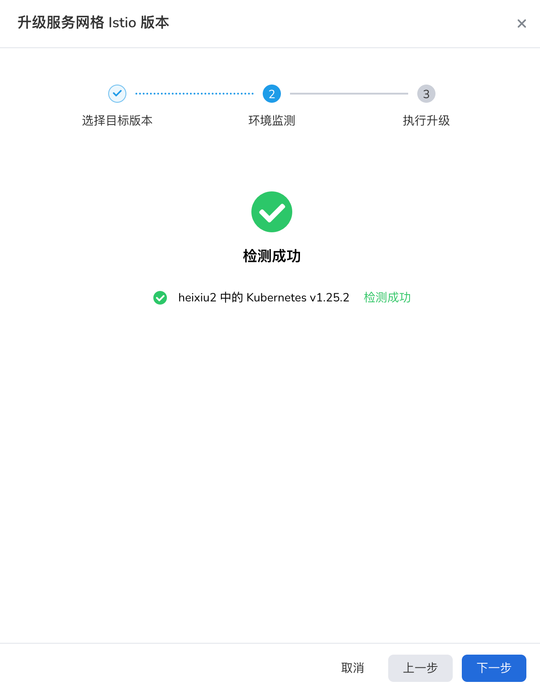
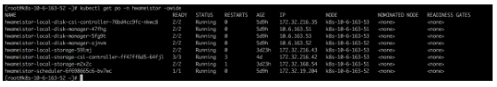

# Writing Style Guide

This style guide is applicable to DaoCloud documentation.

## Images

It is always welcome if you can output some diagrams about architecture, modules, principle, features desc etc.

**A useful picture is worth of a thousand words.**

All images in a book or on a website shall have a consistent style and:

- Show all text cleary
- Fill in with all parameters rather than keep those fields blank
- Do not give a big blank space on your screenshot
- A mermaid image is prefered, which can provide much convenience for translation and localization

### Example

Bad:



This screenshot is clear but has much blank. In this case, you can drag your browser border to a suitable size before making the screenshot.

Good:


## Code and command

For a user guide about software products, it is very popular to show your code and its output to reproduce an actual environment.

**Talk is cheap, show me the code.**

For a code snippet, remember the followings to provide your readers:

- Show clearly
- Easy to read
- Easy to copy/paste
- Give some comments if possible
- Highlights with the code mark of c, c++, yaml, java, shell, bash, or go if you know.

### Bad

However, some images are not suggested, or even to avoid. For example, in a long article,
when you run a simple command and the system outputs something on your screen. In this
case, it's better to directly copy/paste your on-screen text rather than a screenshot as below.



As shown above, it's difficult to control the resolution and pixels of an image to adapt
to different device and cloud environment, and not easy to reproduce your dev, test, and
use environment. Few people may follow your screenshot to type the command letter by
letter again because the reader cannot view it clearly!

### Good example 1

Run the comman to get current pods:

```sh
kubectl get pods
```

The output is similar to:

```none
NAME                                      READY   STATUS    RESTARTS      AGE
piraeus-cs-controller-6d7c6c9d75-5k2tw    1/1     Running   2 (16d ago)   20d
piraeus-csi-controller-65fbdb58dd-q2fp5   6/6     Running   4 (16d ago)   20d
piraeus-csi-node-6s5tx                    3/3     Running   3 (14d ago)   20d
piraeus-csi-node-7rwcf                    3/3     Running   3 (14d ago)   20d
piraeus-csi-node-q6nn7                    3/3     Running   1 (17d ago)   20d
```

### Good example 2

For some YAML files, you need to ensure all intendations are correct and provide a code symbol at the start.
Refer to [yaml.org](https://yaml.org/).

```yaml
apiVersion: batch/v1
kind: Job
metadata:
  name: hello
spec:
  template:
    # This is the pod template
    spec:
      containers:
        - name: hello
          image: busybox:1.28
          command: ["sh", "-c", 'echo "Hello, Kubernetes!" && sleep 3600']
      restartPolicy: OnFailure
    # The pod template ends here
```

## List

DCE 5.0 website is compiled and built with Mkdocs, which requires 4 spaces for a list.

Here are some tips for your list writing:

- Do not use orphan item in a list. A list contains at least two items.
- Use an ordered list for a procedure with sequence.
- Use an unordered list for features, benefits, and more without sequence.

```none
1. A first item in an ordered list

    - unordered list one
        - unordered list one
        - unordered list two
    - unordered list two

1. A second item with an ordered list

    1. Embedded list one
        1. Embedded list one
        1. Embedded list two
    1. Embedded list two

1. A third item in an ordered list
```

The output is:

1. A first item in an ordered list

    - unordered list one
        - unordered list one
        - unordered list two
    - unordered list two

1. A second item with an ordered list

    1. Embedded list one
        1. Embedded list one
        1. Embedded list two
    1. Embedded list two

1. A third item in an ordered list

Refer to [MkDocs list](https://squidfunk.github.io/mkdocs-material/reference/lists/#using-unordered-lists).

## Table

The semantic purpose of a data table is to present tabular data.

DCE docs is written with markdown. The table is not recommneded but sometimes hard to avoid.
In this case, a table cannot be indented, otherwise the table style will be lost.
One suggestion is to put all parameter tables in a page.

Alternatively, a table can easily show comparison, for example:

```none
Do	                        | Don't
----------------------------|------------------------------------
To create a ReplicaSet,	    | In order to create a ReplicaSet,
See the configuration file.	| Please see the configuration file.
View the pods.	| With this next command, we'll view the pods.
```

The output is:

Do	                        | Don't
----------------------------|------------------------------------
To create a ReplicaSet,	    | In order to create a ReplicaSet,
See the configuration file.	| Please see the configuration file.
View the pods.	| With this next command, we'll view the pods.

Refer to [MkDocs table](https://squidfunk.github.io/mkdocs-material/reference/data-tables/).
